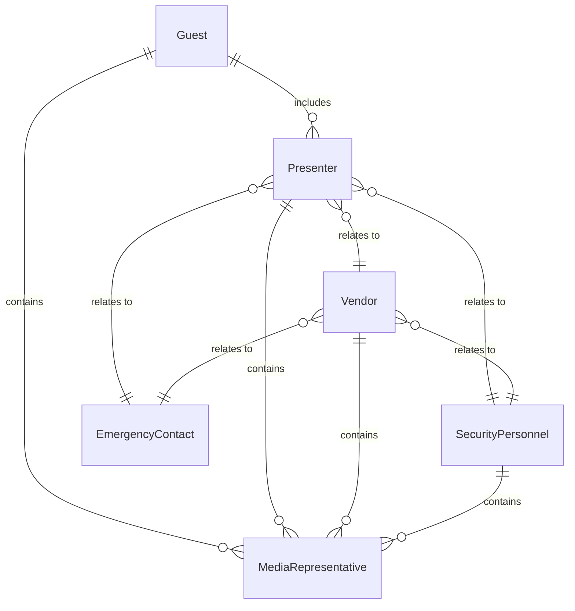
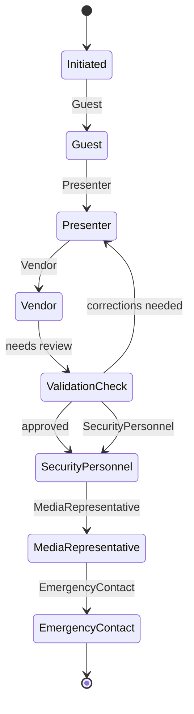
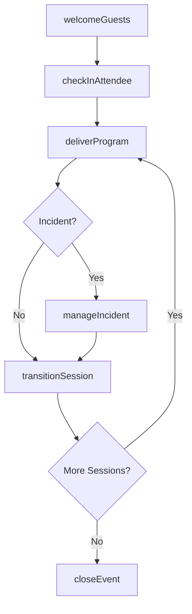
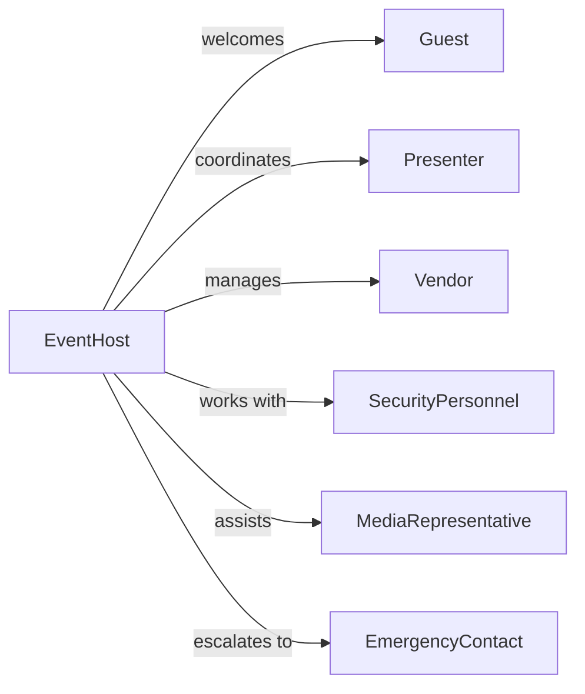

# Host Events

> Business-as-Code definition for event hosting. Models the on-site management and execution of live events including guest reception, program delivery, and real-time coordination.

## Overview

Event hosting involves welcoming attendees, managing on-site logistics, delivering the planned program, and responding to real-time needs during live events. This definition exposes actions for check-in, program execution, guest services, and incident management, along with searches for attendee tracking and post-event analytics.

## Actors

| Actor | Description |
|-------|-------------|
| Guest | Attendee participating in the event |
| Presenter | Speaker or performer delivering program content |
| Vendor | On-site service provider for catering or AV |
| SecurityPersonnel | Ensures safety and manages access control |
| MediaRepresentative | Journalist or photographer covering the event |
| EmergencyContact | First responder or medical support |

## Roles

| Role | Description |
|------|-------------|
| EventHost | Leads the event and welcomes guests |
| CheckInCoordinator | Manages attendee registration and badges |
| FloorManager | Oversees room setup and transitions |
| GuestRelations | Handles attendee questions and needs |
| TechnicalDirector | Manages AV, lighting, and technical requirements |

## Entities

| Entity | Description |
|--------|-------------|
| GuestList | Registry of expected attendees with check-in status |
| ProgramAgenda | Scheduled sessions, speakers, and activities |
| CheckIn | Record of attendee arrival and badge issuance |
| Incident | Real-time issue requiring attention |
| Feedback | Guest comments or complaints during event |
| Session | Individual program segment or activity |

## Actions

| Action | Description |
|--------|-------------|
| welcomeGuests | Greet and orient arriving attendees |
| checkInAttendee | Verify registration and issue event badge |
| deliverProgram | Execute scheduled sessions and activities |
| manageIncident | Respond to real-time issues or emergencies |
| collectFeedback | Gather guest comments during the event |
| transitionSession | Move from one program segment to the next |
| closeEvent | Conclude the event and thank attendees |

## Events

| Event | Description |
|-------|-------------|
| guestsWelcomed | Attendees have been greeted and oriented |
| attendeeCheckedIn | Guest has been verified and badged |
| programDelivered | Scheduled session has been executed |
| incidentManaged | Real-time issue has been addressed |
| feedbackCollected | Guest comments have been captured |
| sessionTransitioned | Program has moved to next segment |
| eventClosed | Event has concluded successfully |

## Searches

| Search | Description |
|--------|-------------|
| getGuestList | Retrieve attendees by status or category |
| getCheckIns | View attendee arrivals by time or type |
| getIncidents | Find issues by severity or resolution status |
| getFeedback | Retrieve guest comments by session or rating |
| getAttendance | Check participation counts by session |


## Entity Relationships



## State Diagram



## Workflow



## Actor Relationships



## Usage

### Calling Actions

```typescript
import { hostEvents } from '@headlessly/host-events'

const hosting = hostEvents()

// Welcome guests and start check-in
await hosting.welcomeGuests({
  eventId: 'evt-2026-summit',
  openingTime: '08:00',
  greeters: ['staff-101', 'staff-102']
})

// Check in an attendee
await hosting.checkInAttendee({
  eventId: 'evt-2026-summit',
  attendeeId: 'att-5521',
  badgeType: 'VIP',
  timestamp: new Date()
})

// Deliver a program session
await hosting.deliverProgram({
  eventId: 'evt-2026-summit',
  sessionId: 'keynote',
  presenter: 'Jane Smith',
  startTime: '09:00',
  duration: 60
})

// Handle an incident
await hosting.manageIncident({
  eventId: 'evt-2026-summit',
  type: 'technical',
  description: 'Microphone not working in Room B',
  severity: 'high',
  assignedTo: 'tech-director'
})
```

### Event-Driven Automation

```typescript
// Alert staff when VIP guests arrive
hosting.attendeeCheckedIn(async ({ attendeeId, badgeType }) => {
  if (badgeType === 'VIP') {
    await notify({
      to: 'guest-relations-team',
      message: `VIP guest ${attendeeId} has arrived`
    })
  }
})

// Escalate high-severity incidents
hosting.incidentManaged(async ({ severity, type, description }) => {
  if (severity === 'critical') {
    await notify({
      to: 'event-manager',
      priority: 'urgent',
      message: `Critical incident: ${type} - ${description}`
    })
  }
})
```
