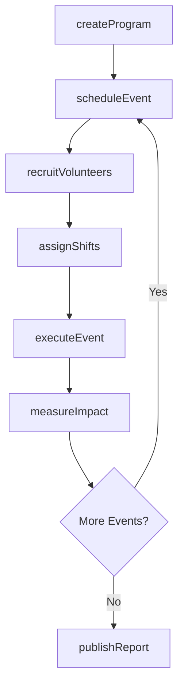
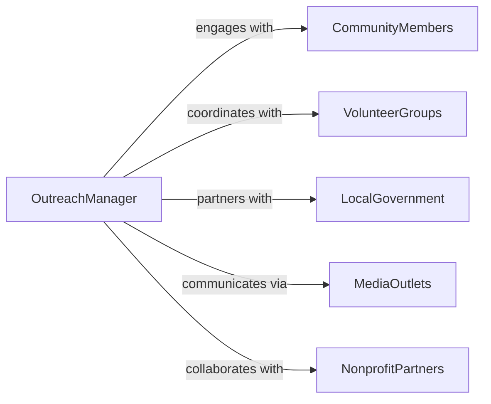

# Manage Outreach Activities

> Business-as-Code definition for community and public outreach management. Models the complete lifecycle of organizing, executing, and measuring outreach initiatives.

## Overview

Community outreach management encompasses planning, coordinating, and evaluating programs that engage external audiences such as community members, stakeholders, and the public. This definition provides actions for initiative setup, volunteer coordination, event execution, and impact measurement.

## Actors

| Actor | Description |
|-------|-------------|
| CommunityMembers | Participants and beneficiaries of outreach programs |
| VolunteerGroups | External volunteers supporting outreach activities |
| LocalGovernment | Municipal authorities coordinating public programs |
| MediaOutlets | News and social media channels promoting initiatives |
| NonprofitPartners | Organizations collaborating on community programs |
| Sponsors | Businesses providing funding or in-kind support |

## Roles

| Role | Description |
|------|-------------|
| OutreachManager | Oversees all outreach program planning and execution |
| CommunityCoordinator | Manages relationships with community stakeholders |
| VolunteerCoordinator | Recruits and schedules volunteers |
| EventPlanner | Organizes logistics for outreach events |

## Entities

| Entity | Description |
|--------|-------------|
| OutreachProgram | A structured initiative targeting specific communities |
| OutreachEvent | A specific activity or gathering within a program |
| VolunteerShift | An assigned time period for volunteer participation |
| ImpactMetric | Measurement of outreach effectiveness and reach |
| CommunityContact | A key stakeholder or partner in the community |

## Actions

| Action | Description |
|--------|-------------|
| createProgram | Establish a new outreach program with goals and target audience |
| scheduleEvent | Plan an outreach event with date, location, and activities |
| recruitVolunteers | Invite and onboard volunteers for outreach activities |
| assignShifts | Allocate volunteers to specific time slots and roles |
| executeEvent | Conduct the outreach event and capture attendance |
| measureImpact | Assess program effectiveness through surveys and metrics |
| publishReport | Share outreach results with stakeholders and sponsors |

## Events

| Event | Description |
|-------|-------------|
| programCreated | A new outreach program has been initiated |
| eventScheduled | An outreach event has been planned and publicized |
| volunteersRecruited | Volunteers have been successfully onboarded |
| shiftsAssigned | Volunteer schedules have been finalized |
| eventExecuted | An outreach event has been completed |
| impactMeasured | Outreach effectiveness data has been collected |
| reportPublished | Results have been shared with stakeholders |

## Searches

| Search | Description |
|--------|-------------|
| findPrograms | List outreach programs by status, date, or target community |
| getEvents | Retrieve upcoming or past outreach events |
| getVolunteers | Find volunteers by availability, skills, or program |
| getImpactMetrics | Retrieve effectiveness data for programs or events |

## Workflow



## Actor Relationships



## Usage

### Calling Actions

```typescript
import { manageOutreachActivities } from '@headlessly/manage-outreach-activities'

const outreach = manageOutreachActivities()

// Create a new community outreach program
const program = await outreach.createProgram({
  name: 'Digital Literacy for Seniors',
  targetCommunity: 'Senior Citizens',
  goals: ['Teach basic computer skills', 'Increase internet confidence'],
  duration: { start: '2026-03-01', end: '2026-06-30' }
})

// Schedule an event within the program
const event = await outreach.scheduleEvent({
  programId: program.id,
  name: 'Introduction to Email',
  date: '2026-03-15',
  location: 'Community Center',
  expectedAttendees: 30
})

// Recruit and assign volunteers
await outreach.recruitVolunteers({
  eventId: event.id,
  roles: ['Tech Instructor', 'Setup Assistant'],
  count: 5
})
```

### Event-Driven Automation

```typescript
// Notify media partners when an event is scheduled
outreach.eventScheduled(async ({ event }) => {
  await notifyPartners({
    channels: ['local-news', 'social-media'],
    message: `Join us for ${event.name} on ${event.date}`
  })
})

// Generate impact reports automatically after events
outreach.eventExecuted(async ({ eventId }) => {
  const impact = await outreach.measureImpact({ eventId })
  if (impact.completionRate > 0.8) {
    await outreach.publishReport({ eventId })
  }
})
```
