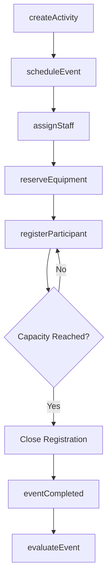
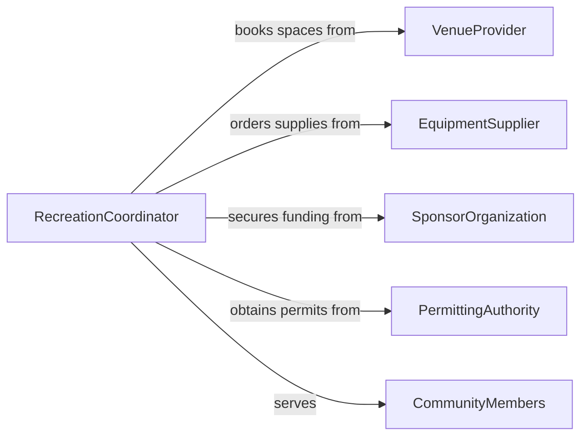

# Organize Recreational Activities Events

> Business-as-Code definition for organizing recreational activities and events. Models the full lifecycle of planning, scheduling, staffing, and executing recreation programs for communities, organizations, and facilities.

## Overview

Organizing recreational activities and events encompasses planning leisure programs, sports leagues, fitness classes, outdoor excursions, and community recreation offerings. This involves coordinating venues, equipment, staff, and participant registrations while ensuring safety compliance and accessibility. The process spans from initial concept development through post-event evaluation, enabling parks departments, recreation centers, resorts, and corporate wellness programs to deliver engaging experiences.

## Actors

| Actor | Description |
|-------|-------------|
| CommunityMembers | Participants who register for and attend recreational activities |
| VenueProvider | Facilities, parks, or property owners supplying event spaces |
| EquipmentSupplier | Vendors providing sports gear, rental equipment, and supplies |
| SponsorOrganization | Businesses or nonprofits funding or co-branding events |
| PermittingAuthority | Municipal or regulatory bodies issuing permits for public activities |

## Roles

| Role | Description |
|------|-------------|
| RecreationCoordinator | Plans and oversees all recreational programming and scheduling |
| ActivityLeader | Leads specific sessions, classes, or activity groups on-site |
| RegistrationClerk | Manages participant sign-ups, waivers, and fee collection |
| SafetyOfficer | Ensures compliance with safety standards and emergency preparedness |

## Entities

| Entity | Description |
|--------|-------------|
| Activity | A defined recreational offering with type, schedule, and capacity |
| Event | A specific occurrence of an activity at a date, time, and location |
| Registration | A participant enrollment record for an activity or event |
| Venue | A physical location where the activity takes place |
| Equipment | Gear, supplies, or materials required for the activity |
| Waiver | A liability release form signed by participants |

## Actions

| Action | Description |
|--------|-------------|
| createActivity | Define a new recreational activity with details and requirements |
| scheduleEvent | Set date, time, venue, and capacity for an activity occurrence |
| registerParticipant | Enroll a community member in a scheduled event |
| assignStaff | Allocate activity leaders and support personnel to events |
| reserveEquipment | Book required gear and supplies for an event |
| cancelEvent | Cancel a scheduled event and notify registered participants |
| evaluateEvent | Collect feedback and assess event outcomes after completion |

## Events

| Event | Description |
|-------|-------------|
| activityCreated | A new recreational activity has been defined |
| eventScheduled | A specific event occurrence has been placed on the calendar |
| participantRegistered | A community member has enrolled in an event |
| staffAssigned | Activity leaders have been allocated to an event |
| eventCapacityReached | Registration has filled all available spots |
| eventCompleted | The scheduled event has concluded |
| eventCancelled | A scheduled event has been cancelled |

## Searches

| Search | Description |
|--------|-------------|
| findActivities | List activities by type, age group, season, or venue |
| getRegistrations | Retrieve participant enrollments by event, status, or date range |
| getUpcomingEvents | Find scheduled events within a date range or location |
| findAvailableVenues | Search venues by capacity, amenities, and availability |

## Workflow



## Actor Relationships



## Usage

### Calling Actions

```typescript
import { organizeRecreationalActivitiesEvents } from '@headlessly/organize-recreational-activities-events'

const recreation = organizeRecreationalActivitiesEvents()

// Define a new summer swim program
const activity = await recreation.createActivity({
  name: 'Adult Lap Swim',
  type: 'aquatics',
  ageGroup: '18+',
  season: 'summer',
  maxCapacity: 30
})

// Schedule weekly sessions
const event = await recreation.scheduleEvent({
  activityId: activity.id,
  venue: 'Riverside Community Pool',
  startDate: '2026-06-01',
  recurrence: 'weekly',
  time: '06:00-07:30'
})

// Register a participant
await recreation.registerParticipant({
  eventId: event.id,
  participantName: 'Jane Rodriguez',
  waiverSigned: true
})
```

### Event-Driven Automation

```typescript
// Notify when capacity is reached
recreation.eventCapacityReached(async ({ eventId, activityName }) => {
  await notify({
    to: 'recreation-staff',
    message: `${activityName} is now full. Consider adding another session.`
  })
})

// Send post-event survey
recreation.eventCompleted(async ({ eventId, participants }) => {
  for (const participant of participants) {
    await sendSurvey({
      to: participant.email,
      template: 'recreation-feedback',
      eventId
    })
  }
})
```
