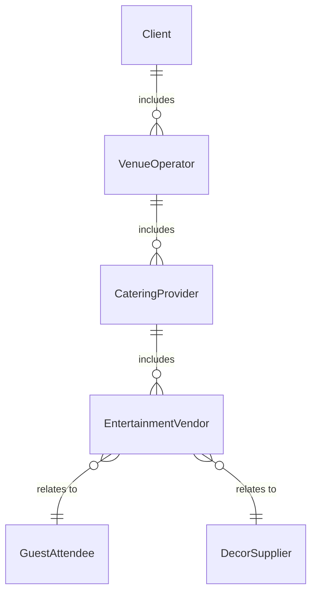
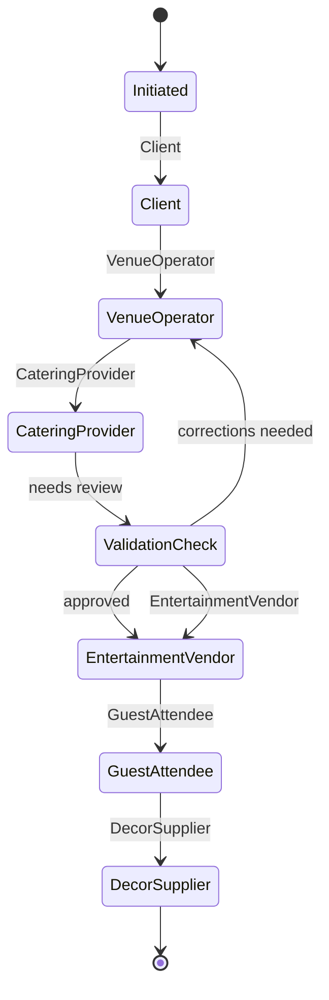
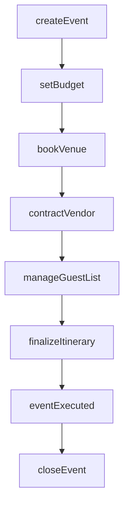
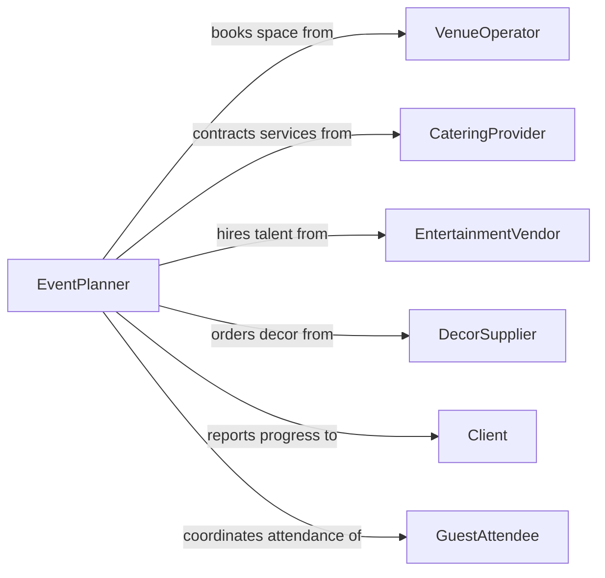

# Organize Special Events

> Business-as-Code definition for organizing special events. Models the end-to-end event lifecycle from concept and budgeting through execution and post-event analysis.

## Overview

Organizing special events involves planning, coordinating, and executing occasions such as galas, conferences, fundraisers, product launches, award ceremonies, and corporate retreats. This process requires managing budgets, vendor contracts, venue logistics, guest lists, catering, entertainment, and event-day operations. The definition supports event planners, marketing teams, nonprofit organizations, and hospitality professionals in delivering memorable, well-coordinated experiences.

## Actors

| Actor | Description |
|-------|-------------|
| Client | The individual or organization commissioning the event |
| VenueOperator | Facility management providing event space and on-site services |
| CateringProvider | Food and beverage service companies supplying meals and refreshments |
| EntertainmentVendor | Performers, DJs, speakers, or production companies |
| GuestAttendee | Invited individuals or ticket holders attending the event |
| DecorSupplier | Florists, rental companies, and decorators providing event aesthetics |

## Roles

| Role | Description |
|------|-------------|
| EventPlanner | Leads overall event strategy, timeline, and vendor coordination |
| EventCoordinator | Manages day-of logistics, setup, and on-site operations |
| BudgetManager | Tracks expenses, approves invoices, and manages financial targets |
| MarketingLead | Promotes the event through invitations, social media, and PR |

## Entities

| Entity | Description |
|--------|-------------|
| Event | A special occasion with date, theme, venue, and budget |
| Budget | Financial plan covering all event revenue and expenses |
| VendorContract | A signed agreement with a supplier for event services |
| GuestList | The roster of invitees with RSVP status and seating assignments |
| Itinerary | The detailed timeline of event activities and transitions |
| Invoice | A billing record from a vendor for services rendered |

## Actions

| Action | Description |
|--------|-------------|
| createEvent | Define a new special event with theme, date, and objectives |
| setBudget | Establish the financial plan and spending limits for the event |
| bookVenue | Reserve an event space and confirm logistics with the operator |
| contractVendor | Engage a vendor and finalize service agreements |
| manageGuestList | Add, remove, or update guest invitations and RSVPs |
| finalizeItinerary | Lock the event-day schedule and distribute to all parties |
| closeEvent | Complete post-event reconciliation, payments, and reporting |

## Events

| Event | Description |
|-------|-------------|
| eventCreated | A new special event has been defined and initiated |
| venueBooked | An event space has been reserved and confirmed |
| vendorContracted | A vendor agreement has been signed and scheduled |
| guestListFinalized | The final attendee roster has been locked |
| itineraryPublished | The event-day schedule has been distributed to stakeholders |
| eventExecuted | The special event has taken place |
| eventClosed | Post-event financials and reporting are complete |

## Searches

| Search | Description |
|--------|-------------|
| findEvents | List events by date range, type, status, or client |
| getVendorContracts | Retrieve vendor agreements by event, vendor, or service type |
| getGuestList | Look up attendees by event, RSVP status, or table assignment |
| getBudgetSummary | Get budget vs. actual spending breakdown for an event |


## Entity Relationships



## State Diagram



## Workflow



## Actor Relationships



## Usage

### Calling Actions

```typescript
import { organizeSpecialEvents } from '@headlessly/organize-special-events'

const events = organizeSpecialEvents()

// Create an annual fundraiser gala
const gala = await events.createEvent({
  name: 'Annual Charity Gala 2026',
  type: 'fundraiser',
  date: '2026-09-15',
  expectedAttendees: 350,
  theme: 'Starlight Soiree'
})

// Set the event budget
await events.setBudget({
  eventId: gala.id,
  totalBudget: 120000,
  categories: [
    { name: 'Venue', allocated: 35000 },
    { name: 'Catering', allocated: 45000 },
    { name: 'Entertainment', allocated: 20000 },
    { name: 'Decor', allocated: 15000 },
    { name: 'Contingency', allocated: 5000 }
  ]
})

// Book the venue
await events.bookVenue({
  eventId: gala.id,
  venue: 'Grand Ballroom at The Regency',
  capacity: 400,
  setupTime: '2026-09-15T10:00',
  eventStart: '2026-09-15T18:00'
})
```

### Event-Driven Automation

```typescript
// Notify planner when all vendors are contracted
events.vendorContracted(async ({ eventId }) => {
  const contracts = await events.getVendorContracts({ eventId })
  const allConfirmed = contracts.every(c => c.status === 'signed')
  if (allConfirmed) {
    await notify({
      to: 'event-planner',
      message: `All vendor contracts confirmed for event ${eventId}`
    })
  }
})

// Auto-generate post-event report
events.eventExecuted(async ({ eventId, attendeeCount }) => {
  await generateReport({
    type: 'post-event-summary',
    eventId,
    metrics: { attendeeCount, satisfaction: 'pending-survey' }
  })
})
```
