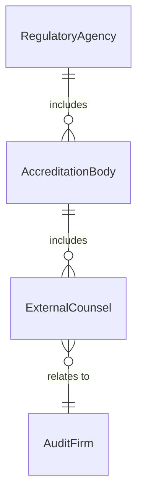
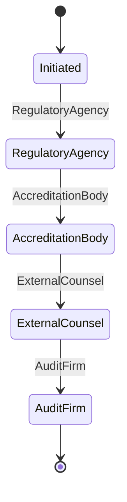
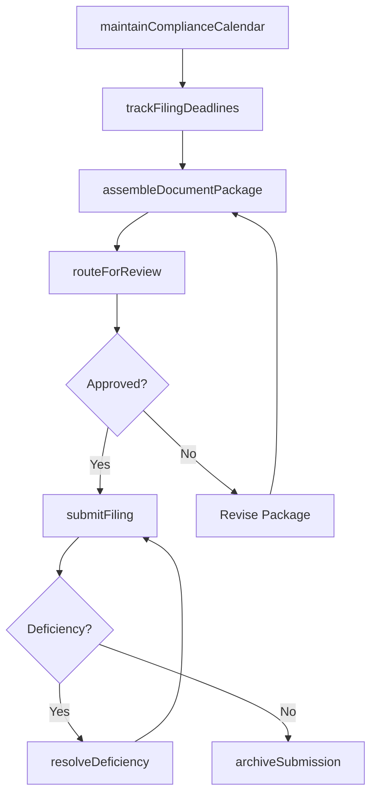
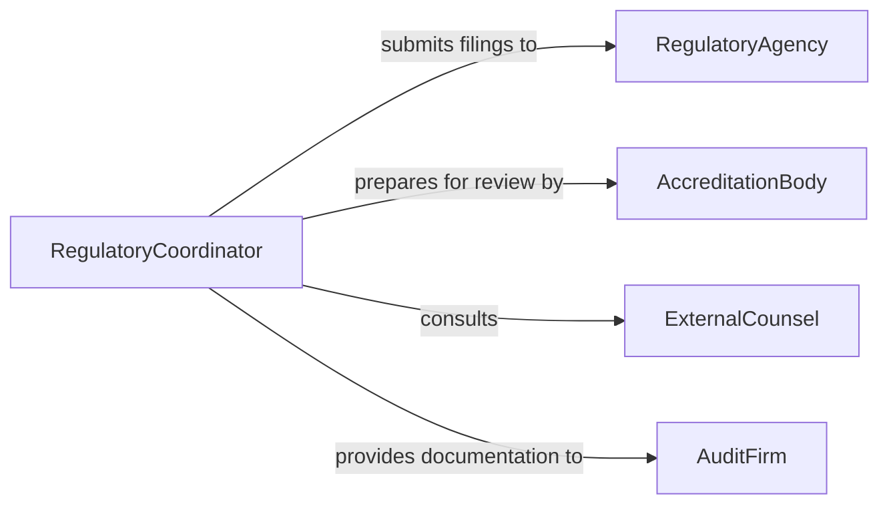

# Coordinate Regulatory Documentation Activities

> Business-as-Code definition for coordinating regulatory documentation activities. Models the management of compliance filings, permit applications, regulatory submissions, and audit documentation across government and industry requirements.

## Overview

Coordinating regulatory documentation activities involves managing the preparation, review, submission, and tracking of documents required by government agencies, industry regulators, and accreditation bodies. This definition provides actions for tracking filing deadlines, assembling documentation packages, routing documents for review, and maintaining submission records. It enables automation of deadline monitoring, document assembly, and submission tracking workflows.

## Actors

| Actor | Description |
|-------|-------------|
| RegulatoryAgency | Government body requiring documentation submissions |
| AccreditationBody | Industry organization reviewing compliance documentation |
| ExternalCounsel | Legal advisors reviewing regulatory filings for accuracy |
| AuditFirm | External reviewers verifying documentation completeness |

## Roles

| Role | Description |
|------|-------------|
| RegulatoryCoordinator | Manages the end-to-end regulatory documentation process |
| ComplianceAnalyst | Prepares and reviews regulatory submissions for accuracy |
| DocumentationSpecialist | Assembles and formats document packages for filing |
| LegalReviewer | Verifies regulatory filings meet legal requirements |

## Entities

| Entity | Description |
|--------|-------------|
| RegulatoryFiling | A required document submission to a government or industry body |
| FilingDeadline | A mandated date for submission of regulatory documentation |
| DocumentPackage | An assembled set of documents for a specific regulatory requirement |
| SubmissionRecord | Confirmation of a filing being received by the regulatory body |
| ComplianceCalendar | Schedule of all upcoming regulatory documentation deadlines |
| ReviewComment | Feedback on a draft filing requiring resolution before submission |
| DeficiencyNotice | A regulatory body notification that a submission is incomplete |

## Actions

| Action | Description |
|--------|-------------|
| trackFilingDeadlines | Monitor upcoming regulatory submission dates |
| assembleDocumentPackage | Gather and organize documents for a regulatory filing |
| routeForReview | Send draft filings to internal reviewers for approval |
| submitFiling | Transmit completed documentation to the regulatory body |
| resolveDeficiency | Address regulatory feedback on incomplete or incorrect submissions |
| maintainComplianceCalendar | Update the schedule of all regulatory documentation requirements |
| archiveSubmission | Store completed filing records for audit and reference |

## Events

| Event | Description |
|-------|-------------|
| filingDeadlineApproaching | A regulatory submission date is within the warning period |
| documentPackageAssembled | Documents have been gathered for a regulatory filing |
| reviewCompleted | Internal reviewers have approved a draft filing |
| filingSubmitted | Documentation has been transmitted to the regulatory body |
| deficiencyReceived | The regulatory body has flagged an issue with a submission |
| complianceCalendarUpdated | Regulatory deadline schedule has been modified |
| submissionArchived | A completed filing record has been stored |

## Searches

| Search | Description |
|--------|-------------|
| getUpcomingDeadlines | List regulatory filing dates within a specified window |
| getFilingStatus | Check the status of a specific regulatory submission |
| findDeficiencies | List unresolved regulatory feedback items |
| getComplianceCalendar | Retrieve the full schedule of documentation requirements |
| getSubmissionHistory | Review past filings by type, agency, or period |


## Entity Relationships



## State Diagram



## Workflow



## Actor Relationships



## Usage

### Calling Actions

```typescript
import { coordinateRegulatoryDocumentationActivities } from '@headlessly/coordinate-regulatory-documentation-activities'

const regulatory = coordinateRegulatoryDocumentationActivities()

// Track upcoming deadlines
const deadlines = await regulatory.getUpcomingDeadlines({
  withinDays: 30,
  agencies: ['fda', 'epa', 'osha']
})

// Assemble a document package
await regulatory.assembleDocumentPackage({
  filing: 'annual-emissions-report',
  agency: 'epa',
  documents: ['emissions-data', 'monitoring-logs', 'corrective-actions'],
  deadline: '2026-04-30'
})

// Submit a filing
await regulatory.submitFiling({
  filing: 'annual-emissions-report',
  agency: 'epa',
  method: 'electronic',
  certifiedBy: 'compliance-director'
})
```

### Event-Driven Automation

```typescript
// Alert on approaching deadlines
regulatory.filingDeadlineApproaching(async ({ filing, agency, daysRemaining }) => {
  await notify({
    to: 'regulatory-coordinator',
    message: `${filing} due to ${agency} in ${daysRemaining} days`
  })
})

// Auto-escalate deficiencies
regulatory.deficiencyReceived(async ({ filing, agency, issues }) => {
  await notify({
    to: 'legal-reviewer',
    message: `Deficiency notice from ${agency} on ${filing}: ${issues.length} items to resolve`,
    priority: 'high'
  })
})
```
