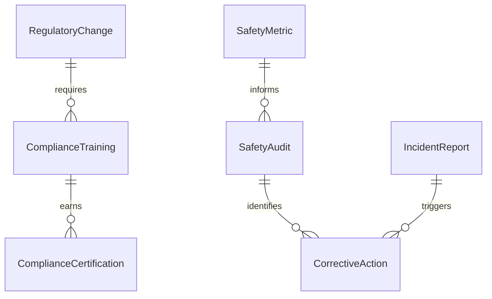
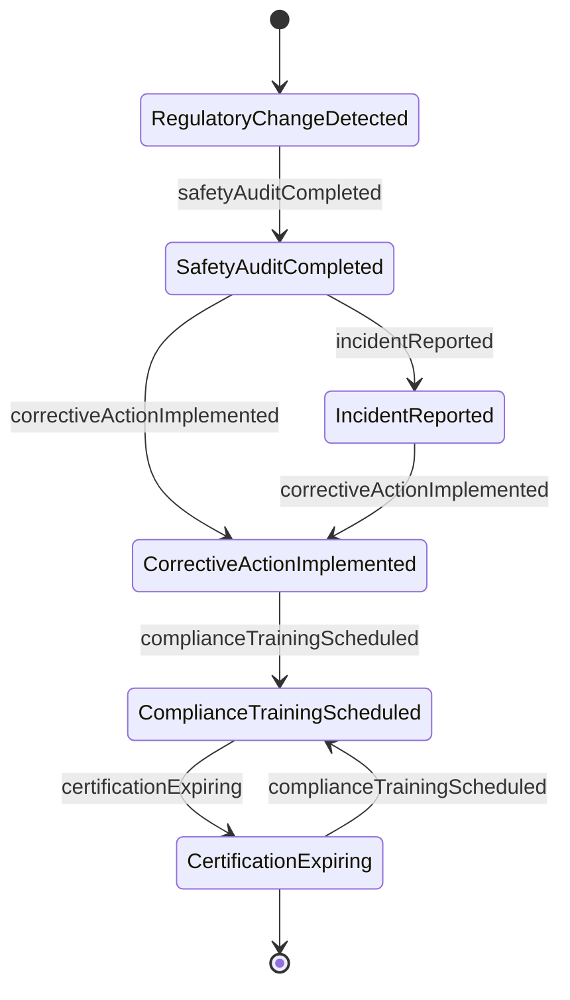
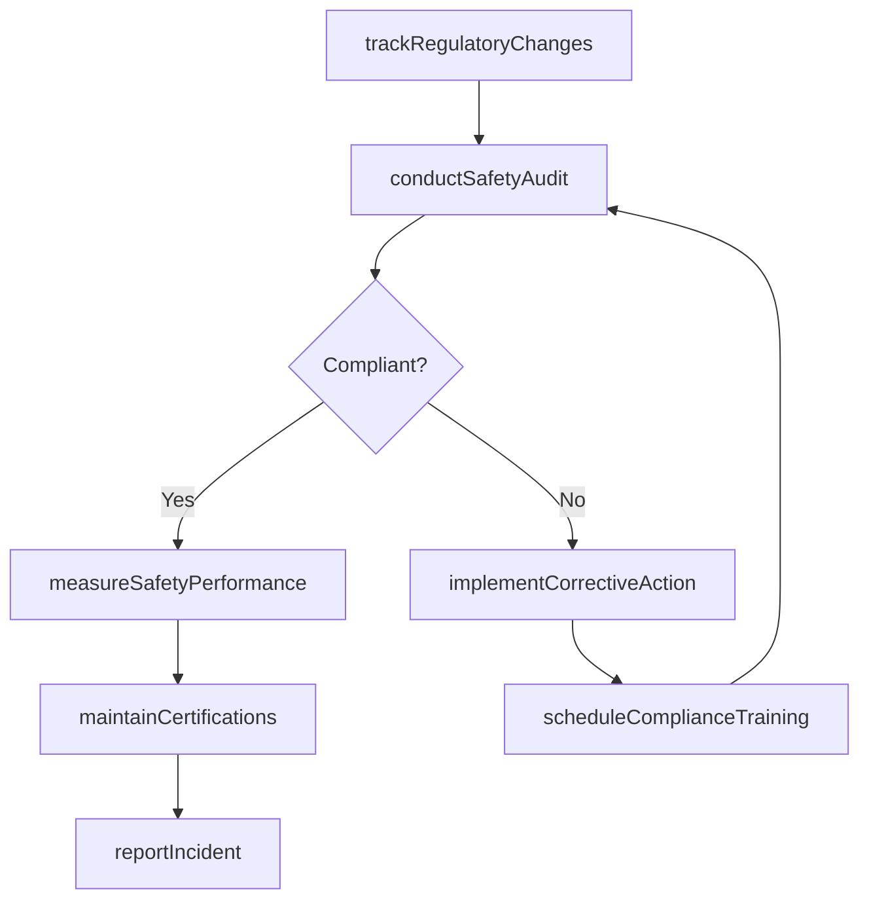
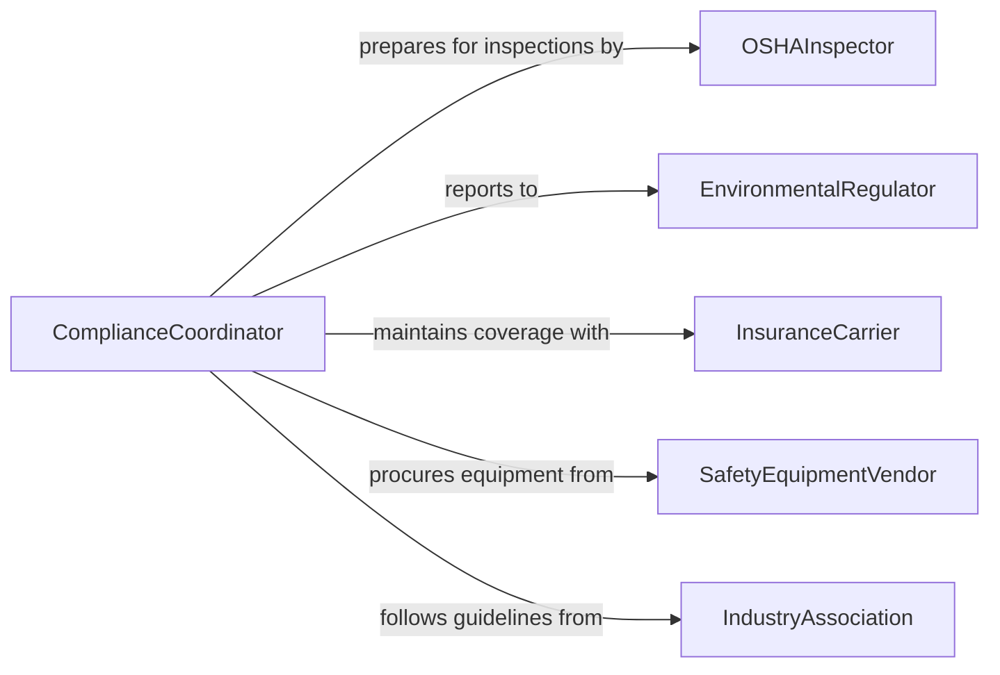

# Coordinate Safety Regulatory Compliance Activities

> Business-as-Code definition for coordinating safety or regulatory compliance activities. Models the oversight of workplace safety programs, regulatory inspections, compliance training, and incident reporting across organizational operations.

## Overview

Coordinating safety or regulatory compliance activities involves overseeing programs that ensure workplace safety, environmental protection, and adherence to government regulations. This definition provides actions for managing safety audits, coordinating compliance training, tracking regulatory changes, and reporting incidents. It enables automation of audit scheduling, training completion tracking, and regulatory change notification workflows.

## Actors

| Actor | Description |
|-------|-------------|
| OSHAInspector | Federal safety inspector conducting workplace compliance reviews |
| EnvironmentalRegulator | Enforces environmental protection standards and permits |
| InsuranceCarrier | Underwrites liability coverage tied to safety compliance |
| SafetyEquipmentVendor | Provides personal protective equipment and safety systems |
| IndustryAssociation | Publishes safety best practices and compliance guidelines |

## Roles

| Role | Description |
|------|-------------|
| ComplianceCoordinator | Oversees all safety and regulatory compliance activities |
| SafetyManager | Implements and monitors workplace safety programs |
| TrainingCoordinator | Manages compliance training schedules and certification tracking |
| IncidentInvestigator | Leads root cause analysis of safety events |

## Entities

| Entity | Description |
|--------|-------------|
| SafetyAudit | A systematic review of workplace safety practices and conditions |
| ComplianceTraining | Required education on safety procedures and regulations |
| IncidentReport | Documentation of a workplace safety event with investigation details |
| RegulatoryChange | A new or modified regulation affecting organizational compliance |
| CorrectiveAction | A documented fix for a compliance deficiency |
| SafetyMetric | A measured indicator of workplace safety performance |
| ComplianceCertification | Documentation proving adherence to a specific regulation or standard |

## Actions

| Action | Description |
|--------|-------------|
| conductSafetyAudit | Perform a systematic review of workplace safety conditions |
| scheduleComplianceTraining | Plan and assign required safety education for employees |
| reportIncident | Document and investigate a workplace safety event |
| trackRegulatoryChanges | Monitor new and modified regulations affecting operations |
| implementCorrectiveAction | Apply fixes for identified compliance deficiencies |
| measureSafetyPerformance | Track workplace safety metrics against benchmarks |
| maintainCertifications | Ensure all required compliance certifications remain current |

## Events

| Event | Description |
|-------|-------------|
| safetyAuditCompleted | A workplace safety review has been performed |
| complianceTrainingScheduled | Required safety education has been planned |
| incidentReported | A workplace safety event has been documented |
| regulatoryChangeDetected | A new or modified regulation has been identified |
| correctiveActionImplemented | A compliance deficiency fix has been applied |
| safetyMetricAlertTriggered | A safety indicator has fallen below acceptable levels |
| certificationExpiring | A required compliance certification is approaching its renewal date |

## Searches

| Search | Description |
|--------|-------------|
| getAuditSchedule | Retrieve upcoming and past safety audit dates by facility |
| getTrainingStatus | Check employee completion rates for required compliance training |
| findOpenIncidents | List unresolved safety events requiring investigation |
| getRegulatoryUpdates | Retrieve recent regulatory changes by topic or agency |
| getCertificationStatus | Check expiration dates for compliance certifications |


## Entity Relationships



## State Diagram



## Workflow



## Actor Relationships



## Usage

### Calling Actions

```typescript
import { coordinateSafetyRegulatoryComplianceActivities } from '@headlessly/coordinate-safety-regulatory-compliance-activities'

const compliance = coordinateSafetyRegulatoryComplianceActivities()

// Conduct a safety audit
const audit = await compliance.conductSafetyAudit({
  facility: 'manufacturing-plant-east',
  scope: ['fall-protection', 'machine-guarding', 'chemical-storage'],
  auditor: 'safety-manager'
})

// Schedule compliance training
await compliance.scheduleComplianceTraining({
  topic: 'hazard-communication-update',
  employees: ['all-manufacturing'],
  deadline: '2026-05-01',
  format: 'in-person'
})

// Track regulatory changes
const changes = await compliance.getRegulatoryUpdates({
  agencies: ['osha', 'epa'],
  since: '2026-01-01',
  relevantTo: ['manufacturing', 'chemical-handling']
})
```

### Event-Driven Automation

```typescript
// Alert on regulatory changes
compliance.regulatoryChangeDetected(async ({ regulation, agency, effectiveDate }) => {
  await notify({
    to: 'compliance-coordinator',
    message: `New regulation from ${agency}: ${regulation}. Effective ${effectiveDate}`
  })
})

// Auto-schedule training when certification expires
compliance.certificationExpiring(async ({ certification, expirationDate, employees }) => {
  await compliance.scheduleComplianceTraining({
    topic: certification,
    employees,
    deadline: expirationDate,
    format: 'online'
  })
})
```
