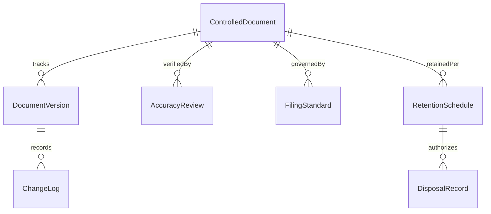
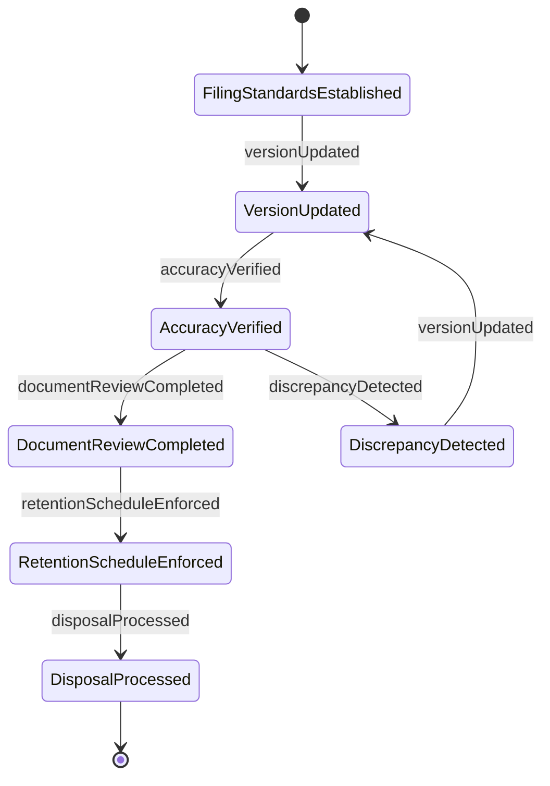
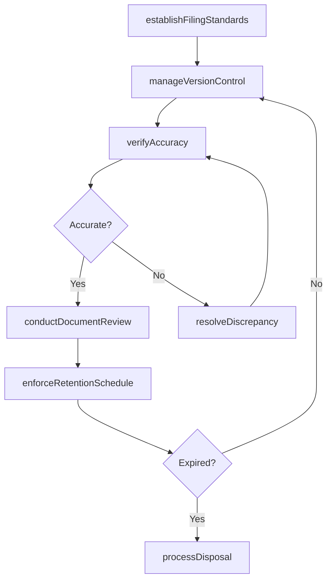
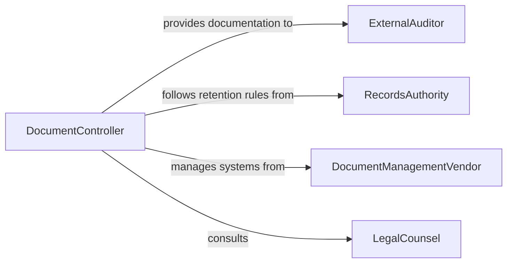

# Manage Documentation Ensure Organization Accuracy

> Business-as-Code definition for managing documentation to ensure organization or accuracy. Models the oversight of document control systems including version management, accuracy verification, filing standards, and records retention.

## Overview

Managing documentation to ensure organization or accuracy involves overseeing document control processes that maintain the integrity, accessibility, and correctness of business records. This definition provides actions for establishing filing standards, verifying document accuracy, managing version control, and enforcing retention schedules. It enables automation of document review cycles, version tracking, and retention policy enforcement workflows.

## Actors

| Actor | Description |
|-------|-------------|
| ExternalAuditor | Reviews documentation for compliance and accuracy during audits |
| RecordsAuthority | Sets government standards for document retention and disposal |
| DocumentManagementVendor | Provides systems and tools for electronic document management |
| LegalCounsel | Advises on documentation requirements for litigation and compliance |

## Roles

| Role | Description |
|------|-------------|
| DocumentController | Oversees document management policies and procedures |
| QualityReviewer | Verifies document accuracy and completeness |
| RecordsManager | Manages filing systems and retention schedules |
| VersionAdministrator | Controls document versions and change tracking |

## Entities

| Entity | Description |
|--------|-------------|
| ControlledDocument | A business record subject to version control and review cycles |
| DocumentVersion | A specific iteration of a controlled document with change history |
| FilingStandard | Rules governing document naming, categorization, and storage |
| AccuracyReview | A verification check confirming document content is correct |
| RetentionSchedule | Policy defining how long documents must be retained |
| ChangeLog | Record of modifications made to a controlled document |
| DisposalRecord | Documentation of authorized destruction of expired records |

## Actions

| Action | Description |
|--------|-------------|
| establishFilingStandards | Define rules for document naming, categorization, and storage |
| verifyAccuracy | Check document content against source data for correctness |
| manageVersionControl | Track and control document iterations and change history |
| enforceRetentionSchedule | Apply rules for document storage duration and disposal |
| conductDocumentReview | Perform periodic reviews to ensure documentation remains current |
| processDisposal | Authorize and execute destruction of expired documents |
| resolveDiscrepancy | Correct identified errors or inconsistencies in documentation |

## Events

| Event | Description |
|-------|-------------|
| filingStandardsEstablished | Document management rules have been defined |
| accuracyVerified | Document content has been confirmed as correct |
| versionUpdated | A new iteration of a controlled document has been recorded |
| retentionScheduleEnforced | Storage duration rules have been applied to documents |
| documentReviewCompleted | A periodic review has confirmed documentation currency |
| disposalProcessed | Expired documents have been authorized for destruction |
| discrepancyDetected | An error or inconsistency has been found in documentation |

## Searches

| Search | Description |
|--------|-------------|
| getControlledDocuments | Retrieve managed documents by type, department, or status |
| getVersionHistory | Check change history for a specific document |
| findExpiredDocuments | List documents past their retention period |
| getReviewSchedule | Retrieve upcoming document review dates |
| findDiscrepancies | List unresolved document errors or inconsistencies |


## Entity Relationships



## State Diagram



## Workflow



## Actor Relationships



## Usage

### Calling Actions

```typescript
import { manageDocumentationEnsureOrganizationAccuracy } from '@headlessly/manage-documentation-ensure-organization-accuracy'

const docs = manageDocumentationEnsureOrganizationAccuracy()

// Establish filing standards for a department
await docs.establishFilingStandards({
  department: 'quality-assurance',
  standards: {
    namingConvention: '{department}-{type}-{date}-{version}',
    categories: ['procedures', 'work-instructions', 'forms', 'records'],
    storageLocation: 'document-management-system'
  }
})

// Verify document accuracy
await docs.verifyAccuracy({
  documentId: 'QA-PROC-2026-001-v3',
  reviewer: 'quality-reviewer',
  checkAgainst: ['source-regulation', 'process-data', 'stakeholder-input']
})

// Check for expired documents
const expired = await docs.findExpiredDocuments({
  department: 'quality-assurance',
  retentionExceededBy: 30,
  unit: 'days'
})
```

### Event-Driven Automation

```typescript
// Alert on document discrepancies
docs.discrepancyDetected(async ({ documentId, issue, severity }) => {
  await notify({
    to: 'document-controller',
    message: `Discrepancy in ${documentId}: ${issue} (severity: ${severity})`
  })
})

// Auto-schedule reviews for updated documents
docs.versionUpdated(async ({ documentId, version, updatedBy }) => {
  await docs.conductDocumentReview({
    documentId,
    version,
    reviewers: ['quality-reviewer', 'department-head'],
    deadline: '30-days'
  })
})
```
