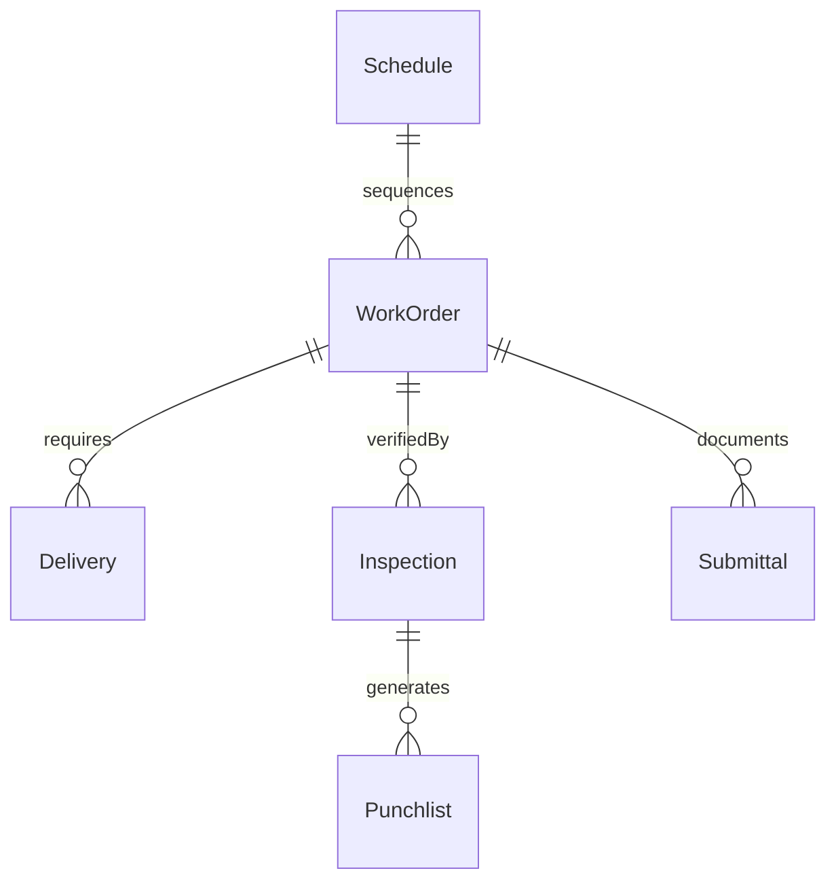
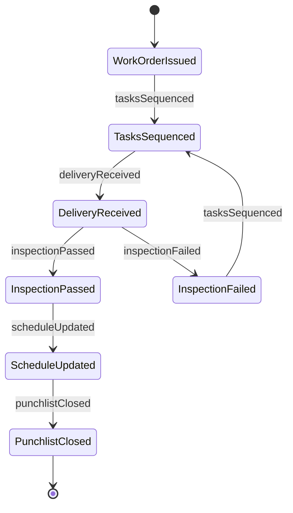
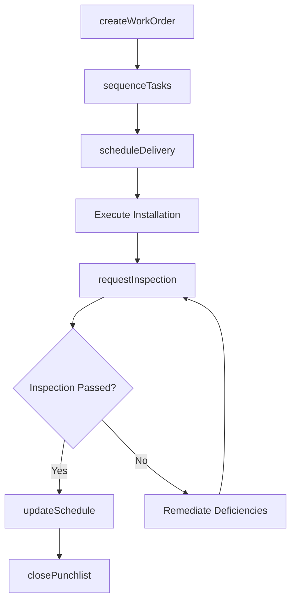
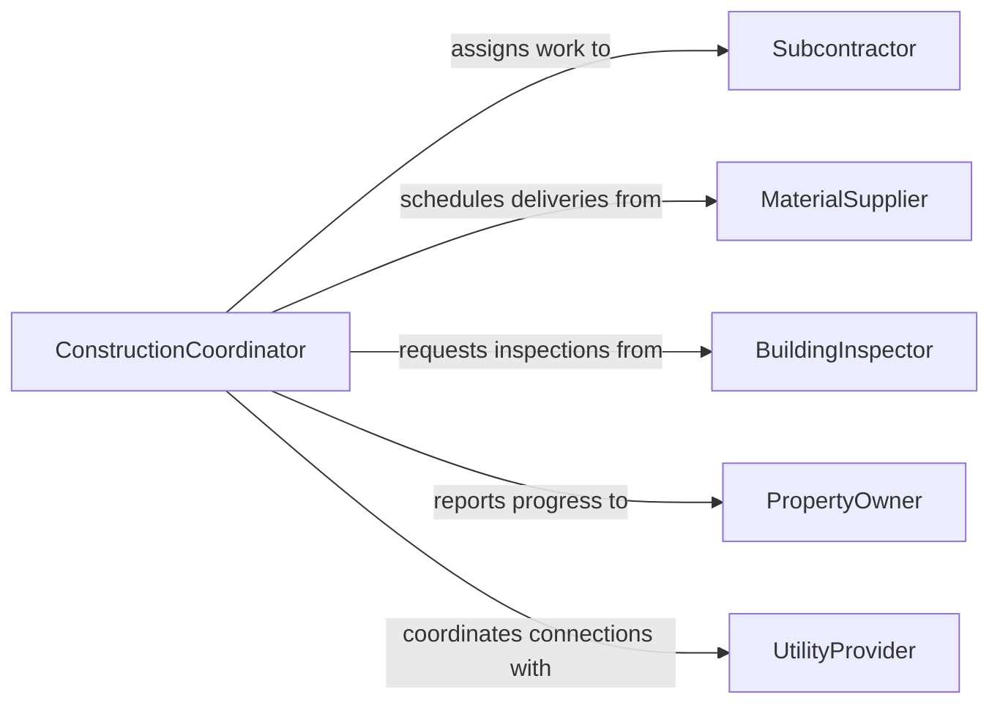

# Coordinate Construction Installation Activities

> Business-as-Code definition for coordinating construction or installation activities. Models the scheduling, resource alignment, and execution tracking of build and installation work across trades and project phases.

## Overview

Coordinating construction or installation activities involves synchronizing the efforts of multiple trade crews, subcontractors, and material deliveries to ensure work proceeds on schedule and within specifications. This includes sequencing tasks, resolving conflicts between overlapping scopes, and verifying that completed installations meet quality and code requirements. The process supports general contractors, construction managers, and facility owners in maintaining project momentum from mobilization through final commissioning.

## Actors

| Actor | Description |
|-------|-------------|
| Subcontractor | Trade-specific firms performing electrical, plumbing, HVAC, or structural work |
| MaterialSupplier | Vendors delivering building materials, fixtures, and components to site |
| BuildingInspector | Municipal or third-party officials verifying code compliance |
| PropertyOwner | The client or developer who owns the site and funds the project |
| UtilityProvider | Electric, gas, water, and telecom companies coordinating service connections |

## Roles

| Role | Description |
|------|-------------|
| ConstructionCoordinator | Manages day-to-day scheduling and sequencing of construction trades |
| SiteForeman | Supervises on-site crews and enforces safety and quality standards |
| ProjectEngineer | Reviews technical submittals and resolves design conflicts in the field |
| SchedulingManager | Maintains the master schedule and identifies critical path dependencies |

## Entities

| Entity | Description |
|--------|-------------|
| WorkOrder | A directive assigning specific construction or installation tasks to a crew |
| Schedule | The master project timeline with milestones and task dependencies |
| Inspection | A formal review verifying that completed work meets specifications |
| Submittal | Technical documentation or shop drawings submitted for approval |
| Delivery | A scheduled shipment of materials or equipment to the job site |
| Punchlist | A list of deficiencies identified during inspection that require correction |

## Actions

| Action | Description |
|--------|-------------|
| createWorkOrder | Issue a work directive for a specific construction or installation task |
| sequenceTasks | Arrange tasks in order based on dependencies and trade availability |
| scheduleDelivery | Coordinate material arrival with on-site readiness |
| requestInspection | Submit completed work for code or quality inspection |
| resolveConflict | Address scheduling or scope overlaps between trades |
| updateSchedule | Modify the master timeline based on progress or delays |
| closePunchlist | Verify all deficiency items have been corrected and approved |

## Events

| Event | Description |
|-------|-------------|
| workOrderIssued | A construction or installation task has been formally assigned |
| tasksSequenced | The task execution order has been established |
| deliveryReceived | Materials or equipment have arrived on site |
| inspectionPassed | Completed work has been verified as code-compliant |
| inspectionFailed | Work did not pass inspection and requires remediation |
| scheduleUpdated | The master project timeline has been revised |
| punchlistClosed | All deficiency items have been resolved and signed off |

## Searches

| Search | Description |
|--------|-------------|
| findWorkOrders | List work orders by trade, status, priority, or date range |
| getScheduleConflicts | Identify overlapping or dependent tasks at risk of delay |
| getInspectionResults | Retrieve inspection outcomes by phase, trade, or date |
| getPendingDeliveries | Find scheduled material shipments not yet received |


## Entity Relationships



## State Diagram



## Workflow



## Actor Relationships



## Usage

### Calling Actions

```typescript
import { coordinateConstructionInstallationActivities } from '@headlessly/coordinate-construction-installation-activities'

const coordination = coordinateConstructionInstallationActivities()

// Issue a work order for HVAC ductwork installation
const workOrder = await coordination.createWorkOrder({
  trade: 'HVAC',
  description: 'Install supply and return ductwork - Building A, Floors 2-4',
  subcontractorId: 'mech-contractors-inc',
  startDate: '2026-03-10',
  duration: '12 days'
})

// Sequence tasks with dependencies
await coordination.sequenceTasks({
  tasks: [
    { id: workOrder.id, dependsOn: ['framing-complete-bldg-a'] },
    { id: 'electrical-rough-in', dependsOn: [workOrder.id] }
  ]
})

// Request inspection after completion
await coordination.requestInspection({
  workOrderId: workOrder.id,
  inspectionType: 'mechanical-rough-in',
  requestedDate: '2026-03-24'
})
```

### Event-Driven Automation

```typescript
// Alert coordinator when inspection fails
coordination.inspectionFailed(async ({ workOrderId, deficiencies }) => {
  await notify({
    to: 'site-foreman',
    message: `Inspection failed for ${workOrderId}: ${deficiencies.length} items to correct`
  })
})

// Auto-update schedule when delivery is received
coordination.deliveryReceived(async ({ deliveryId, materialType }) => {
  await coordination.updateSchedule({
    trigger: 'material-arrived',
    materialType,
    status: 'ready-to-install'
  })
})
```
