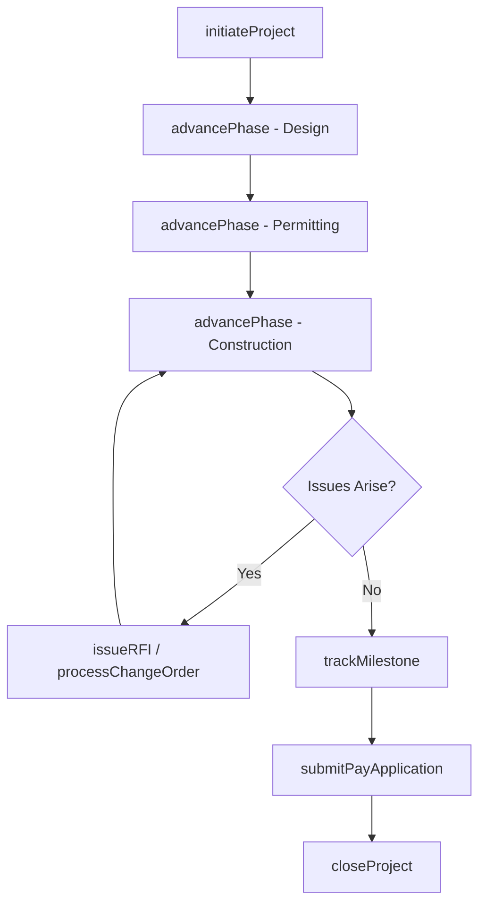
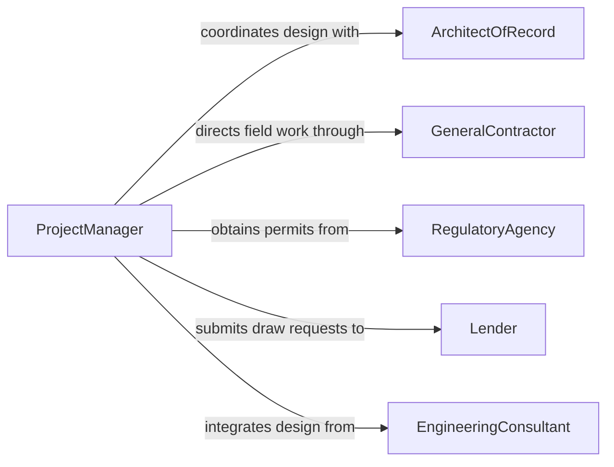

# Coordinate Construction Project Activities

> Business-as-Code definition for coordinating construction project activities. Models the orchestration of project phases, stakeholder communication, and resource management across the full construction lifecycle.

## Overview

Coordinating construction project activities encompasses managing the interplay between design, permitting, procurement, field operations, and closeout across a construction project. This requires aligning architects, engineers, contractors, and owners around shared timelines, budgets, and quality objectives. The definition supports project managers and owners' representatives in maintaining control over complex, multi-phase construction programs from groundbreaking through certificate of occupancy.

## Actors

| Actor | Description |
|-------|-------------|
| ArchitectOfRecord | Design firm producing construction documents and administering the design contract |
| GeneralContractor | Primary firm responsible for executing construction work on site |
| RegulatoryAgency | Permitting and zoning authorities reviewing plans and issuing approvals |
| Lender | Financial institution funding the project and requiring draw documentation |
| EngineeringConsultant | Structural, civil, or MEP engineers providing specialized design services |

## Roles

| Role | Description |
|------|-------------|
| ProjectManager | Oversees the entire project scope, budget, schedule, and stakeholder alignment |
| OwnersRepresentative | Acts on behalf of the property owner to monitor progress and quality |
| ContractAdministrator | Manages contracts, change orders, and payment applications |
| QualityManager | Ensures construction conforms to design documents and specifications |

## Entities

| Entity | Description |
|--------|-------------|
| Project | The overall construction undertaking with scope, budget, and timeline |
| Phase | A distinct stage of the project such as design, permitting, or construction |
| ChangeOrder | A formal modification to the project scope, cost, or schedule |
| PayApplication | A contractor's periodic request for payment based on completed work |
| RFI | A request for information seeking clarification on design documents |
| Milestone | A significant project checkpoint such as foundation completion or topping out |

## Actions

| Action | Description |
|--------|-------------|
| initiateProject | Establish the project with scope, budget, and key stakeholders |
| advancePhase | Transition the project from one phase to the next |
| issueRFI | Submit a request for information to resolve a design or field question |
| processChangeOrder | Evaluate, price, and approve a scope modification |
| submitPayApplication | Prepare and route a periodic payment request for review |
| trackMilestone | Record achievement of a significant project checkpoint |
| closeProject | Complete final inspections, punch lists, and project documentation |

## Events

| Event | Description |
|-------|-------------|
| projectInitiated | A new construction project has been formally established |
| phaseAdvanced | The project has transitioned to its next lifecycle phase |
| rfiIssued | A request for information has been submitted for resolution |
| changeOrderApproved | A scope modification has been reviewed and accepted |
| payApplicationApproved | A payment request has been validated and authorized |
| milestoneAchieved | A key project checkpoint has been reached |
| projectClosed | The project has been formally completed and handed over |

## Searches

| Search | Description |
|--------|-------------|
| findProjects | List projects by status, location, type, or date range |
| getOpenRFIs | Retrieve unresolved requests for information by project or discipline |
| getChangeOrders | Find change orders by project, status, or cost impact |
| getMilestoneStatus | Check progress against planned project milestones |

## Workflow



## Actor Relationships



## Usage

### Calling Actions

```typescript
import { coordinateConstructionProjectActivities } from '@headlessly/coordinate-construction-project-activities'

const project = coordinateConstructionProjectActivities()

// Establish a new mixed-use development project
const dev = await project.initiateProject({
  name: 'Riverfront Mixed-Use Development',
  type: 'commercial',
  budget: 28000000,
  estimatedDuration: '24 months',
  location: '450 Waterfront Drive'
})

// Move into construction phase
await project.advancePhase({
  projectId: dev.id,
  phase: 'construction',
  startDate: '2026-04-01',
  prerequisites: ['building-permit-issued', 'gmp-executed']
})

// Submit an RFI for a structural detail
await project.issueRFI({
  projectId: dev.id,
  subject: 'Foundation detail at grid line B-4',
  discipline: 'structural',
  assignedTo: 'structural-engineer'
})
```

### Event-Driven Automation

```typescript
// Notify lender when milestones are achieved for draw eligibility
project.milestoneAchieved(async ({ projectId, milestone }) => {
  if (milestone.drawEligible) {
    await notify({
      to: 'lender-contact',
      message: `Milestone "${milestone.name}" completed. Draw request eligible.`
    })
  }
})

// Flag overdue RFIs
project.rfiIssued(async ({ rfiId, dueDate }) => {
  await scheduleReminder({
    id: rfiId,
    alertDate: dueDate,
    message: 'RFI response overdue - escalate to design team'
  })
})
```
