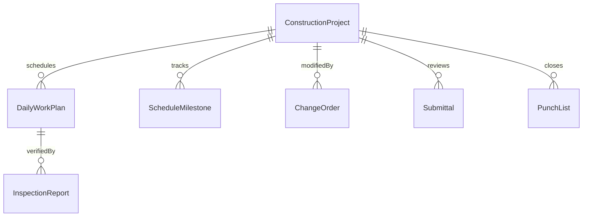
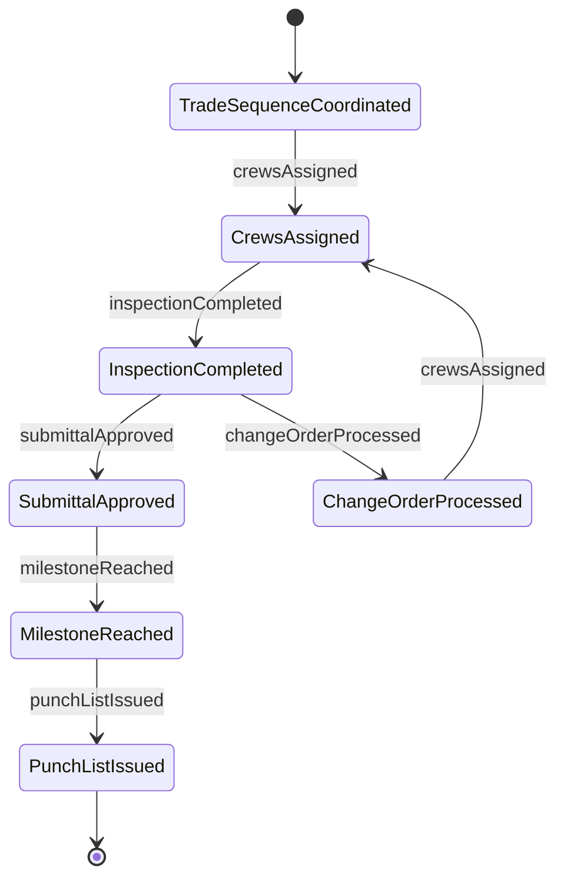
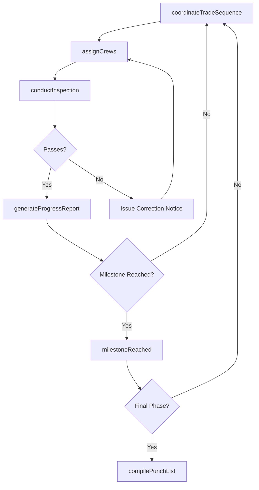
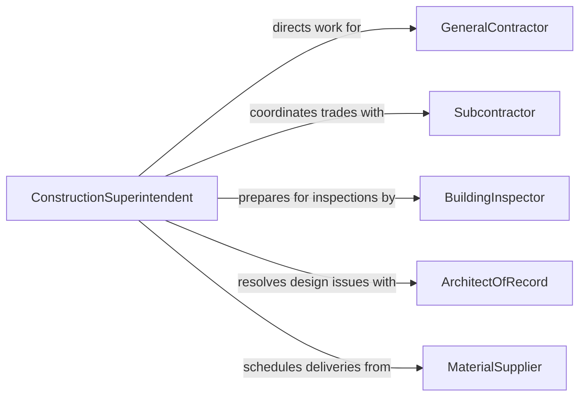

# Direct Construction Activities

> Business-as-Code definition for directing construction activities. Models the oversight of building projects from site mobilization through substantial completion, including crew management, trade coordination, quality inspections, and schedule adherence.

## Overview

Directing construction activities involves overseeing the on-site execution of building projects, coordinating trade crews, enforcing safety standards, managing material deliveries, and ensuring work meets specifications and schedules. This definition provides actions for assigning crews to tasks, scheduling trade work sequences, conducting quality inspections, managing daily field operations, and tracking project milestones. It enables automation of daily work planning, inspection scheduling, progress reporting, and safety compliance tracking.

## Actors

| Actor | Description |
|-------|-------------|
| GeneralContractor | Holds the prime contract and manages overall construction execution |
| Subcontractor | Provides specialized trade labor for specific construction disciplines |
| BuildingInspector | Conducts code compliance inspections on behalf of the jurisdiction |
| ArchitectOfRecord | Provides design clarifications and approves submittals |
| MaterialSupplier | Delivers construction materials, equipment, and components to site |
| ProjectOwner | Commissions the construction project and approves change orders |

## Roles

| Role | Description |
|------|-------------|
| ConstructionSuperintendent | Directs all on-site construction operations and crew coordination |
| ProjectManager | Manages scope, budget, and schedule for the construction project |
| SiteForeman | Supervises specific trade crews and daily work assignments |
| SafetyOfficer | Enforces OSHA compliance and conducts site safety inspections |
| QualityControlInspector | Verifies work meets plans, specifications, and code requirements |

## Entities

| Entity | Description |
|--------|-------------|
| ConstructionProject | A defined building effort with scope, budget, timeline, and deliverables |
| DailyWorkPlan | The schedule of tasks, crews, and materials for a single workday |
| InspectionReport | Documentation of a quality or code compliance review |
| ChangeOrder | A formal modification to the construction contract scope or cost |
| Submittal | Shop drawings, samples, or product data submitted for approval |
| PunchList | A list of deficiencies requiring correction before substantial completion |
| ScheduleMilestone | A critical date marking completion of a major construction phase |

## Actions

| Action | Description |
|--------|-------------|
| assignCrews | Designate trade teams to specific work areas and tasks |
| coordinateTradeSequence | Schedule the order of trade work to avoid conflicts |
| conductInspection | Perform quality or code compliance reviews of completed work |
| processChangeOrder | Evaluate, price, and authorize modifications to project scope |
| reviewSubmittal | Assess shop drawings and product data against specifications |
| generateProgressReport | Compile work completion status against the project schedule |
| compilePunchList | Document deficiencies requiring correction before closeout |

## Events

| Event | Description |
|-------|-------------|
| crewsAssigned | Trade teams have been designated to work areas and tasks |
| tradeSequenceCoordinated | The order of trade work has been scheduled |
| inspectionCompleted | A quality or code compliance review has been performed |
| changeOrderProcessed | A contract modification has been evaluated and authorized |
| submittalApproved | Shop drawings or product data have been accepted |
| milestoneReached | A major construction phase has been completed |
| punchListIssued | Deficiencies have been documented for correction |

## Searches

| Search | Description |
|--------|-------------|
| getDailyWorkPlan | Retrieve the task schedule for a specific date and work area |
| getInspectionResults | List inspection outcomes by type, trade, or date |
| findOpenChangeOrders | Check pending contract modifications by status or value |
| getSubmittalStatus | Track approval progress for shop drawings and product data |
| getProjectSchedule | Retrieve milestone dates and completion percentages |


## Entity Relationships



## State Diagram



## Workflow



## Actor Relationships



## Usage

### Calling Actions

```typescript
import { directConstructionActivities } from '@headlessly/direct-construction-activities'

const construction = directConstructionActivities()

// Assign crews for the day
await construction.assignCrews({
  project: 'riverside-office-tower',
  date: '2026-04-15',
  assignments: [
    { crew: 'structural-steel-team-A', area: 'floors-12-14', task: 'beam-erection' },
    { crew: 'electrical-team-B', area: 'floors-8-10', task: 'rough-in-conduit' },
    { crew: 'concrete-team-C', area: 'parking-level-2', task: 'slab-pour' }
  ]
})

// Conduct a quality inspection
const inspection = await construction.conductInspection({
  project: 'riverside-office-tower',
  type: 'structural-steel',
  area: 'floor-11',
  inspector: 'qc-inspector-martinez',
  checklist: ['bolt-torque-values', 'weld-quality', 'beam-alignment']
})

// Generate weekly progress report
const report = await construction.generateProgressReport({
  project: 'riverside-office-tower',
  period: '2026-04-W3',
  includePhotos: true,
  includeWeatherDelays: true
})
```

### Event-Driven Automation

```typescript
// Notify project manager on milestone completion
construction.milestoneReached(async ({ project, milestone, completionDate }) => {
  await notify({
    to: 'project-manager',
    message: `Milestone achieved on ${project}: ${milestone} completed on ${completionDate}`
  })
})

// Auto-schedule inspection when trade sequence completes
construction.tradeSequenceCoordinated(async ({ project, trade, area }) => {
  await construction.conductInspection({
    project,
    type: trade,
    area,
    inspector: 'qc-inspector-on-duty',
    checklist: 'standard'
  })
})
```
