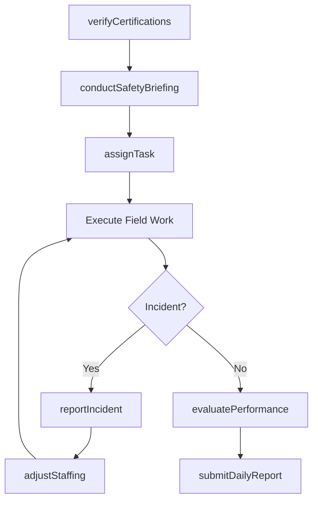
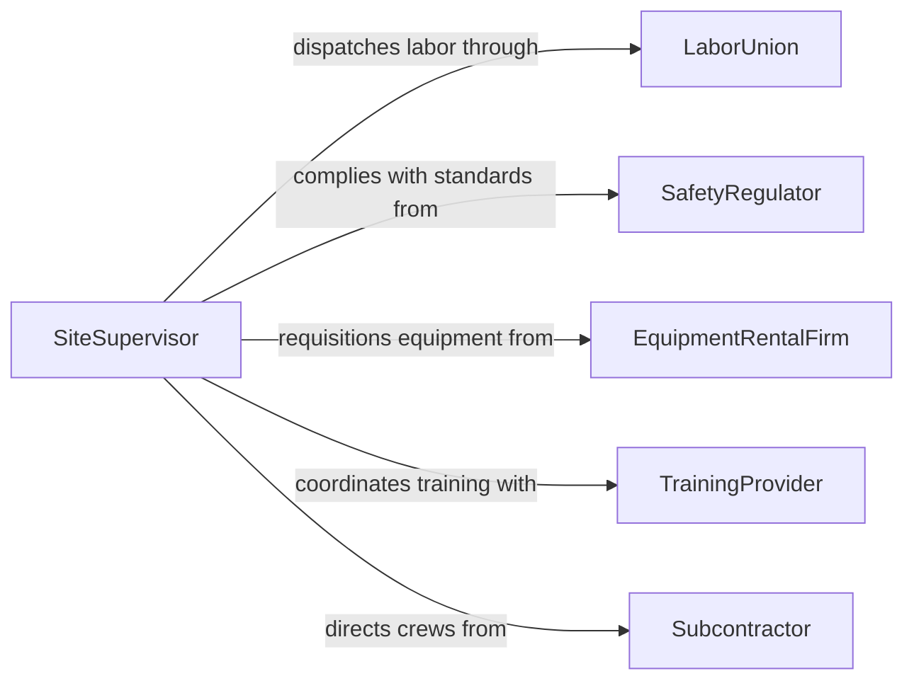

# Direct Construction Extraction Personnel

> Business-as-Code definition for directing construction or extraction personnel. Models the supervision, task assignment, performance management, and safety oversight of field crews in construction and extraction operations.

## Overview

Directing construction or extraction personnel involves assigning work tasks, supervising crew performance, enforcing safety protocols, and managing the daily workforce on job sites. This covers construction trades such as carpentry, masonry, and ironwork, as well as extraction operations including mining, drilling, and quarrying. The process ensures that field personnel execute work according to plans, maintain productivity targets, and comply with occupational health and safety regulations.

## Actors

| Actor | Description |
|-------|-------------|
| LaborUnion | Organized labor representatives negotiating work conditions and dispatching skilled trades |
| SafetyRegulator | OSHA or equivalent agencies enforcing workplace safety standards |
| EquipmentRentalFirm | Companies providing heavy machinery, tools, and specialized extraction equipment |
| TrainingProvider | Certification and skills training organizations for construction and extraction trades |
| Subcontractor | External trade firms supplying specialized labor crews |

## Roles

| Role | Description |
|------|-------------|
| SiteSupervisor | Directs daily field operations and crew assignments on the job site |
| CrewLeader | Leads a specific trade or extraction crew and reports to the site supervisor |
| SafetyManager | Implements and monitors safety programs, conducts toolbox talks and incident investigations |
| LaborCoordinator | Manages workforce scheduling, dispatch, and labor compliance |

## Entities

| Entity | Description |
|--------|-------------|
| CrewMember | An individual worker assigned to a construction or extraction crew |
| TaskAssignment | A specific work directive given to a crew or individual for a shift |
| SafetyIncident | A recorded workplace injury, near-miss, or safety violation |
| DailyReport | A log of work performed, hours, weather, and site conditions for the day |
| Certification | A trade license or safety credential held by a worker |
| Crew | A grouped team of workers organized by trade or function |

## Actions

| Action | Description |
|--------|-------------|
| assignTask | Delegate a specific work activity to a crew or crew member |
| conductSafetyBriefing | Deliver a pre-shift toolbox talk covering hazards and precautions |
| evaluatePerformance | Assess crew or individual productivity and work quality |
| reportIncident | Document a safety incident, near-miss, or violation |
| adjustStaffing | Modify crew composition based on workload or absenteeism |
| verifyCertifications | Confirm workers hold required licenses and safety credentials |
| submitDailyReport | File the end-of-day summary of site activities and progress |

## Events

| Event | Description |
|-------|-------------|
| taskAssigned | A work activity has been delegated to a crew or individual |
| safetyBriefingCompleted | A pre-shift safety talk has been delivered and acknowledged |
| performanceEvaluated | A crew or worker performance review has been completed |
| incidentReported | A safety incident or near-miss has been documented |
| staffingAdjusted | Crew composition has been modified for the shift or project |
| certificationVerified | A worker's trade or safety credentials have been confirmed |
| dailyReportSubmitted | The end-of-day site activity log has been filed |

## Searches

| Search | Description |
|--------|-------------|
| findCrewMembers | List workers by trade, certification, availability, or crew assignment |
| getTaskAssignments | Retrieve task directives by crew, date, status, or priority |
| getIncidentHistory | Look up safety incidents by site, severity, or date range |
| getDailyReports | Find daily site reports by date, supervisor, or project |

## Workflow



## Actor Relationships



## Usage

### Calling Actions

```typescript
import { directConstructionExtractionPersonnel } from '@headlessly/direct-construction-extraction-personnel'

const personnel = directConstructionExtractionPersonnel()

// Verify worker certifications before shift
const verified = await personnel.verifyCertifications({
  crewId: 'steel-crew-alpha',
  requiredCerts: ['ironworker-journeyman', 'osha-30', 'fall-protection']
})

// Conduct morning safety briefing
await personnel.conductSafetyBriefing({
  crewId: 'steel-crew-alpha',
  topic: 'Fall protection and steel erection hazards',
  date: '2026-04-14',
  attendees: verified.members
})

// Assign tasks for the day
await personnel.assignTask({
  crewId: 'steel-crew-alpha',
  description: 'Erect structural steel columns - Grid D through G, Level 3',
  priority: 'high',
  estimatedHours: 8
})
```

### Event-Driven Automation

```typescript
// Escalate safety incidents immediately
personnel.incidentReported(async ({ incidentId, severity, siteId }) => {
  if (severity === 'serious') {
    await notify({
      to: ['safety-manager', 'project-director'],
      message: `Serious incident reported at site ${siteId}. Immediate review required.`
    })
    await pauseOperations({ siteId, reason: incidentId })
  }
})

// Flag expired certifications
personnel.certificationVerified(async ({ crewMemberId, expiring }) => {
  if (expiring.length > 0) {
    await notify({
      to: 'labor-coordinator',
      message: `${crewMemberId} has ${expiring.length} certifications expiring within 30 days`
    })
  }
})
```
