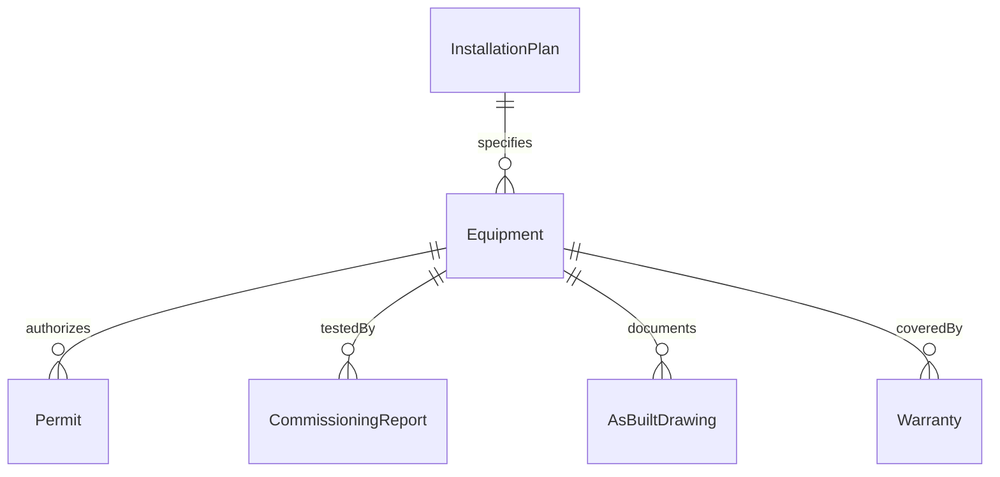
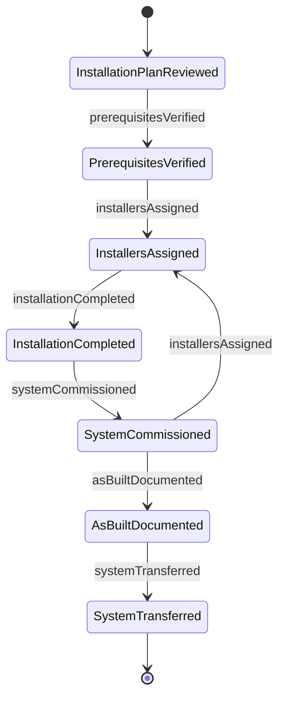
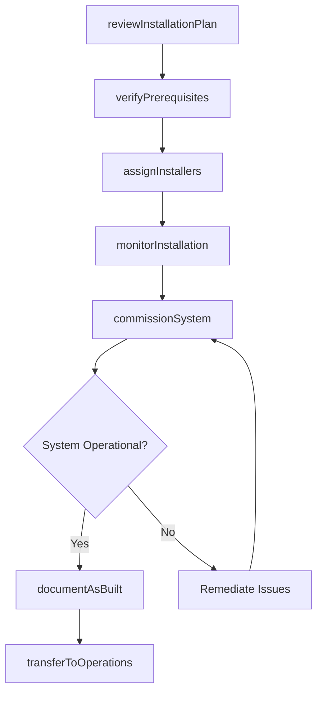
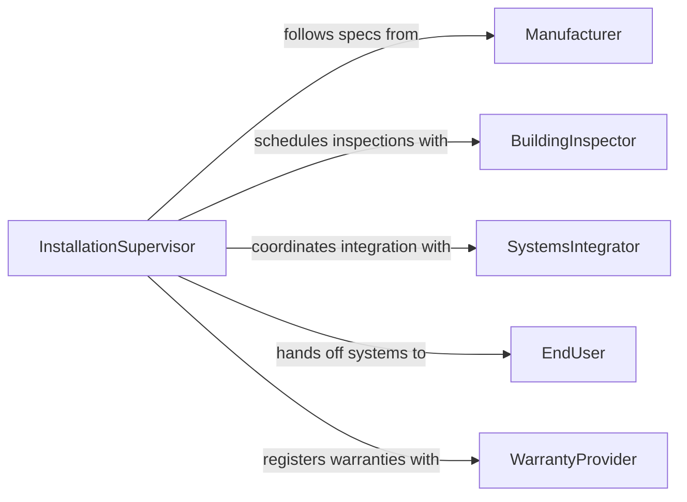

# Direct Installation Activities

> Business-as-Code definition for directing installation activities. Models the planning, supervision, and quality assurance of installing systems, equipment, and components across building trades and industrial settings.

## Overview

Directing installation activities involves overseeing the placement, connection, and commissioning of mechanical, electrical, plumbing, HVAC, telecommunications, and specialty systems within structures or facilities. This includes reviewing installation plans, assigning installation crews, verifying compliance with manufacturer specifications and building codes, and managing the testing and handoff of installed systems. The definition supports installation managers, trade supervisors, and facilities teams in delivering properly installed and functioning systems.

## Actors

| Actor | Description |
|-------|-------------|
| Manufacturer | Equipment and system producers providing installation specifications and warranties |
| BuildingInspector | Code enforcement officials verifying installations meet regulatory requirements |
| SystemsIntegrator | Specialists coordinating interoperability between installed systems |
| EndUser | The facility occupant or operator who will use the installed systems |
| WarrantyProvider | Entities covering defects and performance guarantees for installed equipment |

## Roles

| Role | Description |
|------|-------------|
| InstallationSupervisor | Oversees all installation crews and ensures work follows specifications |
| TradeTechnician | Skilled worker performing hands-on installation of specific systems |
| CommissioningAgent | Tests and verifies that installed systems operate as designed |
| DocumentationSpecialist | Maintains as-built drawings, manuals, and warranty records |

## Entities

| Entity | Description |
|--------|-------------|
| InstallationPlan | Detailed instructions for placing and connecting a system or component |
| Equipment | A specific piece of machinery, fixture, or system being installed |
| CommissioningReport | Documentation of system testing, calibration, and performance verification |
| AsBuiltDrawing | Updated construction drawings reflecting actual installed conditions |
| Permit | A regulatory authorization required before installation work may begin |
| Warranty | A manufacturer or contractor guarantee covering installed equipment |

## Actions

| Action | Description |
|--------|-------------|
| reviewInstallationPlan | Evaluate installation specifications and identify prerequisites |
| assignInstallers | Allocate qualified technicians to specific installation tasks |
| verifyPrerequisites | Confirm site readiness, permits, and material availability before work begins |
| monitorInstallation | Track progress and quality of installation work in real time |
| commissionSystem | Test and verify that the installed system operates per design specifications |
| documentAsBuilt | Record actual installed conditions and update construction drawings |
| transferToOperations | Hand off the installed system to the end user with training and documentation |

## Events

| Event | Description |
|-------|-------------|
| installationPlanReviewed | Installation specifications have been evaluated and approved |
| installersAssigned | Qualified technicians have been allocated to installation tasks |
| prerequisitesVerified | Site readiness and permit requirements have been confirmed |
| installationCompleted | Physical installation of the system or equipment is finished |
| systemCommissioned | The installed system has been tested and verified as operational |
| asBuiltDocumented | As-built drawings and records have been updated |
| systemTransferred | The installed system has been handed off to operations |

## Searches

| Search | Description |
|--------|-------------|
| findInstallations | List installation activities by system type, status, or location |
| getCommissioningResults | Retrieve testing and performance data by system or date |
| getPendingPermits | Find installations awaiting regulatory approval to proceed |
| getWarrantyStatus | Check warranty coverage and expiration for installed equipment |


## Entity Relationships



## State Diagram



## Workflow



## Actor Relationships



## Usage

### Calling Actions

```typescript
import { directInstallationActivities } from '@headlessly/direct-installation-activities'

const installations = directInstallationActivities()

// Review the HVAC installation plan for a commercial building
const plan = await installations.reviewInstallationPlan({
  systemType: 'HVAC',
  building: 'Corporate Tower B',
  floors: [1, 2, 3, 4],
  specifications: 'carrier-rooftop-unit-50xc'
})

// Assign qualified installers
await installations.assignInstallers({
  planId: plan.id,
  technicians: [
    { id: 'tech-042', trade: 'hvac', certification: 'epa-608-universal' },
    { id: 'tech-078', trade: 'hvac', certification: 'epa-608-universal' }
  ],
  startDate: '2026-05-12'
})

// Commission the system after installation
const report = await installations.commissionSystem({
  planId: plan.id,
  tests: ['airflow-balance', 'refrigerant-charge', 'controls-sequence'],
  inspector: 'commissioning-agent-01'
})
```

### Event-Driven Automation

```typescript
// Notify end user when system is ready for handoff
installations.systemCommissioned(async ({ planId, systemType, building }) => {
  await notify({
    to: 'facilities-manager',
    message: `${systemType} system in ${building} commissioned and ready for operations handoff`
  })
})

// Auto-register warranty upon completion
installations.installationCompleted(async ({ equipmentId, manufacturer }) => {
  await installations.documentAsBuilt({ equipmentId })
  await registerWarranty({
    equipmentId,
    manufacturer,
    activationDate: new Date().toISOString()
  })
})
```
