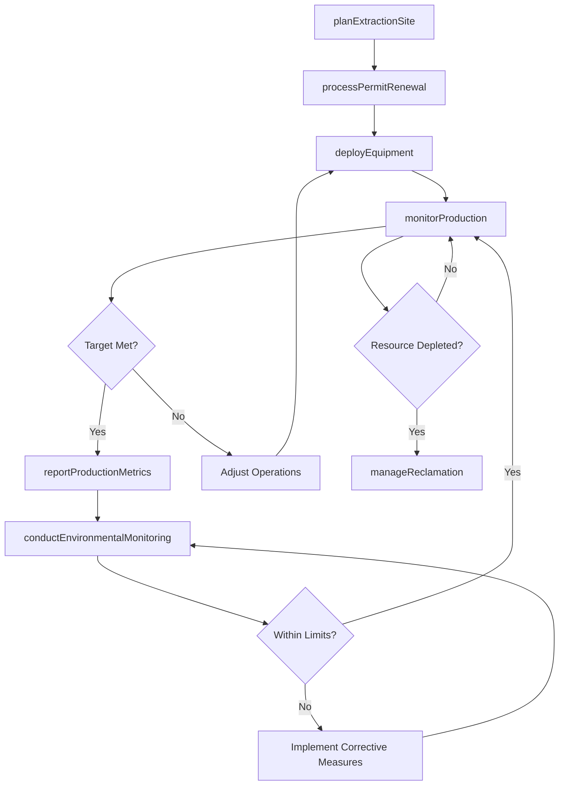
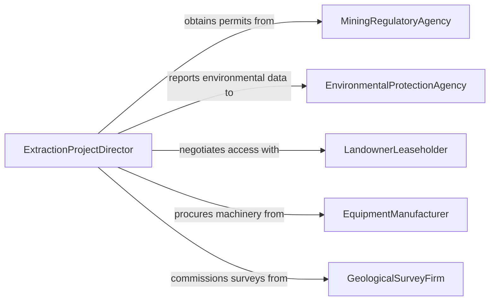

# Direct Natural Resources Extraction Projects

> Business-as-Code definition for directing natural resources extraction projects. Models the oversight of mining, drilling, quarrying, and timber harvesting operations including site planning, equipment deployment, production monitoring, and environmental compliance.

## Overview

Directing natural resources extraction projects involves overseeing the planning, permitting, execution, and reclamation of operations that extract minerals, petroleum, natural gas, timber, and aggregate materials. This definition provides actions for planning extraction sites, deploying equipment and crews, monitoring production output, enforcing environmental safeguards, and managing reclamation activities. It enables automation of production tracking, equipment maintenance scheduling, environmental monitoring alerts, and regulatory reporting workflows.

## Actors

| Actor | Description |
|-------|-------------|
| MiningRegulatoryAgency | Enforces extraction permits, safety standards, and reclamation requirements |
| EnvironmentalProtectionAgency | Monitors environmental impact and enforces pollution controls |
| LandownerLeaseholder | Grants surface or mineral rights access for extraction operations |
| EquipmentManufacturer | Provides heavy machinery, drilling rigs, and extraction equipment |
| GeologicalSurveyFirm | Conducts subsurface analysis and resource estimation studies |
| TransportationCarrier | Hauls extracted materials from site to processing or market |

## Roles

| Role | Description |
|------|-------------|
| ExtractionProjectDirector | Oversees all aspects of the extraction operation from planning through reclamation |
| MineSuperintendent | Directs daily mining or quarrying operations and crew assignments |
| DrillingEngineer | Plans and supervises well drilling and completion activities |
| EnvironmentalComplianceManager | Ensures extraction operations meet environmental regulations |
| ProductionEngineer | Optimizes extraction rates and monitors resource recovery efficiency |

## Entities

| Entity | Description |
|--------|-------------|
| ExtractionSite | A permitted location where natural resources are being removed |
| ExtractionPermit | Government authorization to conduct resource removal operations |
| ProductionLog | Daily record of extracted volumes, equipment utilization, and downtime |
| ResourceEstimate | Geological assessment of the quantity and quality of recoverable resources |
| ReclamationPlan | A documented strategy for restoring land after extraction is complete |
| EquipmentDeployment | Assignment of heavy machinery to specific extraction tasks and locations |
| EnvironmentalMonitoringReport | Data collected on air, water, and soil conditions around the extraction site |

## Actions

| Action | Description |
|--------|-------------|
| planExtractionSite | Design the layout and phasing for a new extraction operation |
| deployEquipment | Assign heavy machinery and rigs to extraction tasks and zones |
| monitorProduction | Track daily extraction volumes and resource recovery rates |
| conductEnvironmentalMonitoring | Collect and analyze air, water, and soil data around the site |
| manageReclamation | Oversee land restoration activities during and after extraction |
| processPermitRenewal | Prepare and submit documentation for extraction permit continuation |
| reportProductionMetrics | Compile output, efficiency, and cost data for stakeholder review |

## Events

| Event | Description |
|-------|-------------|
| extractionSitePlanned | The layout and phasing for a new operation have been designed |
| equipmentDeployed | Heavy machinery has been assigned to extraction zones |
| productionTargetMet | Daily or periodic extraction volumes have reached planned levels |
| productionShortfall | Extraction output has fallen below expected targets |
| environmentalThresholdExceeded | Monitoring data has exceeded permitted levels |
| reclamationMilestoneReached | A phase of land restoration has been completed |
| permitRenewalProcessed | Extraction permit continuation documentation has been submitted |

## Searches

| Search | Description |
|--------|-------------|
| getExtractionSites | List active extraction operations by resource type or region |
| getProductionLogs | Retrieve daily output records by site, period, or resource |
| getEquipmentStatus | Check machinery assignments, utilization, and maintenance schedules |
| getEnvironmentalData | Retrieve monitoring results by site, parameter, or date range |
| getReclamationProgress | Check land restoration status by site and phase |

## Workflow



## Actor Relationships



## Usage

### Calling Actions

```typescript
import { directNaturalResourcesExtractionProjects } from '@headlessly/direct-natural-resources-extraction-projects'

const extraction = directNaturalResourcesExtractionProjects()

// Plan a new extraction site
const site = await extraction.planExtractionSite({
  name: 'Eagle Mountain Quarry Phase 3',
  resourceType: 'limestone-aggregate',
  estimatedReserves: { volume: '2.5-million-tons', grade: 'high-purity' },
  phases: [
    { phase: 1, area: 'north-face', duration: '18-months' },
    { phase: 2, area: 'east-bench', duration: '24-months' }
  ]
})

// Deploy equipment to the site
await extraction.deployEquipment({
  siteId: site.id,
  assignments: [
    { equipment: 'cat-390f-excavator', zone: 'north-face', task: 'overburden-removal' },
    { equipment: 'sandvik-dr416i-drill', zone: 'north-face', task: 'blast-hole-drilling' },
    { equipment: 'komatsu-hd785-haul-truck', zone: 'haul-road', task: 'material-transport' }
  ]
})

// Monitor production output
const production = await extraction.getProductionLogs({
  siteId: site.id,
  period: '2026-04',
  metrics: ['tons-extracted', 'equipment-utilization', 'cost-per-ton']
})
```

### Event-Driven Automation

```typescript
// Alert on environmental threshold exceedance
extraction.environmentalThresholdExceeded(async ({ siteId, parameter, value, limit }) => {
  await notify({
    to: 'environmental-compliance-manager',
    message: `Environmental alert at site ${siteId}: ${parameter} at ${value} exceeds limit of ${limit}. Immediate corrective action required.`,
    priority: 'critical'
  })
})

// Auto-report when production targets are met
extraction.productionTargetMet(async ({ siteId, period, actualOutput, targetOutput }) => {
  await extraction.reportProductionMetrics({
    siteId,
    period,
    metrics: { actual: actualOutput, target: targetOutput, efficiency: (actualOutput / targetOutput * 100).toFixed(1) + '%' }
  })
})
```
