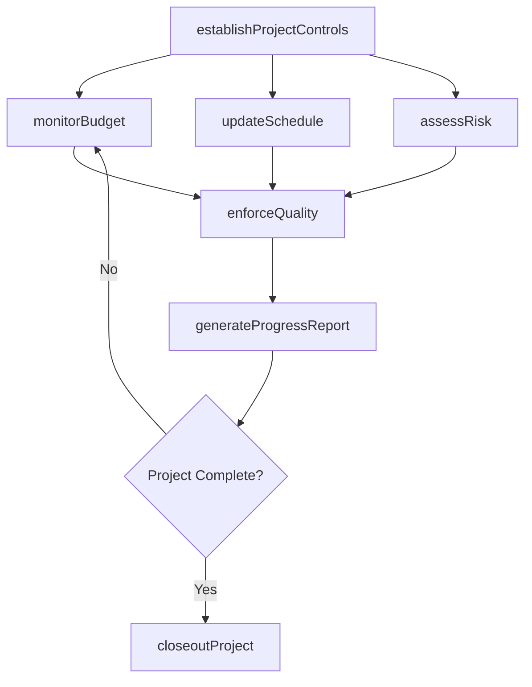
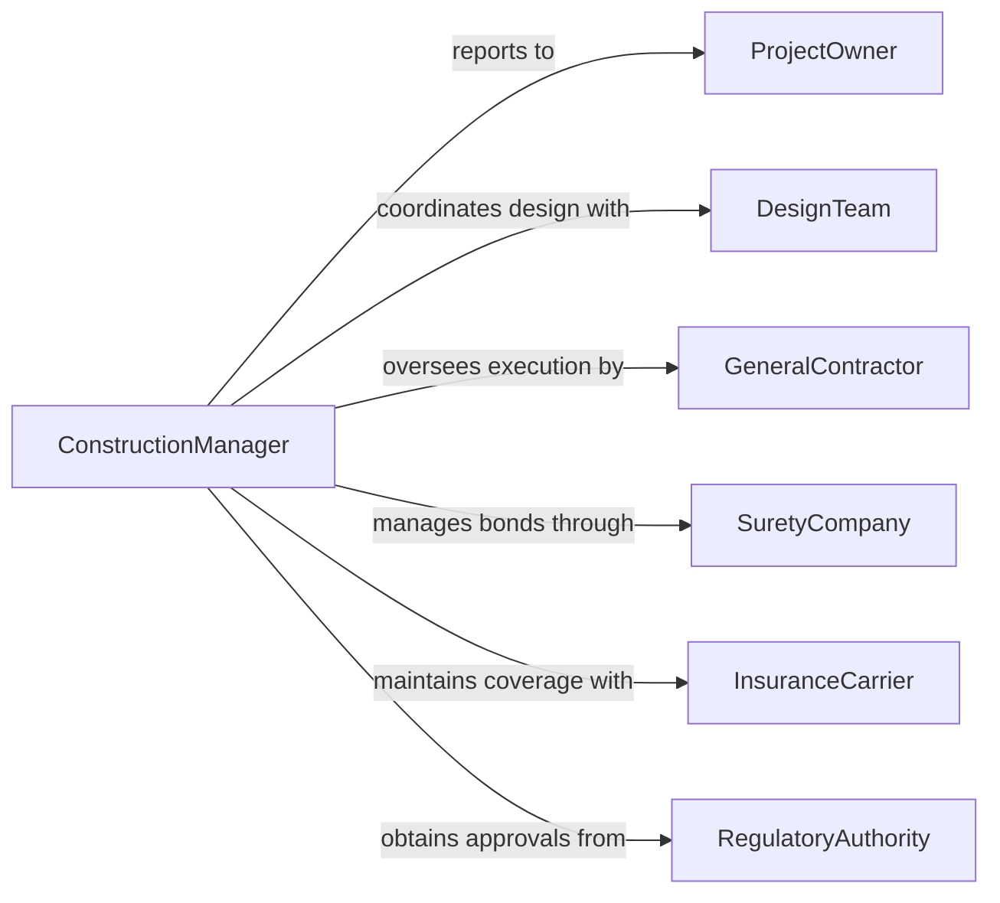

# Manage Construction Activities

> Business-as-Code definition for managing construction activities. Models the comprehensive oversight of construction operations including budgeting, scheduling, quality control, risk management, and stakeholder reporting.

## Overview

Managing construction activities encompasses the high-level direction of all building, renovation, or infrastructure work from project inception through substantial completion and closeout. This involves establishing project controls, monitoring budgets and schedules, managing risk, ensuring quality standards, and reporting to stakeholders. The definition supports construction managers, program directors, and owners in maintaining strategic oversight while delegating day-to-day execution to field supervisors and trade contractors.

## Actors

| Actor | Description |
|-------|-------------|
| ProjectOwner | The entity funding the construction project and defining requirements |
| DesignTeam | Architects, engineers, and consultants producing construction documents |
| GeneralContractor | The primary firm executing construction work under contract |
| SuretyCompany | Bonding company guaranteeing contractor performance and payment obligations |
| InsuranceCarrier | Provider of builders risk, general liability, and workers compensation coverage |
| RegulatoryAuthority | Government agencies issuing permits, conducting inspections, and enforcing codes |

## Roles

| Role | Description |
|------|-------------|
| ConstructionManager | Directs overall construction program strategy, budget, and reporting |
| ProjectControls | Monitors cost, schedule, and earned value metrics across the project |
| RiskManager | Identifies, assesses, and mitigates project risks and exposures |
| QualityDirector | Establishes and enforces quality assurance and quality control programs |

## Entities

| Entity | Description |
|--------|-------------|
| ConstructionProject | The overall building or infrastructure undertaking being managed |
| Budget | The approved cost plan with contingency and allowance allocations |
| Schedule | The critical path method timeline governing project execution |
| RiskRegister | A log of identified risks with probability, impact, and mitigation plans |
| QualityPlan | Standards and procedures governing construction workmanship and materials |
| ProgressReport | Periodic summary of project status, cost, schedule, and issues |

## Actions

| Action | Description |
|--------|-------------|
| establishProjectControls | Set up cost, schedule, and quality baseline metrics for the project |
| monitorBudget | Track actual costs against the approved budget and forecast at completion |
| updateSchedule | Revise the project timeline based on progress and emerging conditions |
| assessRisk | Evaluate project risks and update mitigation strategies |
| enforceQuality | Conduct quality reviews and enforce compliance with the quality plan |
| generateProgressReport | Compile and distribute periodic project status summaries |
| closeoutProject | Complete final documentation, warranties, and financial reconciliation |

## Events

| Event | Description |
|-------|-------------|
| projectControlsEstablished | Baseline cost, schedule, and quality metrics have been set |
| budgetVarianceDetected | Actual spending has deviated from the approved budget beyond threshold |
| scheduleDelayIdentified | A critical path activity has fallen behind the planned timeline |
| riskMitigated | A project risk has been successfully addressed or transferred |
| qualityNonconformanceFound | Work or materials failed to meet quality plan requirements |
| progressReportPublished | A periodic status summary has been distributed to stakeholders |
| projectClosedOut | Final documentation and financial reconciliation are complete |

## Searches

| Search | Description |
|--------|-------------|
| findProjects | List construction projects by type, status, location, or manager |
| getBudgetStatus | Retrieve current budget vs. actual cost data by project or category |
| getOpenRisks | Find active risks by project, severity, or mitigation status |
| getQualityIssues | List quality nonconformances by trade, severity, or resolution status |

## Workflow



## Actor Relationships



## Usage

### Calling Actions

```typescript
import { manageConstructionActivities } from '@headlessly/manage-construction-activities'

const construction = manageConstructionActivities()

// Establish project controls for a new hospital wing
const project = await construction.establishProjectControls({
  name: 'Memorial Hospital West Wing Expansion',
  budget: 45000000,
  duration: '30 months',
  qualityStandard: 'OSHPD-3',
  startDate: '2026-02-01'
})

// Monitor budget performance
const budgetStatus = await construction.monitorBudget({
  projectId: project.id,
  period: '2026-Q2',
  includeForecasts: true
})

// Generate monthly progress report
await construction.generateProgressReport({
  projectId: project.id,
  reportDate: '2026-06-30',
  sections: ['cost', 'schedule', 'quality', 'safety', 'risks'],
  distribution: ['owner', 'design-team', 'lender']
})
```

### Event-Driven Automation

```typescript
// Alert stakeholders on budget variance
construction.budgetVarianceDetected(async ({ projectId, category, variance }) => {
  if (Math.abs(variance.percentage) > 10) {
    await notify({
      to: ['construction-manager', 'project-owner'],
      message: `Budget variance of ${variance.percentage}% in ${category} on project ${projectId}`
    })
  }
})

// Escalate schedule delays on critical path
construction.scheduleDelayIdentified(async ({ projectId, activity, daysLate }) => {
  if (daysLate > 5) {
    await escalate({
      to: 'construction-manager',
      subject: `Critical path delay: ${activity} is ${daysLate} days behind`,
      projectId
    })
  }
})
```
