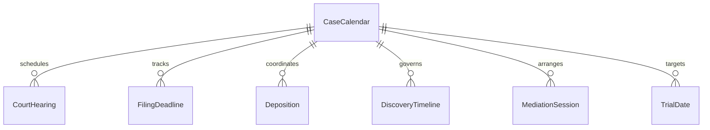
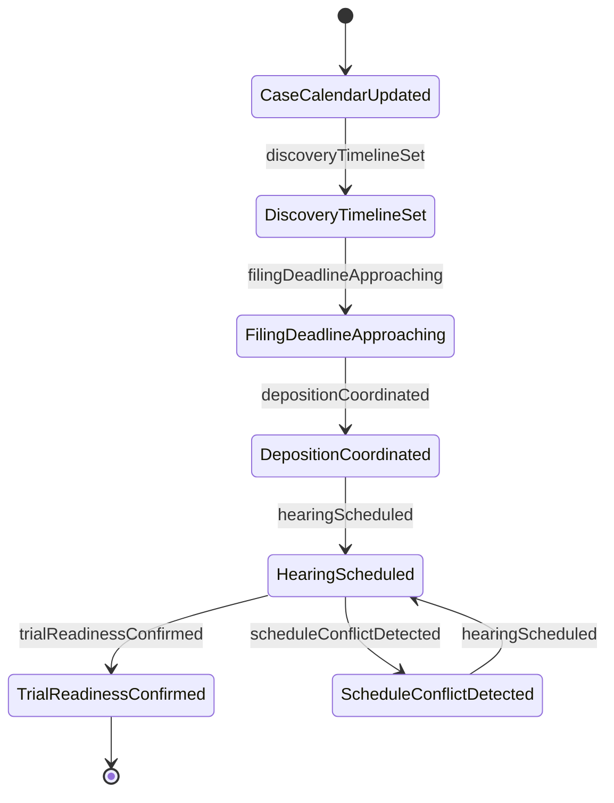
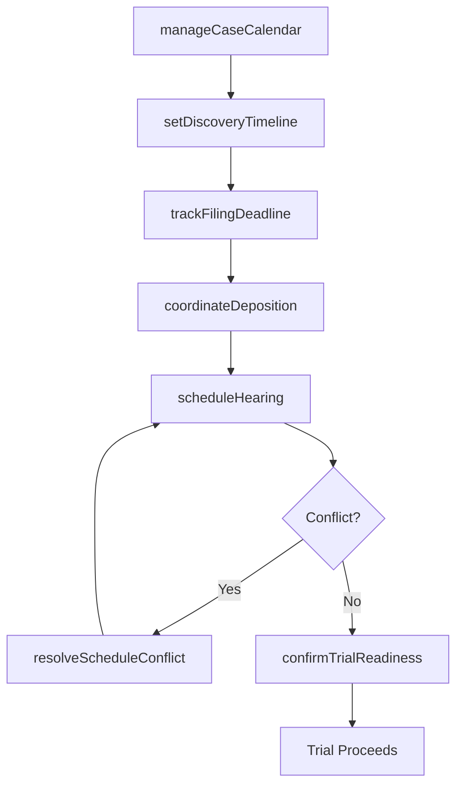
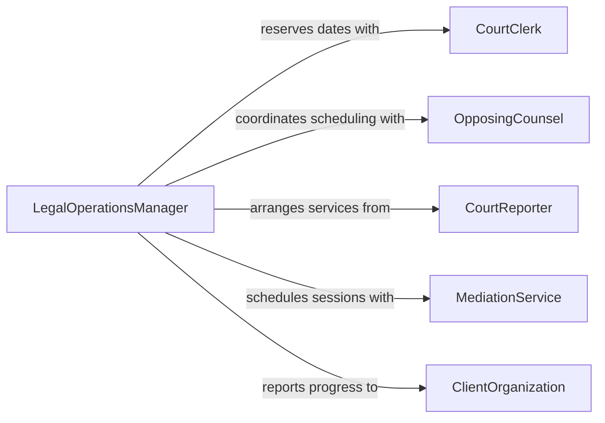

# Coordinate Legal Schedules Activities

> Business-as-Code definition for coordinating legal schedules or activities. Models the management of court calendars, hearing scheduling, filing deadlines, deposition coordination, and legal team workflow across litigation and transactional matters.

## Overview

Coordinating legal schedules or activities involves managing the complex calendaring of court appearances, filing deadlines, depositions, mediations, and internal legal team workflows. This definition provides actions for scheduling hearings, tracking statutory deadlines, coordinating attorney availability, managing discovery timelines, and monitoring case milestones. It enables automation of deadline alerting, calendar conflict resolution, filing reminder notifications, and case progress tracking workflows.

## Actors

| Actor | Description |
|-------|-------------|
| CourtClerk | Manages the official court calendar and hearing assignments |
| OpposingCounsel | Coordinates scheduling of depositions and joint filings |
| CourtReporter | Provides transcription services for depositions and hearings |
| MediationService | Schedules and facilitates alternative dispute resolution sessions |
| ClientOrganization | Requires updates on case schedules and milestone progress |

## Roles

| Role | Description |
|------|-------------|
| LegalOperationsManager | Oversees scheduling and workflow for the legal department |
| LitigationParalegal | Manages case calendars, filings, and discovery deadlines |
| ManagingAttorney | Prioritizes case work and approves scheduling commitments |
| DocketClerk | Tracks court-imposed deadlines and filing requirements |
| LegalSecretary | Coordinates attorney calendars and meeting logistics |

## Entities

| Entity | Description |
|--------|-------------|
| CourtHearing | A scheduled appearance before a judge or magistrate |
| FilingDeadline | A mandatory date for submitting documents to the court |
| Deposition | A scheduled out-of-court witness testimony session |
| CaseCalendar | The consolidated schedule of events for a legal matter |
| DiscoveryTimeline | The sequence of deadlines for exchanging case information |
| MediationSession | A scheduled alternative dispute resolution meeting |
| TrialDate | The assigned date for courtroom proceedings on the merits |

## Actions

| Action | Description |
|--------|-------------|
| scheduleHearing | Reserve a court date for a case appearance |
| trackFilingDeadline | Monitor and alert on upcoming mandatory submission dates |
| coordinateDeposition | Arrange witness testimony sessions with all parties |
| manageCaseCalendar | Maintain the consolidated schedule for a legal matter |
| resolveScheduleConflict | Identify and resolve overlapping commitments for attorneys |
| setDiscoveryTimeline | Establish deadlines for information exchange between parties |
| confirmTrialReadiness | Verify all pre-trial requirements are met before the trial date |

## Events

| Event | Description |
|-------|-------------|
| hearingScheduled | A court appearance date has been reserved |
| filingDeadlineApproaching | A mandatory submission date is within the alert window |
| depositionCoordinated | A witness testimony session has been arranged |
| caseCalendarUpdated | The schedule for a legal matter has been modified |
| scheduleConflictDetected | Overlapping attorney commitments have been identified |
| discoveryTimelineSet | Information exchange deadlines have been established |
| trialReadinessConfirmed | All pre-trial requirements have been verified |

## Searches

| Search | Description |
|--------|-------------|
| getUpcomingHearings | List scheduled court appearances by date, case, or attorney |
| getFilingDeadlines | Retrieve mandatory submission dates by case or urgency |
| getDepositionSchedule | Check arranged witness testimony sessions by case or party |
| findScheduleConflicts | Identify overlapping commitments across attorneys and cases |
| getCaseMilestones | Review progress of case events against the litigation timeline |


## Entity Relationships



## State Diagram



## Workflow



## Actor Relationships



## Usage

### Calling Actions

```typescript
import { coordinateLegalSchedulesActivities } from '@headlessly/coordinate-legal-schedules-activities'

const legal = coordinateLegalSchedulesActivities()

// Schedule a court hearing
await legal.scheduleHearing({
  caseId: 'smith-v-acme-corp-2026',
  hearingType: 'summary-judgment-motion',
  preferredDates: ['2026-06-15', '2026-06-22'],
  attorneys: ['attorney-williams', 'attorney-park'],
  estimatedDuration: '2-hours'
})

// Coordinate a deposition
await legal.coordinateDeposition({
  caseId: 'smith-v-acme-corp-2026',
  witness: 'jane-doe-plant-manager',
  parties: ['plaintiff-counsel', 'defense-counsel'],
  courtReporter: 'certified-reporter-adams',
  location: 'conference-room-B',
  date: '2026-05-10T09:00'
})

// Check upcoming filing deadlines
const deadlines = await legal.getFilingDeadlines({
  attorney: 'attorney-williams',
  withinDays: 14,
  urgency: 'high'
})
```

### Event-Driven Automation

```typescript
// Auto-alert on approaching filing deadlines
legal.filingDeadlineApproaching(async ({ caseId, deadline, daysRemaining, filingType }) => {
  await notify({
    to: 'litigation-paralegal',
    message: `Filing deadline in ${daysRemaining} days: ${filingType} for case ${caseId} due ${deadline}`
  })
})

// Auto-resolve schedule conflicts
legal.scheduleConflictDetected(async ({ attorney, conflictingEvents }) => {
  await notify({
    to: 'legal-operations-manager',
    message: `Schedule conflict for ${attorney}: ${conflictingEvents.map(e => e.description).join(' vs ')}`
  })
})
```
