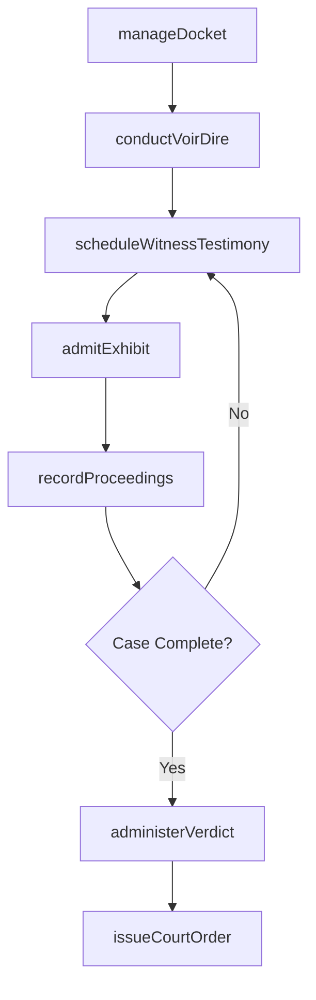
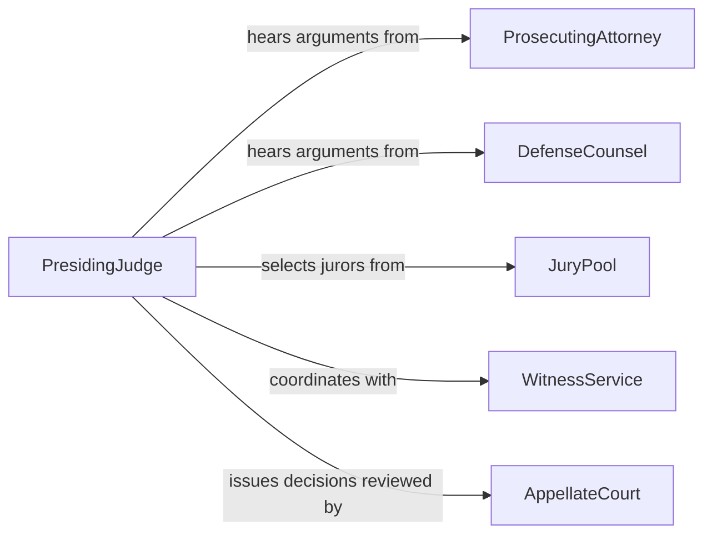

# Direct Courtroom Activities Procedures

> Business-as-Code definition for directing courtroom activities or procedures. Models the management of trial proceedings, jury operations, witness examination scheduling, courtroom security, and judicial administration.

## Overview

Directing courtroom activities or procedures involves overseeing the orderly conduct of judicial proceedings including trial management, jury selection and instruction, witness scheduling, evidence presentation, and courtroom decorum. This definition provides actions for managing dockets, coordinating jury pools, scheduling witness testimony, overseeing bailiff operations, and administering verdicts and sentencing. It enables automation of docket management, jury notification, witness scheduling, and proceeding documentation workflows.

## Actors

| Actor | Description |
|-------|-------------|
| ProsecutingAttorney | Presents the government's case in criminal proceedings |
| DefenseCounsel | Represents the defendant's interests in legal proceedings |
| JuryPool | Citizens summoned for potential selection as trial jurors |
| WitnessService | Coordinates witness attendance and provides support services |
| AppellateCourt | Reviews trial court decisions on appeal |

## Roles

| Role | Description |
|------|-------------|
| PresidingJudge | Oversees courtroom proceedings and rules on matters of law |
| CourtAdministrator | Manages dockets, scheduling, and courtroom resources |
| Bailiff | Maintains courtroom security and order during proceedings |
| CourtClerk | Records proceedings, manages exhibits, and administers oaths |
| JuryCoordinator | Manages jury pool selection, notification, and service logistics |

## Entities

| Entity | Description |
|--------|-------------|
| CourtDocket | The official schedule of cases to be heard in a courtroom |
| TrialProceeding | A formal judicial hearing on the merits of a case |
| JuryPanel | A group of citizens selected to hear and decide a case |
| Exhibit | A document or item admitted into evidence during proceedings |
| CourtOrder | A directive issued by the judge during or after proceedings |
| Transcript | The official written record of courtroom proceedings |
| Verdict | The jury or judge's formal decision on a case |

## Actions

| Action | Description |
|--------|-------------|
| manageDocket | Schedule and sequence cases for courtroom proceedings |
| conductVoirDire | Oversee jury selection questioning and challenges |
| scheduleWitnessTestimony | Arrange the order and timing of witness appearances |
| admitExhibit | Process evidence items for formal admission into the record |
| issueCourtOrder | Direct the preparation and issuance of judicial orders |
| recordProceedings | Ensure accurate transcription of courtroom activities |
| administerVerdict | Process the jury or judge's decision and schedule sentencing |

## Events

| Event | Description |
|-------|-------------|
| docketSet | Cases have been scheduled for courtroom proceedings |
| jurySelected | A panel of jurors has been chosen for a trial |
| witnessTestified | A witness has completed their examination in court |
| exhibitAdmitted | An evidence item has been formally entered into the record |
| courtOrderIssued | A judicial directive has been prepared and filed |
| proceedingsRecorded | A transcript of courtroom activities has been completed |
| verdictRendered | The jury or judge has delivered a formal decision |

## Searches

| Search | Description |
|--------|-------------|
| getDocket | Retrieve the schedule of cases by courtroom, date, or judge |
| getJuryPanels | List selected jury panels by trial or service period |
| findExhibits | Search admitted evidence by case, type, or party |
| getCourtOrders | Retrieve judicial directives by case, type, or date |
| getTrialStatus | Check the current phase and progress of active trials |

## Workflow



## Actor Relationships



## Usage

### Calling Actions

```typescript
import { directCourtroomActivitiesProcedures } from '@headlessly/direct-courtroom-activities-procedures'

const courtroom = directCourtroomActivitiesProcedures()

// Manage the daily docket
await courtroom.manageDocket({
  courtroom: 'courtroom-3A',
  date: '2026-06-15',
  cases: [
    { caseId: 'state-v-johnson', type: 'criminal-trial', time: '09:00', estimatedDuration: '3-days' },
    { caseId: 'martinez-v-city', type: 'civil-hearing', time: '14:00', estimatedDuration: '2-hours' }
  ]
})

// Schedule witness testimony
await courtroom.scheduleWitnessTestimony({
  caseId: 'state-v-johnson',
  witnesses: [
    { name: 'officer-reynolds', party: 'prosecution', estimatedTime: '45-minutes', day: 1 },
    { name: 'forensic-expert-lee', party: 'prosecution', estimatedTime: '60-minutes', day: 1 },
    { name: 'character-witness-davis', party: 'defense', estimatedTime: '30-minutes', day: 2 }
  ]
})

// Check trial status
const trials = await courtroom.getTrialStatus({
  courtroom: 'courtroom-3A',
  status: 'in-progress'
})
```

### Event-Driven Automation

```typescript
// Auto-notify parties on verdict
courtroom.verdictRendered(async ({ caseId, verdict, sentencingDate }) => {
  await notify({
    to: ['prosecuting-attorney', 'defense-counsel', 'court-administrator'],
    message: `Verdict in ${caseId}: ${verdict}. Sentencing scheduled for ${sentencingDate}.`
  })
})

// Auto-generate transcript after proceedings
courtroom.proceedingsRecorded(async ({ caseId, date, courtroom }) => {
  await notify({
    to: 'court-clerk',
    message: `Proceedings for ${caseId} on ${date} in ${courtroom} ready for transcript finalization.`
  })
})
```
