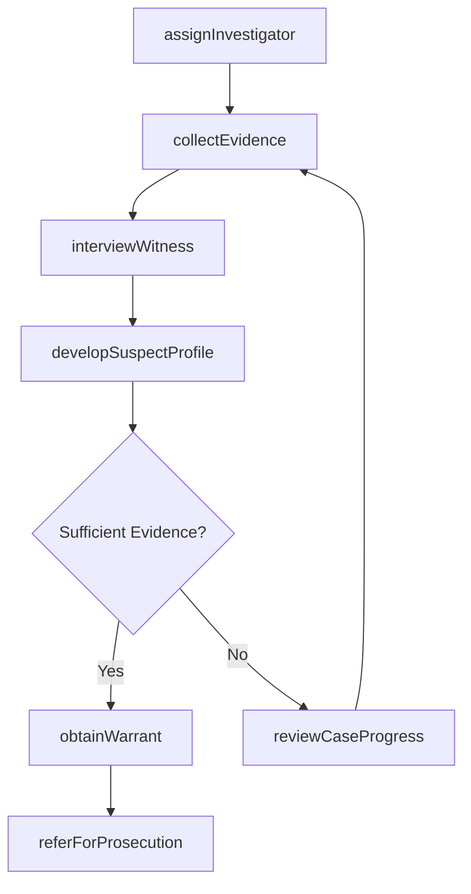
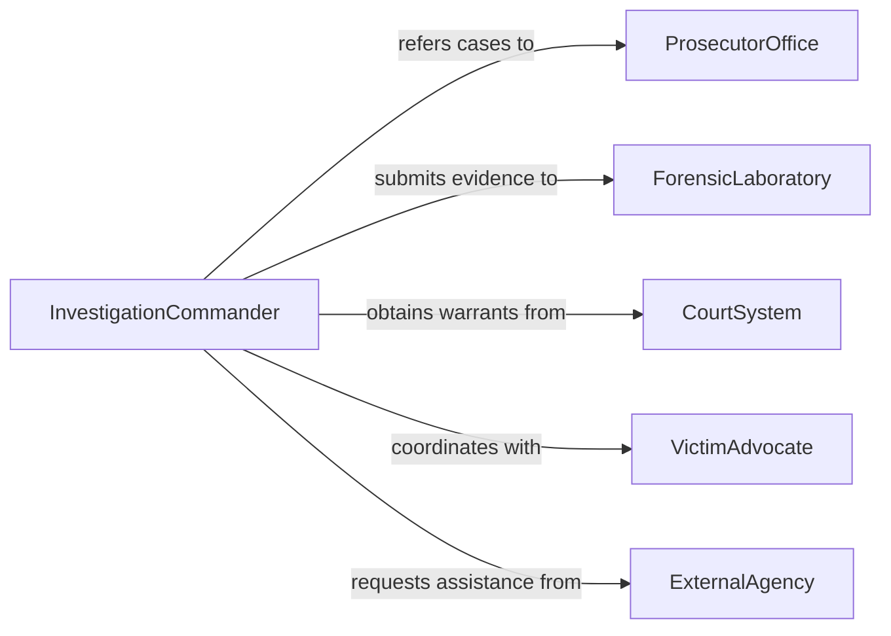

# Direct Criminal Investigations

> Business-as-Code definition for directing criminal investigations. Models the oversight of investigative operations including case assignment, evidence management, witness coordination, suspect tracking, and prosecution referral.

## Overview

Directing criminal investigations involves overseeing the systematic process of gathering evidence, interviewing witnesses, identifying suspects, and building cases for prosecution. This definition provides actions for assigning investigators to cases, managing evidence chains of custody, coordinating witness interviews, issuing warrants, and referring completed cases to prosecutors. It enables automation of case assignment routing, evidence tracking, investigation milestone monitoring, and case status reporting workflows.

## Actors

| Actor | Description |
|-------|-------------|
| ProsecutorOffice | Receives completed cases and determines charges to file |
| ForensicLaboratory | Processes physical and digital evidence for analysis |
| CourtSystem | Issues warrants and subpoenas for investigation purposes |
| VictimAdvocate | Provides support services to crime victims during investigation |
| ExternalAgency | Federal or neighboring jurisdiction providing investigative assistance |

## Roles

| Role | Description |
|------|-------------|
| InvestigationCommander | Oversees all criminal investigation operations and case prioritization |
| LeadDetective | Manages individual case investigations and directs field work |
| EvidenceTechnician | Collects, catalogs, and preserves physical evidence |
| IntelligenceAnalyst | Researches criminal patterns and develops suspect profiles |
| WitnessCoordinator | Arranges and documents witness interviews and depositions |

## Entities

| Entity | Description |
|--------|-------------|
| CriminalCase | A formal investigation into an alleged criminal offense |
| EvidenceItem | Physical or digital material collected during an investigation |
| WitnessStatement | A documented account from a person with knowledge of the case |
| SearchWarrant | Court-authorized permission to search a location or seize items |
| SuspectProfile | Compiled information identifying a person of interest |
| CaseFile | The complete collection of documents and evidence for an investigation |
| InvestigationTimeline | A chronological record of investigative actions and findings |

## Actions

| Action | Description |
|--------|-------------|
| assignInvestigator | Designate detectives and resources to a criminal case |
| collectEvidence | Gather and catalog physical or digital evidence from a scene |
| interviewWitness | Conduct and document witness or victim statements |
| developSuspectProfile | Compile intelligence to identify persons of interest |
| obtainWarrant | Request court authorization for searches or seizures |
| referForProsecution | Submit a completed case to the prosecutor for charging |
| reviewCaseProgress | Evaluate investigation milestones and direct next steps |

## Events

| Event | Description |
|-------|-------------|
| investigatorAssigned | A detective has been designated to a criminal case |
| evidenceCollected | Physical or digital material has been cataloged |
| witnessInterviewed | A statement has been documented from a witness or victim |
| suspectIdentified | A person of interest has been formally identified |
| warrantObtained | Court authorization for search or seizure has been granted |
| caseReferredForProsecution | A completed investigation has been submitted for charging |
| caseProgressReviewed | Investigation milestones have been evaluated |

## Searches

| Search | Description |
|--------|-------------|
| getActiveCases | List open criminal investigations by type, priority, or detective |
| getEvidenceLog | Retrieve evidence items and chain of custody for a case |
| findWitnessStatements | List documented statements by case, witness, or date |
| getSuspectProfiles | Retrieve persons of interest by case or identifying criteria |
| getCaseTimeline | Review chronological investigation actions for a case |

## Workflow



## Actor Relationships



## Usage

### Calling Actions

```typescript
import { directCriminalInvestigations } from '@headlessly/direct-criminal-investigations'

const investigations = directCriminalInvestigations()

// Assign an investigator to a new case
await investigations.assignInvestigator({
  caseId: 'case-2026-04821',
  offense: 'commercial-burglary',
  leadDetective: 'detective-ruiz',
  supportTeam: ['evidence-tech-johnson', 'analyst-chen'],
  priority: 'high'
})

// Collect evidence from a crime scene
await investigations.collectEvidence({
  caseId: 'case-2026-04821',
  scene: '4500-industrial-boulevard',
  items: [
    { type: 'fingerprint-lift', location: 'rear-door-handle' },
    { type: 'surveillance-footage', location: 'neighboring-business' },
    { type: 'tool-mark-impression', location: 'window-frame' }
  ],
  technician: 'evidence-tech-johnson'
})

// Review active investigations
const active = await investigations.getActiveCases({
  priority: 'high',
  status: 'open',
  assignedTo: 'detective-ruiz'
})
```

### Event-Driven Automation

```typescript
// Auto-notify prosecutor when case is ready
investigations.caseReferredForProsecution(async ({ caseId, offense, suspect }) => {
  await notify({
    to: 'district-attorney-intake',
    message: `Case ${caseId} (${offense}) ready for prosecution review. Suspect: ${suspect}`
  })
})

// Auto-escalate stalled investigations
investigations.caseProgressReviewed(async ({ caseId, daysSinceLastAction, priority }) => {
  if (daysSinceLastAction > 30 && priority === 'high') {
    await notify({
      to: 'investigation-commander',
      message: `High-priority case ${caseId} has had no activity for ${daysSinceLastAction} days. Review recommended.`
    })
  }
})
```
