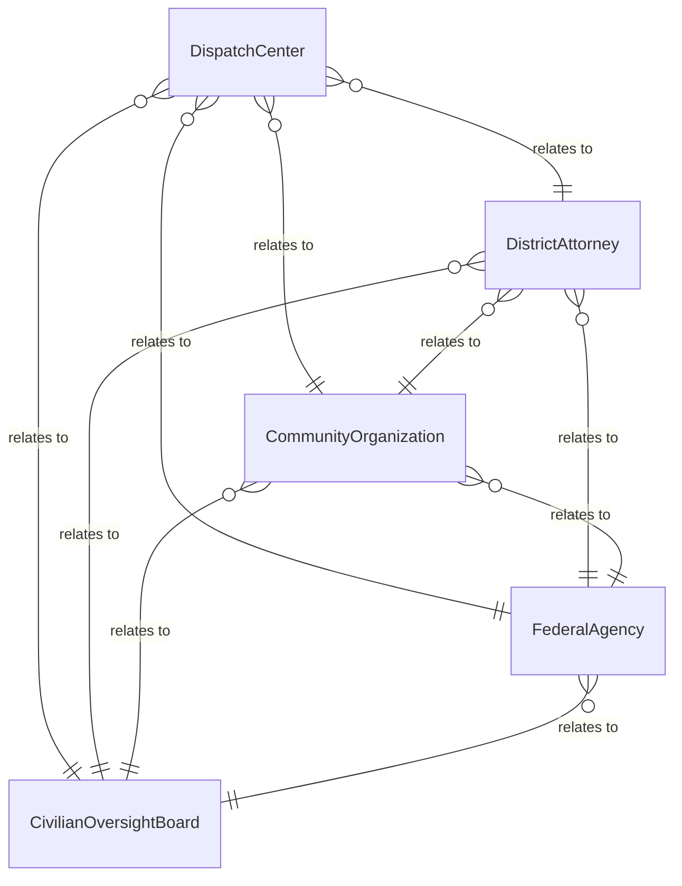
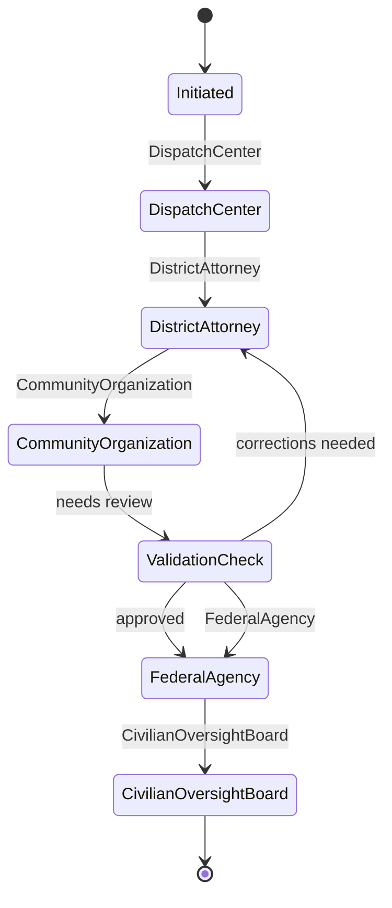
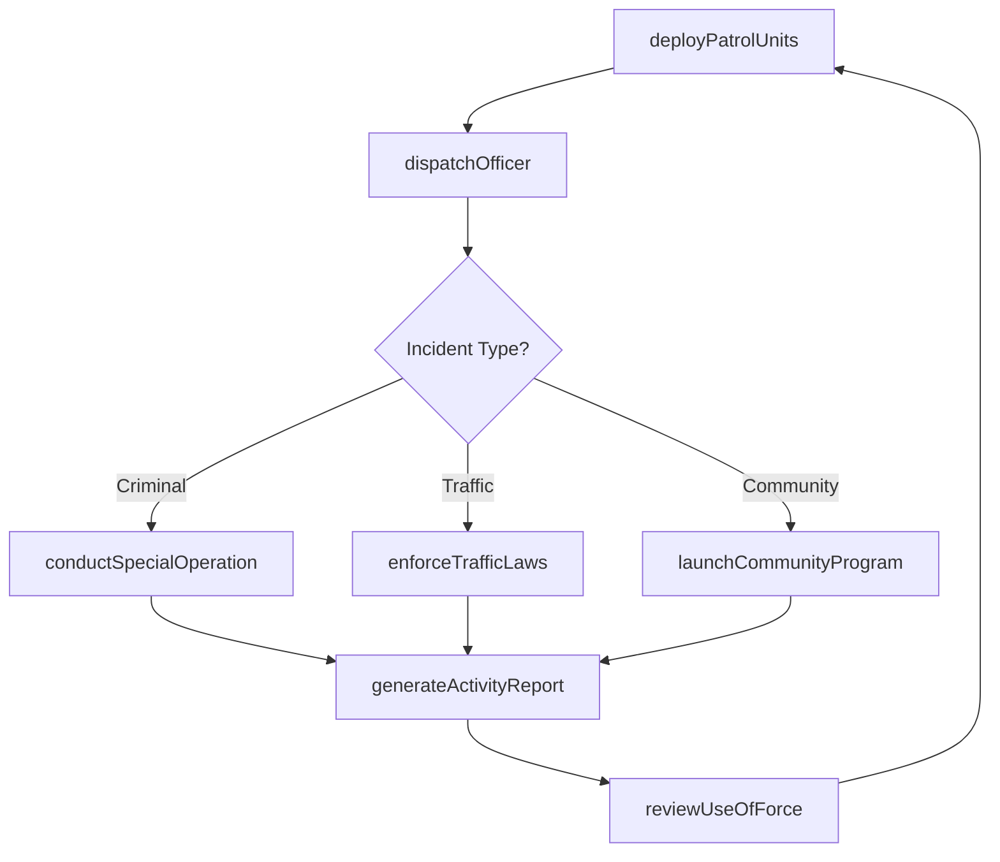
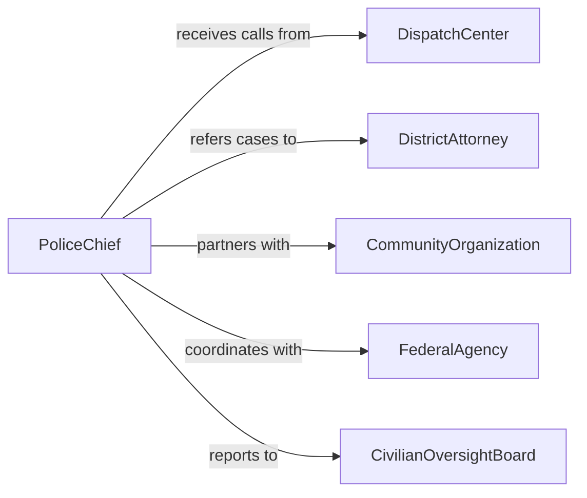

# Direct Law Enforcement Activities

> Business-as-Code definition for directing law enforcement activities. Models the oversight of patrol operations, officer deployment, community policing programs, traffic enforcement, and inter-agency coordination.

## Overview

Directing law enforcement activities involves managing the deployment and coordination of sworn officers to maintain public safety, enforce laws, respond to calls for service, and engage with communities. This definition provides actions for deploying patrol units, managing call dispatch, coordinating special operations, overseeing traffic enforcement, and directing community policing initiatives. It enables automation of beat assignment, dispatch prioritization, officer tracking, and activity reporting workflows.

## Actors

| Actor | Description |
|-------|-------------|
| DispatchCenter | Receives emergency and non-emergency calls and routes officers |
| DistrictAttorney | Prosecutes criminal cases developed by law enforcement |
| CommunityOrganization | Partners with law enforcement on neighborhood safety programs |
| FederalAgency | Provides intelligence, task force support, and grant funding |
| CivilianOversightBoard | Reviews use-of-force incidents and misconduct complaints |

## Roles

| Role | Description |
|------|-------------|
| PoliceChief | Sets department policy and oversees all law enforcement operations |
| WatchCommander | Directs patrol operations during a specific shift |
| PatrolSergeant | Supervises officers in the field and responds to escalated calls |
| CommunityLiaisonOfficer | Manages neighborhood engagement and outreach programs |
| TrafficEnforcementOfficer | Conducts speed enforcement, DUI checkpoints, and accident investigation |

## Entities

| Entity | Description |
|--------|-------------|
| BeatAssignment | A geographic patrol area assigned to an officer or unit |
| CallForService | A dispatched request requiring officer response |
| FieldReport | An officer-authored document summarizing an encounter or incident |
| SpecialOperation | A planned enforcement action targeting specific criminal activity |
| TrafficCitation | A notice of violation issued for traffic law infractions |
| CommunityProgram | An outreach initiative promoting public safety and trust |
| UseOfForceReport | Documentation of an incident involving physical force by officers |

## Actions

| Action | Description |
|--------|-------------|
| deployPatrolUnits | Assign officers to beats and patrol sectors |
| dispatchOfficer | Route an officer to respond to a call for service |
| conductSpecialOperation | Execute a planned enforcement action targeting specific crime |
| enforceTrafficLaws | Perform traffic stops, checkpoints, and accident response |
| launchCommunityProgram | Initiate neighborhood engagement and crime prevention outreach |
| reviewUseOfForce | Evaluate incidents involving physical force by officers |
| generateActivityReport | Compile shift and period summaries of enforcement activity |

## Events

| Event | Description |
|-------|-------------|
| patrolUnitsDeployed | Officers have been assigned to their beats |
| officerDispatched | An officer has been routed to a call for service |
| specialOperationConducted | A planned enforcement action has been executed |
| trafficCitationIssued | A notice of violation has been issued for a traffic infraction |
| communityProgramLaunched | A neighborhood outreach initiative has been started |
| useOfForceReviewed | An incident involving physical force has been evaluated |
| activityReportGenerated | A summary of enforcement activity has been compiled |

## Searches

| Search | Description |
|--------|-------------|
| getBeatAssignments | Retrieve officer-to-beat assignments by shift or district |
| getCallsForService | List dispatched calls by priority, type, or location |
| findFieldReports | Search officer reports by date, incident type, or beat |
| getTrafficCitations | Retrieve citation records by officer, location, or violation type |
| getCrimeStatistics | Review offense counts by beat, period, or category |


## Entity Relationships



## State Diagram



## Workflow



## Actor Relationships



## Usage

### Calling Actions

```typescript
import { directLawEnforcementActivities } from '@headlessly/direct-law-enforcement-activities'

const enforcement = directLawEnforcementActivities()

// Deploy patrol units for evening shift
await enforcement.deployPatrolUnits({
  shift: 'evening-2026-04-15',
  assignments: [
    { officer: 'officer-thompson', beat: 'downtown-1', vehicle: 'unit-214' },
    { officer: 'officer-garcia', beat: 'residential-3', vehicle: 'unit-307' },
    { officer: 'officer-lee', beat: 'commercial-2', vehicle: 'unit-118' }
  ]
})

// Conduct a special operation
await enforcement.conductSpecialOperation({
  name: 'operation-safe-corridor',
  type: 'narcotics-enforcement',
  location: 'highway-corridor-south',
  personnel: ['sergeant-davis', 'detective-unit-3', 'k9-unit'],
  duration: { start: '2026-04-16T20:00', end: '2026-04-17T04:00' }
})

// Review crime statistics for a district
const stats = await enforcement.getCrimeStatistics({
  beat: 'downtown-1',
  period: '2026-Q1',
  categories: ['property-crime', 'violent-crime']
})
```

### Event-Driven Automation

```typescript
// Auto-notify oversight board on use-of-force incidents
enforcement.useOfForceReviewed(async ({ officer, incidentId, forceLevel }) => {
  if (forceLevel === 'lethal' || forceLevel === 'serious') {
    await notify({
      to: 'civilian-oversight-board',
      message: `Use of force incident ${incidentId} by ${officer} (level: ${forceLevel}) requires board review.`
    })
  }
})

// Auto-generate weekly activity reports
enforcement.activityReportGenerated(async ({ shift, callsResponded, citations, arrests }) => {
  await notify({
    to: 'watch-commander',
    message: `Shift ${shift}: ${callsResponded} calls, ${citations} citations, ${arrests} arrests.`
  })
})
```
