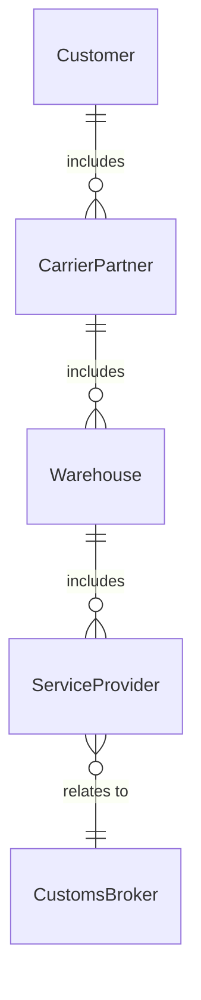
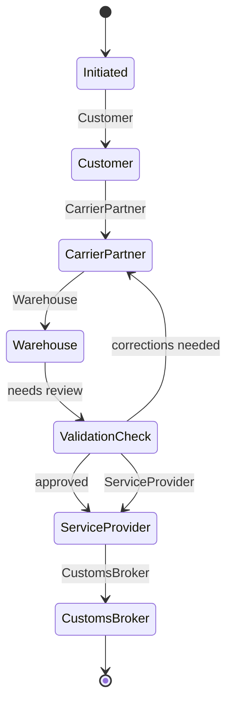
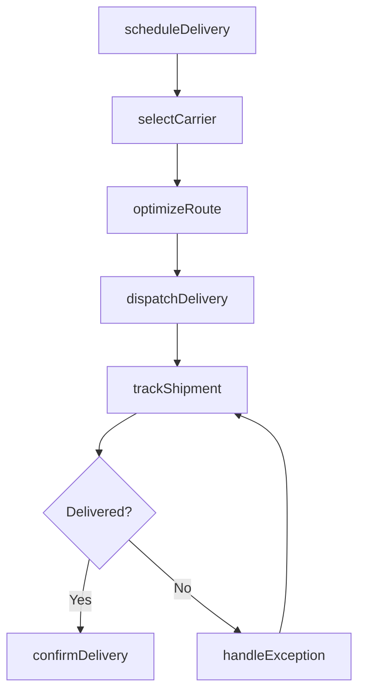
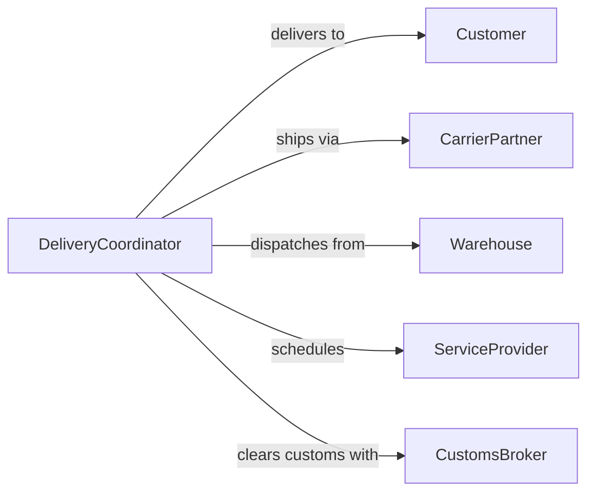

# Arrange Delivery Goods Services

> Business-as-Code definition for arranging the delivery of goods or services. Models the coordination of fulfillment logistics from order processing through last-mile delivery and service dispatch.

## Overview

Arranging delivery of goods or services involves coordinating the fulfillment process from order receipt through scheduling, routing, and final delivery confirmation. This definition provides actions for scheduling deliveries, selecting carriers, optimizing routes, and managing service appointments. It enables automation of delivery window assignment, carrier selection, and customer notification workflows.

## Actors

| Actor | Description |
|-------|-------------|
| Customer | Individual or organization receiving the goods or services |
| CarrierPartner | Third-party logistics provider handling physical delivery |
| Warehouse | Storage facility that picks, packs, and ships orders |
| ServiceProvider | External party performing on-site service delivery |
| CustomsBroker | Facilitates international shipment clearance and documentation |

## Roles

| Role | Description |
|------|-------------|
| DeliveryCoordinator | Oversees scheduling and routing of all deliveries |
| FulfillmentManager | Manages order processing and warehouse dispatch |
| RouteOptimizer | Plans efficient delivery sequences and vehicle assignments |
| CustomerServiceAgent | Communicates delivery status and handles rescheduling |

## Entities

| Entity | Description |
|--------|-------------|
| DeliveryOrder | A confirmed request to deliver goods or services to a location |
| DeliveryRoute | An optimized sequence of delivery stops for a vehicle or crew |
| CarrierContract | Agreement with a logistics provider specifying rates and SLAs |
| ServiceAppointment | A scheduled time window for on-site service delivery |
| ProofOfDelivery | Confirmation record including signature, photo, or timestamp |
| ShipmentTracking | Real-time location and status data for an in-transit delivery |
| DeliveryException | A documented issue preventing on-time or complete delivery |

## Actions

| Action | Description |
|--------|-------------|
| scheduleDelivery | Assign a delivery date and time window for an order |
| selectCarrier | Choose the optimal carrier based on cost, speed, and destination |
| optimizeRoute | Plan efficient delivery sequences to minimize time and cost |
| dispatchDelivery | Release a shipment or service crew for fulfillment |
| trackShipment | Monitor real-time location and status of in-transit deliveries |
| confirmDelivery | Record proof of delivery upon successful completion |
| handleException | Manage delivery failures, delays, or customer-requested changes |

## Events

| Event | Description |
|-------|-------------|
| deliveryScheduled | A delivery date and window have been assigned |
| carrierSelected | A logistics provider has been chosen for the shipment |
| routeOptimized | Delivery stops have been sequenced for efficiency |
| deliveryDispatched | A shipment or service crew has been released |
| shipmentInTransit | A delivery is actively moving toward its destination |
| deliveryConfirmed | Proof of delivery has been recorded |
| deliveryExceptionRaised | An issue preventing on-time delivery has been documented |

## Searches

| Search | Description |
|--------|-------------|
| getDeliverySchedule | Retrieve scheduled deliveries by date, route, or customer |
| getShipmentStatus | Check real-time tracking for in-transit deliveries |
| findExceptions | List delivery failures or delays by type or carrier |
| getCarrierPerformance | Review carrier on-time rates and cost metrics |
| getProofOfDelivery | Retrieve delivery confirmation records by order |


## Entity Relationships



## State Diagram



## Workflow



## Actor Relationships



## Usage

### Calling Actions

```typescript
import { arrangeDeliveryGoodsServices } from '@headlessly/arrange-delivery-goods-services'

const delivery = arrangeDeliveryGoodsServices()

// Schedule a delivery
const scheduled = await delivery.scheduleDelivery({
  orderId: 'order-2026-8841',
  destination: '742 Evergreen Terrace, Springfield',
  preferredWindow: '2026-04-10T09:00/12:00',
  items: [{ sku: 'WH-4420', quantity: 2, weight: 45 }]
})

// Select optimal carrier
const carrier = await delivery.selectCarrier({
  orderId: scheduled.orderId,
  criteria: ['cost', 'speed'],
  destination: scheduled.destination
})

// Track in-transit shipment
const status = await delivery.getShipmentStatus({
  trackingId: 'TRK-2026-8841',
  carrier: carrier.name
})
```

### Event-Driven Automation

```typescript
// Notify customer on dispatch
delivery.deliveryDispatched(async ({ orderId, estimatedArrival, trackingId }) => {
  await notify({
    to: 'customer',
    message: `Order ${orderId} shipped. Estimated arrival: ${estimatedArrival}. Track: ${trackingId}`
  })
})

// Auto-reschedule on exception
delivery.deliveryExceptionRaised(async ({ orderId, reason }) => {
  if (reason === 'customer-not-available') {
    await delivery.scheduleDelivery({
      orderId,
      preferredWindow: 'next-available',
      reattempt: true
    })
  }
})
```
