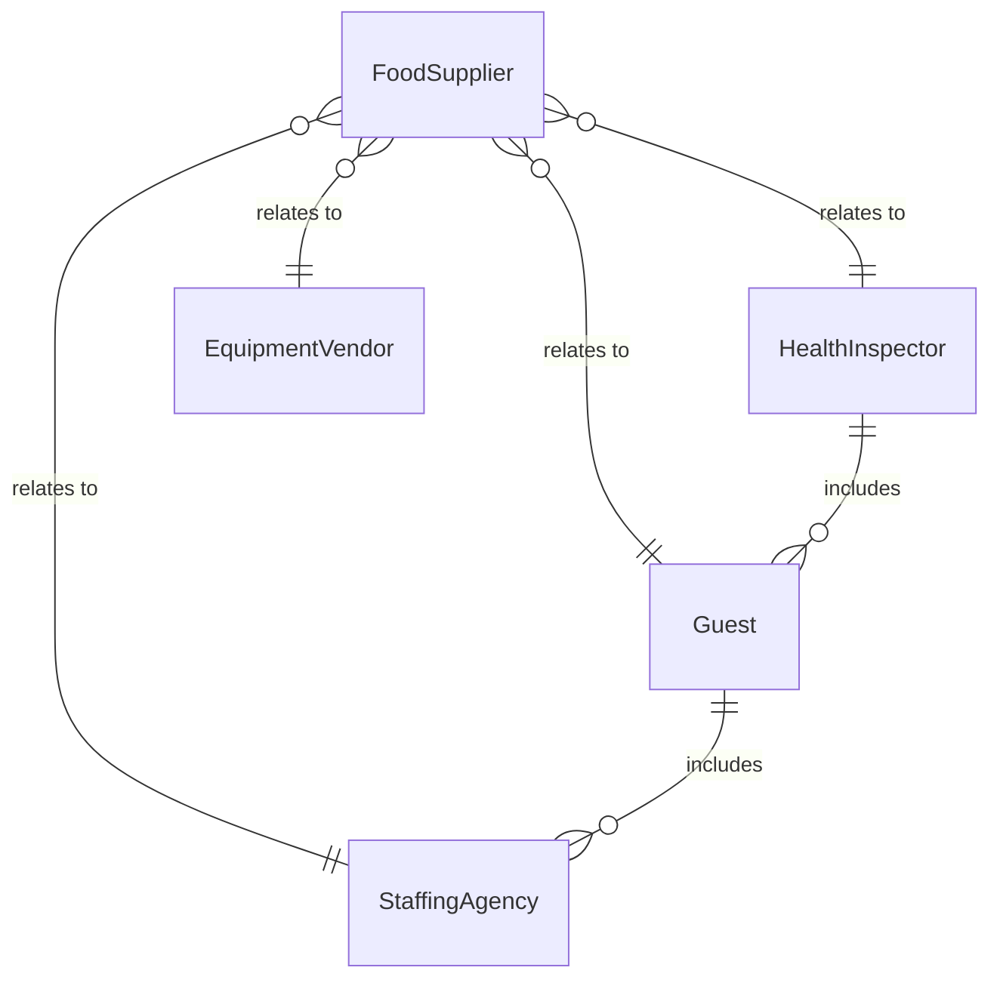
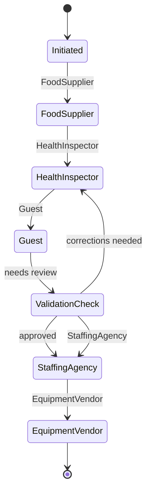
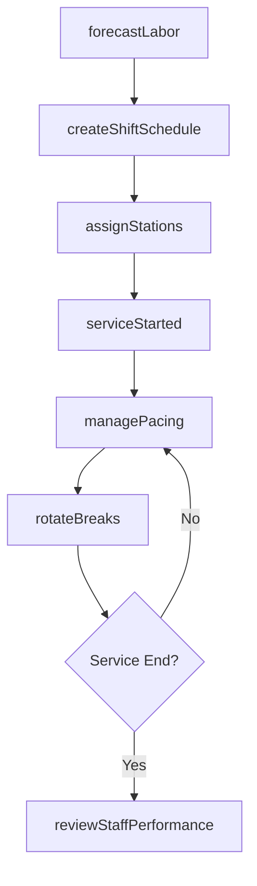
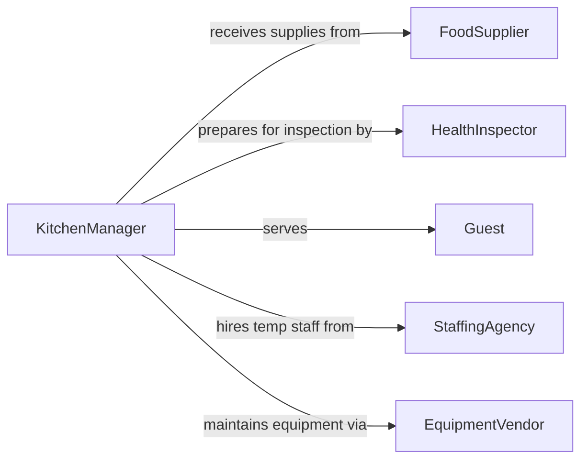

# Coordinate Activities of Food Service Staff

> Business-as-Code definition for coordinating food service staff activities. Models the scheduling, task assignment, and performance management of kitchen, serving, and support personnel in food service operations.

## Overview

Coordinating food service staff activities involves managing the scheduling, task assignment, and workflow synchronization of kitchen crews, servers, hosts, and support personnel. This definition provides actions for creating shift schedules, assigning station duties, managing service pacing, and tracking staff performance. It enables automation of labor scheduling, break rotations, and real-time service coordination during meal periods.

## Actors

| Actor | Description |
|-------|-------------|
| FoodSupplier | Delivers ingredients and supplies for food preparation |
| HealthInspector | Conducts food safety and sanitation inspections |
| Guest | Patron receiving food and beverage service |
| StaffingAgency | Provides temporary or seasonal food service workers |
| EquipmentVendor | Supplies and services kitchen equipment |

## Roles

| Role | Description |
|------|-------------|
| KitchenManager | Oversees back-of-house staff and food preparation workflow |
| FrontOfHouseManager | Manages servers, hosts, and dining room operations |
| ShiftLead | Supervises staff during a specific service period |
| SchedulingCoordinator | Creates and manages employee work schedules |

## Entities

| Entity | Description |
|--------|-------------|
| ShiftSchedule | Work schedule assigning staff to specific service periods |
| StationAssignment | Allocation of a staff member to a kitchen or dining station |
| ServicePeriod | A defined meal service window such as lunch or dinner |
| BreakRotation | Planned sequence of employee rest periods during a shift |
| PerformanceReview | Assessment of individual staff member service quality |
| LaborForecast | Predicted staffing needs based on reservations and covers |
| TrainingRecord | Documentation of employee certifications and training completion |

## Actions

| Action | Description |
|--------|-------------|
| createShiftSchedule | Build staff work schedules for upcoming service periods |
| assignStations | Allocate staff to kitchen lines, serving sections, or support roles |
| managePacing | Control the flow of orders between kitchen and dining room |
| rotateBreaks | Schedule and track employee rest periods during service |
| reviewStaffPerformance | Evaluate individual staff contributions and service quality |
| forecastLabor | Predict staffing requirements based on expected business volume |
| approveTimeOff | Process and authorize employee schedule change requests |

## Events

| Event | Description |
|-------|-------------|
| shiftScheduleCreated | Staff schedules have been published for an upcoming period |
| stationsAssigned | Staff have been allocated to their service positions |
| serviceStarted | A meal service period has begun |
| pacingAdjusted | Order flow between kitchen and dining has been modified |
| breakRotated | An employee break cycle has been completed |
| performanceReviewed | A staff performance evaluation has been completed |
| laborForecasted | Staffing predictions have been generated |

## Searches

| Search | Description |
|--------|-------------|
| getShiftSchedule | Retrieve staff schedules by date or employee |
| findAvailableStaff | List staff members available for scheduling |
| getStationAssignments | Check current station allocations for a service period |
| getLaborForecast | Retrieve predicted staffing needs by date |
| getPerformanceMetrics | Retrieve staff performance data by employee or period |


## Entity Relationships



## State Diagram



## Workflow



## Actor Relationships



## Usage

### Calling Actions

```typescript
import { coordinateActivitiesFoodServiceStaff } from '@headlessly/coordinate-activities-food-service-staff'

const foodService = coordinateActivitiesFoodServiceStaff()

// Create next week's shift schedule
const schedule = await foodService.createShiftSchedule({
  week: '2026-03-16',
  servicePeriods: ['breakfast', 'lunch', 'dinner'],
  minimumStaff: { breakfast: 4, lunch: 8, dinner: 10 }
})

// Assign stations for dinner service
await foodService.assignStations({
  date: '2026-03-16',
  period: 'dinner',
  assignments: [
    { employee: 'chef-martinez', station: 'grill' },
    { employee: 'chef-lee', station: 'sautee' },
    { employee: 'server-jones', station: 'section-A' }
  ]
})

// Forecast labor for the weekend
const forecast = await foodService.forecastLabor({
  dates: ['2026-03-21', '2026-03-22'],
  basedOn: 'reservations-and-historical'
})
```

### Event-Driven Automation

```typescript
// Auto-call in extra staff when forecast exceeds capacity
foodService.laborForecasted(async ({ date, requiredStaff, scheduledStaff }) => {
  if (requiredStaff > scheduledStaff) {
    const available = await foodService.findAvailableStaff({ date })
    await notify({
      to: available.map(s => s.id),
      message: `Extra shift available on ${date}`
    })
  }
})

// Track performance after each service
foodService.serviceStarted(async ({ date, period }) => {
  // Schedule post-service review
  await scheduleTask({
    after: period,
    action: () => foodService.reviewStaffPerformance({ date, period })
  })
})
```
