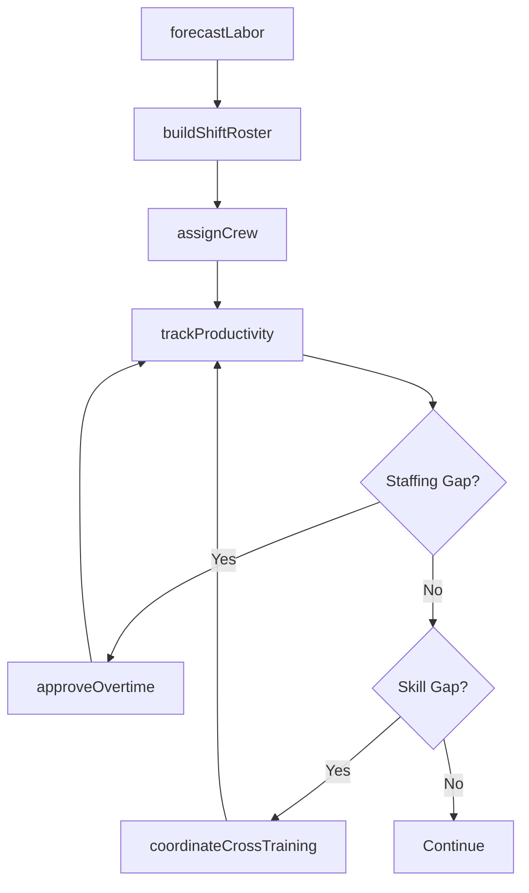
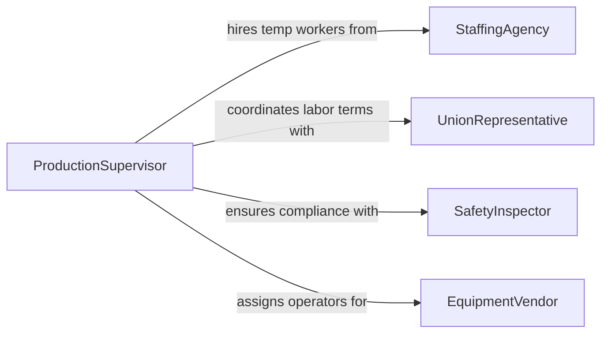

# Coordinate Activities of Production Personnel

> Business-as-Code definition for coordinating production personnel activities. Models the assignment, scheduling, and performance tracking of workers across manufacturing and production environments.

## Overview

Coordinating production personnel activities involves managing the assignment, scheduling, and workflow synchronization of workers on production lines, in processing plants, and across manufacturing facilities. This definition provides actions for assigning crew positions, managing shift rotations, tracking productivity, and coordinating cross-training. It enables automation of labor allocation, overtime management, and skill-based assignment workflows.

## Actors

| Actor | Description |
|-------|-------------|
| StaffingAgency | Provides temporary production workers during peak periods |
| UnionRepresentative | Negotiates labor agreements affecting production staffing |
| SafetyInspector | Enforces workplace safety standards on production floors |
| EquipmentVendor | Provides machinery requiring trained operator assignments |

## Roles

| Role | Description |
|------|-------------|
| ProductionSupervisor | Manages daily crew assignments and production flow |
| ShiftManager | Oversees personnel during a specific production shift |
| TrainingCoordinator | Manages cross-training and skill certification programs |
| LaborPlanner | Forecasts staffing needs and manages workforce scheduling |

## Entities

| Entity | Description |
|--------|-------------|
| CrewAssignment | Allocation of workers to specific production stations or lines |
| ShiftRoster | List of personnel scheduled for a production shift |
| SkillMatrix | Documentation of worker qualifications by equipment or task |
| OvertimeRequest | Request for additional hours beyond standard shift |
| ProductivityMetric | Measured output per worker or crew per period |
| CrossTrainingPlan | Scheduled program to expand worker skill sets |
| LaborForecast | Predicted staffing requirements based on production demand |

## Actions

| Action | Description |
|--------|-------------|
| assignCrew | Allocate workers to production stations based on skills |
| buildShiftRoster | Create personnel schedules for upcoming production shifts |
| trackProductivity | Monitor output metrics per worker or crew |
| approveOvertime | Authorize additional work hours for production needs |
| updateSkillMatrix | Record new worker qualifications and certifications |
| forecastLabor | Predict staffing needs based on production schedules |
| coordinateCrossTraining | Schedule and manage worker skill development programs |

## Events

| Event | Description |
|-------|-------------|
| crewAssigned | Workers have been allocated to production stations |
| shiftRosterBuilt | Personnel schedules have been published |
| productivityTracked | Worker output metrics have been recorded |
| overtimeApproved | Additional work hours have been authorized |
| skillMatrixUpdated | A worker qualification record has been modified |
| laborForecasted | Staffing predictions have been generated |
| crossTrainingCompleted | A worker has finished a cross-training program |

## Searches

| Search | Description |
|--------|-------------|
| getShiftRoster | Retrieve personnel schedules by date or shift |
| findQualifiedWorkers | List workers with specific skills or certifications |
| getProductivityMetrics | Retrieve output data by worker, crew, or period |
| findOvertimeRequests | List pending overtime authorizations |
| getSkillGaps | Identify positions lacking qualified backup personnel |

## Workflow



## Actor Relationships



## Usage

### Calling Actions

```typescript
import { coordinateActivitiesProductionPersonnel } from '@headlessly/coordinate-activities-production-personnel'

const personnel = coordinateActivitiesProductionPersonnel()

// Build next week's shift roster
const roster = await personnel.buildShiftRoster({
  week: '2026-04-06',
  shifts: ['day', 'swing', 'night'],
  minimumCrew: { day: 12, swing: 10, night: 8 }
})

// Assign crew to stations
await personnel.assignCrew({
  shift: 'day',
  date: '2026-04-06',
  assignments: [
    { worker: 'emp-301', station: 'welding-line-1' },
    { worker: 'emp-302', station: 'assembly-line-2' },
    { worker: 'emp-303', station: 'quality-inspection' }
  ]
})

// Track productivity
const metrics = await personnel.trackProductivity({
  shift: 'day',
  date: '2026-04-06'
})
```

### Event-Driven Automation

```typescript
// Auto-flag skill gaps when roster is built
personnel.shiftRosterBuilt(async ({ week, shifts }) => {
  const gaps = await personnel.getSkillGaps({ week })
  if (gaps.length > 0) {
    await personnel.coordinateCrossTraining({ workers: gaps.map(g => g.workerId) })
  }
})

// Notify when overtime is needed
personnel.laborForecasted(async ({ date, shortfall }) => {
  if (shortfall > 0) {
    await notify({
      to: 'shift-manager',
      message: `${shortfall} additional workers needed on ${date}`
    })
  }
})
```
