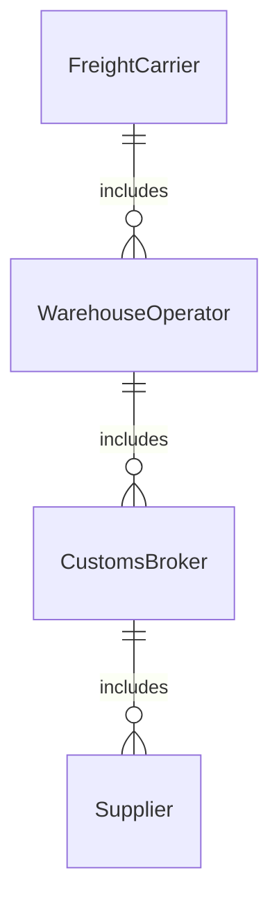
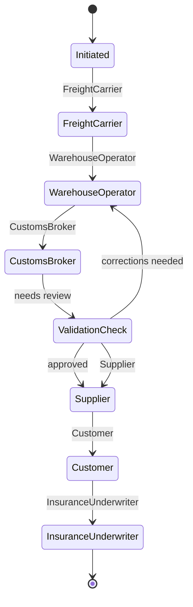
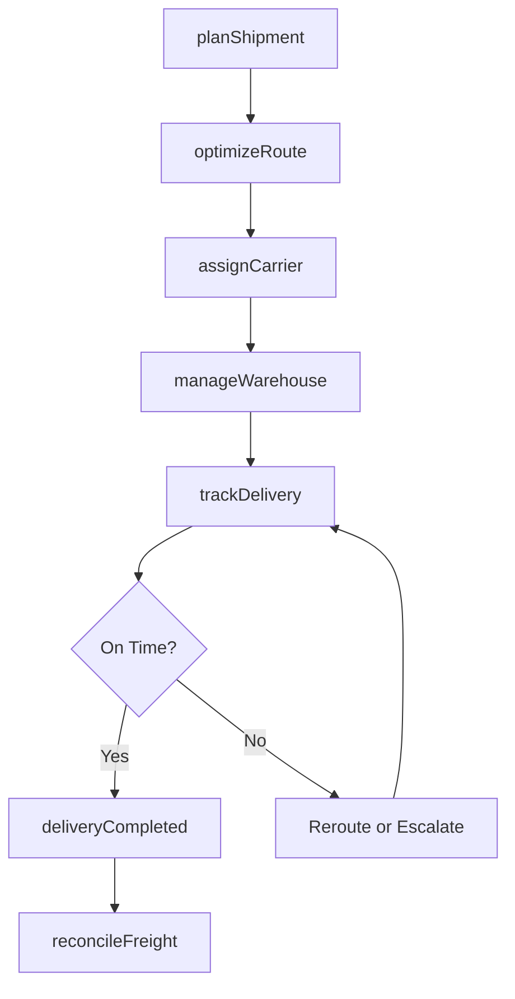
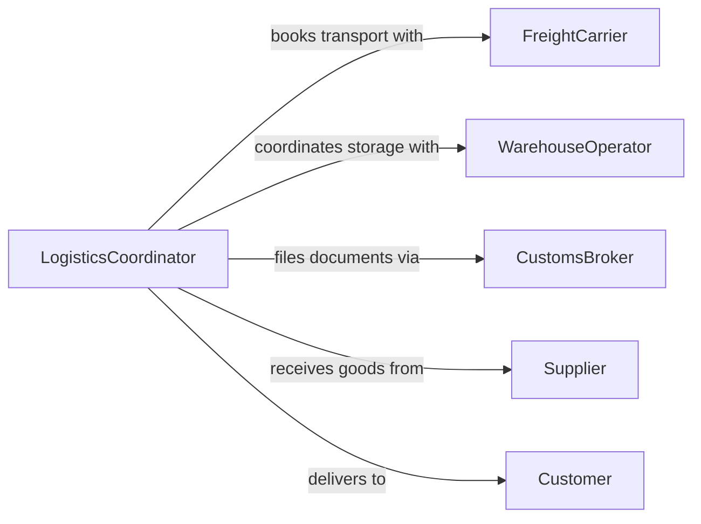

# Coordinate Logistics or Business Operations

> Business-as-Code definition for coordinating logistics and business operations. Models the orchestration of supply chain movements, warehousing, and cross-functional operational workflows.

## Overview

Coordinating logistics and business operations involves synchronizing the flow of goods, information, and resources across supply chain partners, warehouses, and internal departments. This definition provides actions for planning shipments, managing warehouse capacity, tracking deliveries, and optimizing transportation routes. It enables automation of order fulfillment workflows, carrier selection, and real-time shipment visibility.

## Actors

| Actor | Description |
|-------|-------------|
| FreightCarrier | Transportation company moving goods between locations |
| WarehouseOperator | Third-party logistics provider managing storage facilities |
| CustomsBroker | Handles import and export documentation and compliance |
| Supplier | Originates goods flowing into the supply chain |
| Customer | Receives delivered goods and defines delivery requirements |
| InsuranceUnderwriter | Provides cargo and transit insurance coverage |

## Roles

| Role | Description |
|------|-------------|
| LogisticsCoordinator | Orchestrates shipment scheduling and carrier assignments |
| SupplyChainManager | Oversees end-to-end supply chain operations |
| WarehouseManager | Manages inventory storage, picking, and packing |
| TransportPlanner | Optimizes routes and transportation modes |

## Entities

| Entity | Description |
|--------|-------------|
| Shipment | A consignment of goods in transit between locations |
| WarehouseOrder | Instruction for receiving, storing, or dispatching inventory |
| Route | A planned path for goods movement between origin and destination |
| CarrierContract | Agreement with a transportation provider for shipping services |
| BillOfLading | Legal document detailing shipment contents and terms |
| DeliverySchedule | Planned timeline for goods arrival at destination |
| InventoryPosition | Current stock level at a specific warehouse location |
| FreightInvoice | Billing document for transportation services rendered |

## Actions

| Action | Description |
|--------|-------------|
| planShipment | Create a shipping plan with carrier, route, and timeline |
| assignCarrier | Select and book a freight carrier for a shipment |
| trackDelivery | Monitor real-time location and status of a shipment |
| manageWarehouse | Coordinate receiving, storage, and dispatch at a facility |
| optimizeRoute | Calculate the most efficient transportation path |
| processCustoms | Handle import or export clearance documentation |
| reconcileFreight | Match freight invoices against shipment records |

## Events

| Event | Description |
|-------|-------------|
| shipmentPlanned | A new shipping plan has been created |
| carrierAssigned | A freight carrier has been booked for a shipment |
| shipmentDispatched | Goods have departed the origin facility |
| deliveryCompleted | Goods have arrived at the destination |
| customsCleared | Import or export clearance has been granted |
| deliveryDelayed | A shipment has not met its scheduled arrival time |
| freightReconciled | Freight invoices have been matched to shipments |

## Searches

| Search | Description |
|--------|-------------|
| findShipments | List shipments by status, carrier, or destination |
| getDeliveryStatus | Check real-time status of a specific shipment |
| getWarehouseCapacity | Retrieve available storage capacity by facility |
| findCarrierRates | Compare carrier pricing for a given route |
| getFreightCosts | Retrieve transportation costs by period or route |


## Entity Relationships



## State Diagram



## Workflow



## Actor Relationships



## Usage

### Calling Actions

```typescript
import { coordinateLogisticsBusinessOperations } from '@headlessly/coordinate-logistics-business-operations'

const logistics = coordinateLogisticsBusinessOperations()

// Plan a new shipment
const shipment = await logistics.planShipment({
  origin: 'Warehouse-Chicago',
  destination: 'Distribution-Center-NYC',
  items: [{ sku: 'PROD-100', quantity: 500 }],
  requiredBy: '2026-04-10'
})

// Optimize the route
const route = await logistics.optimizeRoute({
  shipmentId: shipment.id,
  criteria: 'cost-and-time'
})

// Track the delivery in real-time
const status = await logistics.trackDelivery({
  shipmentId: shipment.id
})
```

### Event-Driven Automation

```typescript
// Alert on delivery delays
logistics.deliveryDelayed(async ({ shipmentId, expectedDate, estimatedDate }) => {
  await notify({
    to: 'supply-chain-manager',
    message: `Shipment ${shipmentId} delayed: expected ${expectedDate}, now ${estimatedDate}`
  })
})

// Auto-reconcile freight on delivery
logistics.deliveryCompleted(async ({ shipmentId, carrierId }) => {
  await logistics.reconcileFreight({ shipmentId, carrierId })
})
```
