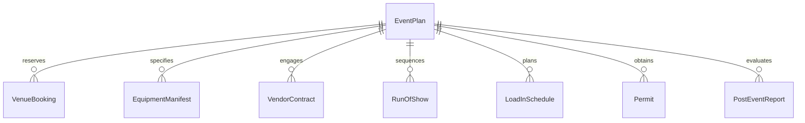
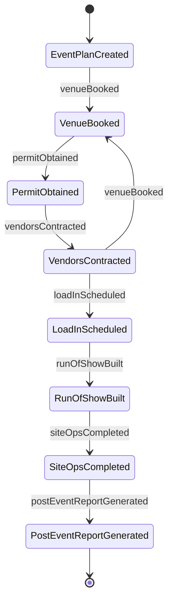
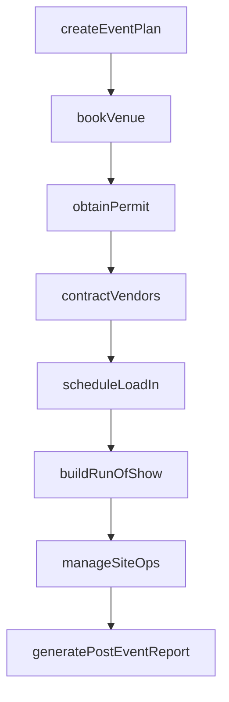
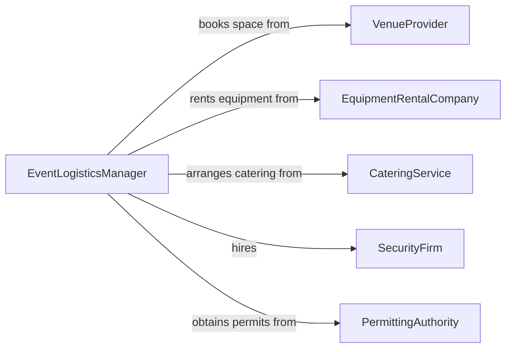

# Coordinate Logistics for Productions or Events

> Business-as-Code definition for coordinating event and production logistics. Models the planning and execution of venue setup, vendor coordination, equipment transport, and on-site operations for events and productions.

## Overview

Coordinating logistics for productions or events involves managing the physical and operational requirements for live events, film productions, conferences, and similar gatherings. This definition provides actions for securing venues, scheduling equipment delivery, coordinating vendor services, managing on-site operations, and tracking event timelines. It enables automation of load-in scheduling, vendor confirmations, and run-of-show management.

## Actors

| Actor | Description |
|-------|-------------|
| VenueProvider | Supplies the physical space for the event or production |
| EquipmentRentalCompany | Provides staging, lighting, audio, and technical equipment |
| CateringService | Delivers food and beverage services for the event |
| SecurityFirm | Provides crowd management and access control services |
| TransportCompany | Handles equipment and material delivery logistics |
| PermittingAuthority | Issues permits for events, road closures, or noise variances |

## Roles

| Role | Description |
|------|-------------|
| EventLogisticsManager | Oversees all logistical planning and execution for events |
| ProductionCoordinator | Manages technical and staging requirements |
| VendorLiaison | Coordinates with external service providers |
| SiteManager | Directs on-site operations during load-in, event, and teardown |

## Entities

| Entity | Description |
|--------|-------------|
| EventPlan | Comprehensive plan covering all logistics for an event |
| VenueBooking | Confirmed reservation of a performance or event space |
| EquipmentManifest | List of technical equipment required for the production |
| VendorContract | Agreement with a service provider for event support |
| RunOfShow | Detailed timeline of event activities and cues |
| LoadInSchedule | Timeline for equipment delivery and setup at the venue |
| Permit | Authorization from local authorities for the event |
| PostEventReport | Assessment of event logistics execution and outcomes |

## Actions

| Action | Description |
|--------|-------------|
| createEventPlan | Develop a comprehensive logistics plan for an event |
| bookVenue | Reserve and confirm an event or production space |
| scheduleLoadIn | Plan equipment delivery and setup timelines |
| contractVendors | Engage and confirm external service providers |
| buildRunOfShow | Create the detailed event timeline and cue sheet |
| obtainPermit | Secure required authorizations from local authorities |
| manageSiteOps | Direct on-site operations during setup and event execution |
| generatePostEventReport | Document logistics performance and lessons learned |

## Events

| Event | Description |
|-------|-------------|
| eventPlanCreated | A logistics plan has been developed for an event |
| venueBooked | An event space has been confirmed |
| loadInScheduled | Equipment delivery timelines have been established |
| vendorsContracted | External service providers have been confirmed |
| runOfShowBuilt | The event timeline and cue sheet have been created |
| permitObtained | Required event authorizations have been secured |
| siteOpsCompleted | On-site event operations have concluded |
| postEventReportGenerated | Event logistics assessment has been documented |

## Searches

| Search | Description |
|--------|-------------|
| findEvents | List events by date, venue, or status |
| getVenueAvailability | Check venue booking availability by date |
| getEquipmentManifest | Retrieve equipment requirements for a production |
| getVendorStatus | Check confirmation status of contracted vendors |
| getRunOfShow | Retrieve the detailed event timeline |


## Entity Relationships



## State Diagram



## Workflow



## Actor Relationships



## Usage

### Calling Actions

```typescript
import { coordinateLogisticsProductionsEvents } from '@headlessly/coordinate-logistics-productions-events'

const events = coordinateLogisticsProductionsEvents()

// Create an event logistics plan
const plan = await events.createEventPlan({
  name: 'Annual Tech Conference 2026',
  date: '2026-09-15',
  expectedAttendance: 2000,
  venue: 'Convention Center Hall A'
})

// Book the venue
await events.bookVenue({
  eventId: plan.id,
  venue: 'Convention Center Hall A',
  dates: ['2026-09-14', '2026-09-15', '2026-09-16'],
  setupDay: '2026-09-14'
})

// Build the run of show
await events.buildRunOfShow({
  eventId: plan.id,
  segments: [
    { time: '09:00', activity: 'Registration Opens' },
    { time: '10:00', activity: 'Keynote Address' },
    { time: '12:00', activity: 'Lunch Break' },
    { time: '13:30', activity: 'Breakout Sessions' }
  ]
})
```

### Event-Driven Automation

```typescript
// Auto-schedule load-in when venue is booked
events.venueBooked(async ({ eventId, setupDay }) => {
  await events.scheduleLoadIn({ eventId, date: setupDay })
})

// Generate post-event report after site operations conclude
events.siteOpsCompleted(async ({ eventId }) => {
  await events.generatePostEventReport({ eventId })
})
```
