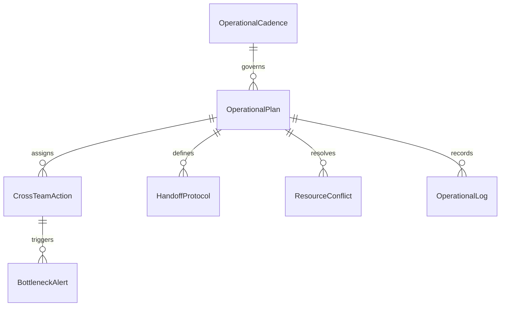
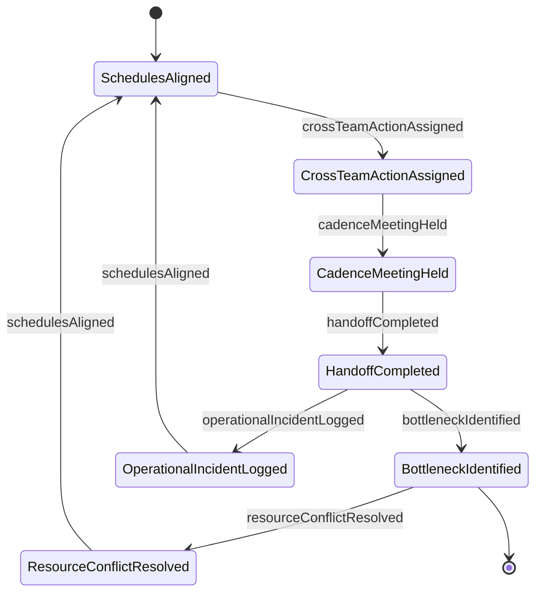
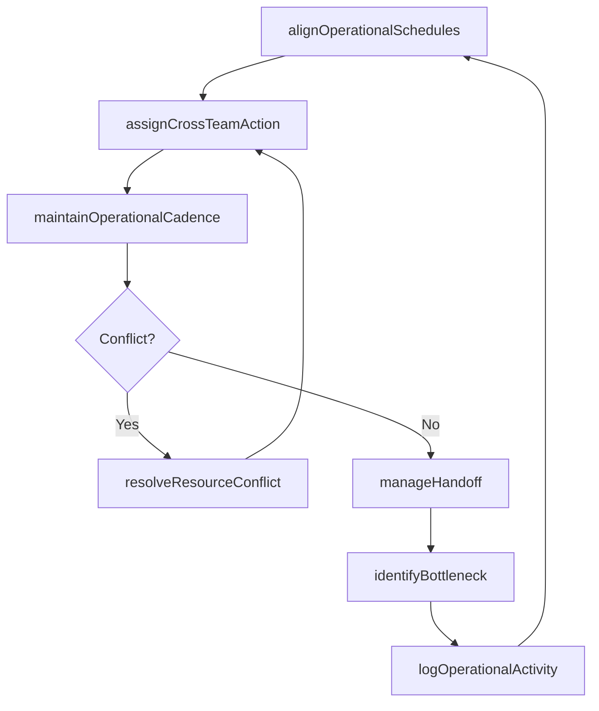
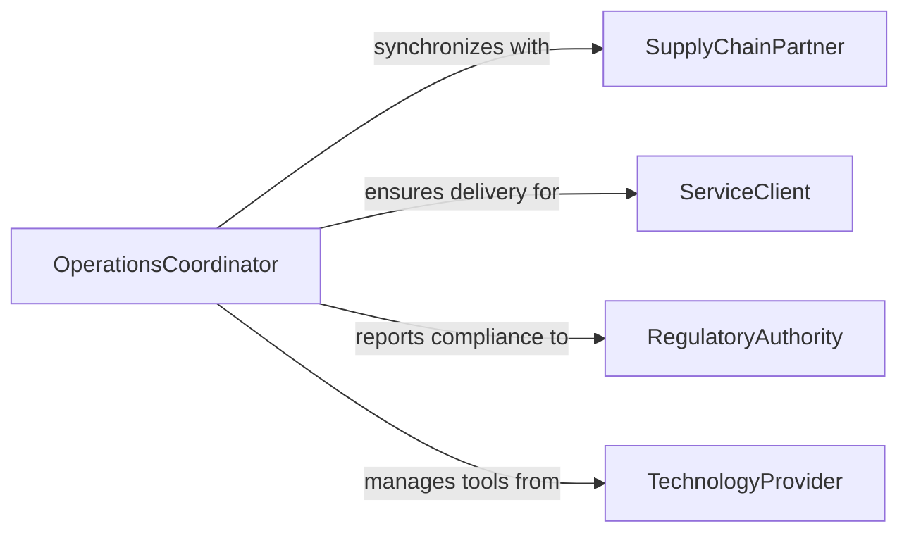

# Coordinate Operational Activities

> Business-as-Code definition for coordinating operational activities. Models the alignment of cross-functional business operations including scheduling, resource sharing, workflow handoffs, and operational cadence management.

## Overview

Coordinating operational activities involves synchronizing work across multiple teams, shifts, or locations to maintain smooth business operations. This definition provides actions for aligning schedules, managing handoffs between operational units, resolving resource conflicts, and maintaining operational cadence. It enables automation of shift transition protocols, cross-team communication, and operational bottleneck detection.

## Actors

| Actor | Description |
|-------|-------------|
| SupplyChainPartner | External logistics or manufacturing partner requiring coordination |
| ServiceClient | Customer whose service delivery depends on coordinated operations |
| RegulatoryAuthority | Enforces operational standards and reporting requirements |
| TechnologyProvider | Supplies software and systems supporting operational coordination |

## Roles

| Role | Description |
|------|-------------|
| OperationsCoordinator | Manages day-to-day alignment of cross-functional activities |
| ShiftManager | Oversees operations during a specific work period |
| CapacityPlanner | Forecasts resource needs and prevents operational bottlenecks |
| CommunicationsLead | Ensures operational information flows between teams and shifts |

## Entities

| Entity | Description |
|--------|-------------|
| OperationalPlan | A coordinated schedule of activities across teams and periods |
| HandoffProtocol | Defined procedure for transferring work between shifts or teams |
| ResourceConflict | A scheduling overlap requiring resolution between competing needs |
| OperationalCadence | Recurring rhythm of meetings, reports, and review cycles |
| BottleneckAlert | Identified constraint limiting operational throughput |
| CrossTeamAction | A task requiring execution by multiple operational units |
| OperationalLog | Record of activities, decisions, and incidents during a period |

## Actions

| Action | Description |
|--------|-------------|
| alignOperationalSchedules | Synchronize activity timelines across teams and locations |
| manageHandoff | Execute work transition procedures between shifts or teams |
| resolveResourceConflict | Arbitrate competing resource demands between operations |
| maintainOperationalCadence | Schedule and facilitate recurring coordination activities |
| identifyBottleneck | Detect constraints limiting operational throughput |
| assignCrossTeamAction | Allocate tasks requiring multi-unit coordination |
| logOperationalActivity | Record activities and decisions for operational continuity |

## Events

| Event | Description |
|-------|-------------|
| schedulesAligned | Cross-functional activity timelines have been synchronized |
| handoffCompleted | Work transition between shifts or teams has been executed |
| resourceConflictResolved | Competing resource demands have been arbitrated |
| cadenceMeetingHeld | A recurring coordination session has been conducted |
| bottleneckIdentified | An operational throughput constraint has been detected |
| crossTeamActionAssigned | A multi-unit task has been allocated |
| operationalIncidentLogged | An unplanned event affecting operations has been recorded |

## Searches

| Search | Description |
|--------|-------------|
| getOperationalPlan | Retrieve coordinated schedules by team, location, or period |
| findResourceConflicts | List unresolved scheduling overlaps between operations |
| getBottlenecks | Identify active throughput constraints by area or severity |
| getHandoffStatus | Check shift transition completion and open items |
| getOperationalLog | Retrieve activity records by period, team, or incident type |


## Entity Relationships



## State Diagram



## Workflow



## Actor Relationships



## Usage

### Calling Actions

```typescript
import { coordinateOperationalActivities } from '@headlessly/coordinate-operational-activities'

const ops = coordinateOperationalActivities()

// Align schedules across teams
await ops.alignOperationalSchedules({
  teams: ['production', 'quality', 'shipping'],
  period: '2026-04-W2',
  constraints: ['equipment-availability', 'staff-certifications']
})

// Manage shift handoff
await ops.manageHandoff({
  outgoingShift: 'day-shift',
  incomingShift: 'evening-shift',
  location: 'plant-floor-A',
  openItems: ['batch-2204-in-progress', 'equipment-calibration-pending']
})

// Check for bottlenecks
const bottlenecks = await ops.getBottlenecks({
  area: 'production',
  severity: 'high',
  period: '2026-04-W2'
})
```

### Event-Driven Automation

```typescript
// Alert on bottleneck detection
ops.bottleneckIdentified(async ({ area, constraint, impact }) => {
  await notify({
    to: 'capacity-planner',
    message: `Bottleneck in ${area}: ${constraint}. Throughput impact: ${impact}%`
  })
})

// Auto-log handoff completion
ops.handoffCompleted(async ({ outgoingShift, incomingShift, openItems }) => {
  if (openItems.length > 0) {
    await notify({
      to: 'shift-manager',
      message: `Handoff ${outgoingShift} to ${incomingShift}: ${openItems.length} open items carried over`
    })
  }
})
```
