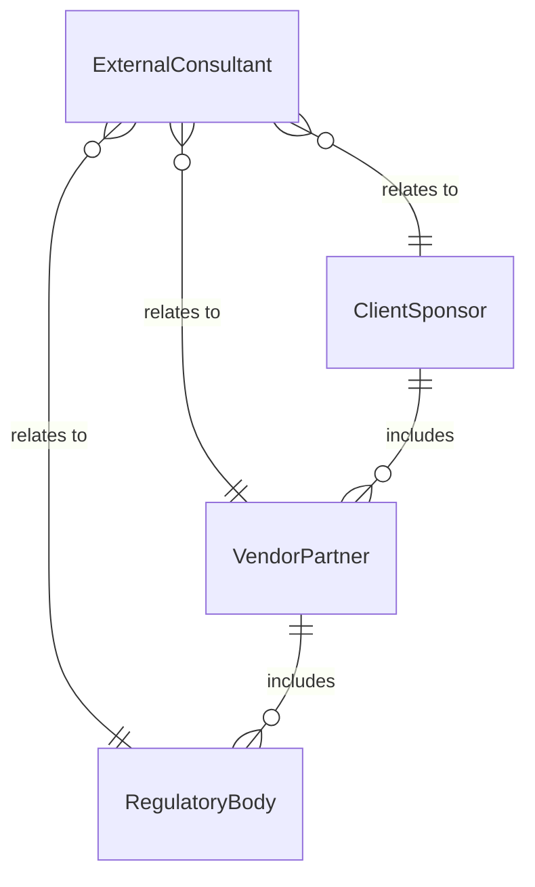
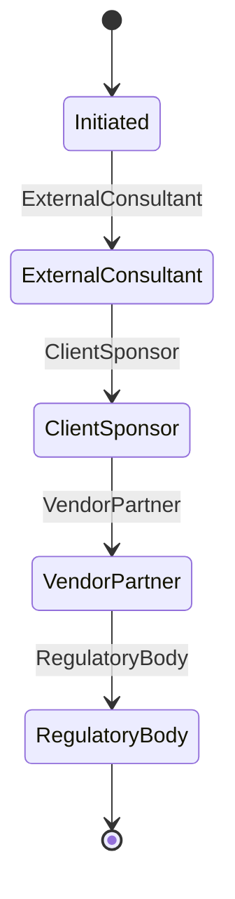
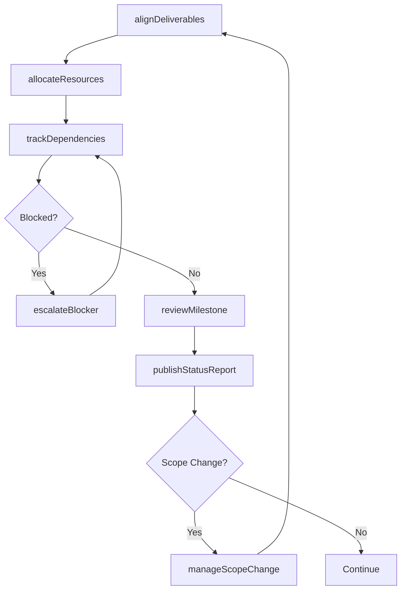
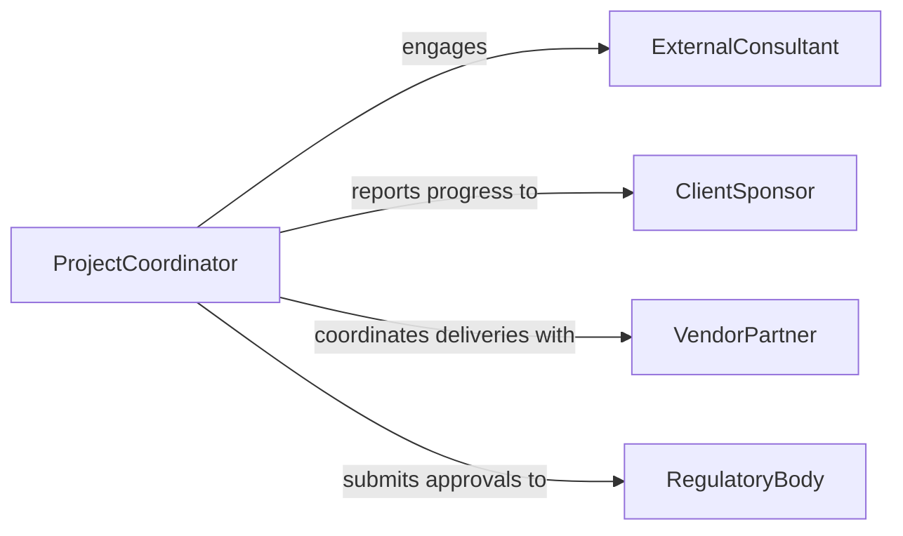

# Coordinate Project Activities Personnel Departments

> Business-as-Code definition for coordinating project activities with other personnel or departments. Models cross-functional project coordination including task alignment, dependency management, and stakeholder communication.

## Overview

Coordinating project activities with other personnel or departments involves aligning work streams across organizational units, managing interdependencies between teams, and ensuring all stakeholders are informed of project progress. This definition provides actions for defining cross-team deliverables, tracking dependencies, escalating blockers, and facilitating status reporting. It enables automation of dependency alerts, milestone tracking, and stakeholder notification workflows.

## Actors

| Actor | Description |
|-------|-------------|
| ExternalConsultant | Provides specialized expertise for project tasks |
| ClientSponsor | External stakeholder funding or requesting the project |
| VendorPartner | Supplies products or services required by the project |
| RegulatoryBody | Requires compliance documentation or approvals during the project |

## Roles

| Role | Description |
|------|-------------|
| ProjectCoordinator | Manages cross-departmental task alignment and communication |
| DepartmentLead | Represents their team in cross-functional project planning |
| ResourceManager | Allocates personnel and assets to project work streams |
| ExecutiveSponsor | Provides strategic direction and removes organizational blockers |

## Entities

| Entity | Description |
|--------|-------------|
| ProjectPlan | Master schedule of tasks, milestones, and deliverables |
| CrossTeamDependency | A task requiring completion by another department before work can proceed |
| Milestone | A significant project checkpoint or deliverable date |
| StatusReport | Periodic summary of progress, risks, and blockers |
| ResourceAllocation | Assignment of personnel or assets to project work streams |
| RiskRegister | Catalog of identified risks with impact and mitigation plans |
| ChangeRequest | A proposed modification to project scope, timeline, or budget |

## Actions

| Action | Description |
|--------|-------------|
| alignDeliverables | Synchronize task schedules across participating departments |
| trackDependencies | Monitor cross-team task prerequisites and completion status |
| escalateBlocker | Raise an unresolved issue to leadership for resolution |
| publishStatusReport | Distribute project progress updates to stakeholders |
| allocateResources | Assign personnel and assets to project work streams |
| manageScopeChange | Evaluate and process requests to modify project parameters |
| reviewMilestone | Assess deliverable completion at a project checkpoint |

## Events

| Event | Description |
|-------|-------------|
| deliverablesAligned | Cross-departmental task schedules have been synchronized |
| dependencyCompleted | A prerequisite task from another department has been finished |
| blockerEscalated | An unresolved issue has been raised to leadership |
| statusReportPublished | Project progress updates have been distributed |
| resourcesAllocated | Personnel or assets have been assigned to work streams |
| scopeChangeApproved | A modification to project parameters has been authorized |
| milestoneReviewed | A project checkpoint has been assessed |

## Searches

| Search | Description |
|--------|-------------|
| getProjectPlan | Retrieve task schedules and milestones by project or department |
| findBlockedTasks | List tasks waiting on cross-team dependencies |
| getResourceUtilization | Check personnel allocation across active projects |
| getRiskRegister | Retrieve identified risks by severity or mitigation status |
| getChangeRequests | List pending scope or timeline modifications |


## Entity Relationships



## State Diagram



## Workflow



## Actor Relationships



## Usage

### Calling Actions

```typescript
import { coordinateProjectActivitiesPersonnelDepartments } from '@headlessly/coordinate-project-activities-personnel-departments'

const project = coordinateProjectActivitiesPersonnelDepartments()

// Align deliverables across departments
await project.alignDeliverables({
  projectId: 'proj-erp-migration',
  departments: ['engineering', 'finance', 'operations'],
  milestones: [
    { name: 'Data Migration Complete', date: '2026-06-01', owner: 'engineering' },
    { name: 'UAT Sign-off', date: '2026-07-15', owner: 'operations' }
  ]
})

// Track cross-team dependencies
const blocked = await project.findBlockedTasks({
  projectId: 'proj-erp-migration',
  status: 'waiting-on-dependency'
})

// Publish status report
await project.publishStatusReport({
  projectId: 'proj-erp-migration',
  period: '2026-04-W2',
  recipients: ['executive-sponsor', 'department-leads']
})
```

### Event-Driven Automation

```typescript
// Auto-notify when dependency is completed
project.dependencyCompleted(async ({ taskId, dependentTasks, completedBy }) => {
  for (const task of dependentTasks) {
    await notify({
      to: task.owner,
      message: `Dependency resolved: ${taskId} completed by ${completedBy}. Your task ${task.id} is now unblocked.`
    })
  }
})

// Alert on blocker escalation
project.blockerEscalated(async ({ projectId, blocker, impact }) => {
  await notify({
    to: 'executive-sponsor',
    message: `Project ${projectId} blocker: ${blocker.description}. Impact: ${impact.delayDays} day delay`
  })
})
```
