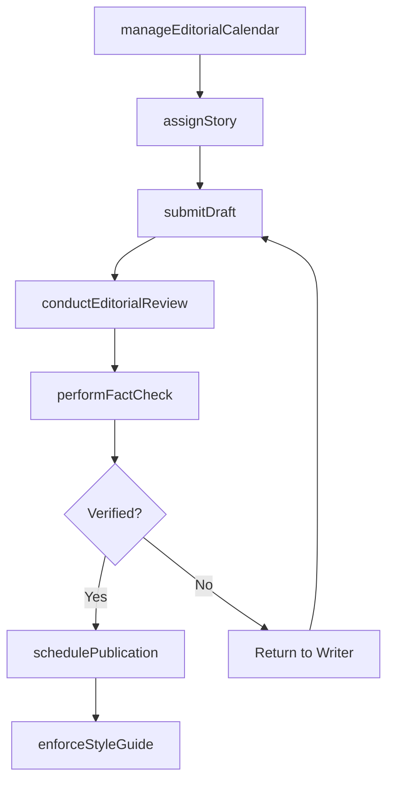
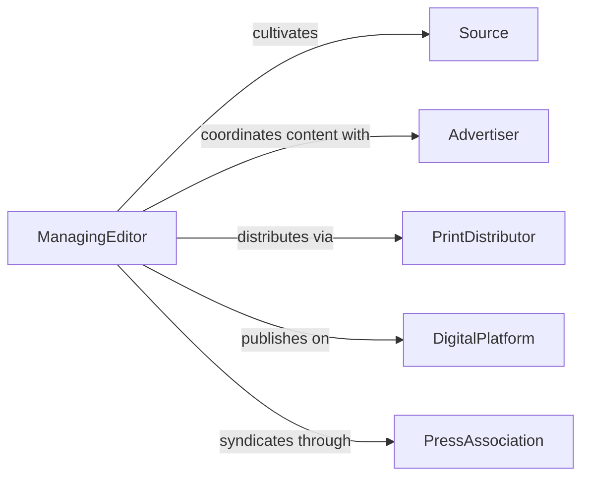

# Coordinate Reporting Editing Activities

> Business-as-Code definition for coordinating reporting or editing activities. Models the oversight of content production pipelines including story assignment, editorial review, fact-checking, and publication scheduling.

## Overview

Coordinating reporting or editing activities involves overseeing the content creation lifecycle from story assignment and research through drafting, editorial review, fact-checking, and publication. This definition provides actions for managing editorial calendars, assigning reporters and editors, tracking content through review stages, and coordinating publication timing. It enables automation of deadline monitoring, editorial workflow routing, and publication scheduling.

## Actors

| Actor | Description |
|-------|-------------|
| Source | Individual or organization providing information for reporting |
| Advertiser | Purchases advertising space tied to editorial content |
| PrintDistributor | Handles physical distribution of printed publications |
| DigitalPlatform | Hosts and distributes online content |
| PressAssociation | Provides wire service content and syndication agreements |

## Roles

| Role | Description |
|------|-------------|
| ManagingEditor | Oversees all editorial operations and content standards |
| AssignmentEditor | Assigns stories to reporters and manages coverage priorities |
| CopyEditor | Reviews content for grammar, style, and factual accuracy |
| Reporter | Researches and writes original content for publication |
| ProductionManager | Coordinates layout, design, and publication timing |

## Entities

| Entity | Description |
|--------|-------------|
| StoryAssignment | A reporting task with topic, deadline, and assigned writer |
| EditorialCalendar | Planned content schedule by publication date and section |
| DraftManuscript | Written content submitted for editorial review |
| EditorialReview | Feedback and corrections applied to a draft |
| FactCheckRecord | Verification of claims and sources within a story |
| PublicationSchedule | Timing and sequencing of content for release |
| StyleGuide | Standards for writing tone, formatting, and terminology |

## Actions

| Action | Description |
|--------|-------------|
| assignStory | Allocate a reporting topic to a writer with deadline |
| submitDraft | Submit written content for editorial review |
| conductEditorialReview | Apply edits and feedback to a draft manuscript |
| performFactCheck | Verify claims, sources, and data within a story |
| schedulePublication | Set the release date and placement for approved content |
| manageEditorialCalendar | Plan and update the content schedule across sections |
| enforceStyleGuide | Ensure content conforms to publication standards |

## Events

| Event | Description |
|-------|-------------|
| storyAssigned | A reporting topic has been allocated to a writer |
| draftSubmitted | Written content has been sent for editorial review |
| editorialReviewCompleted | Edits and feedback have been applied to a draft |
| factCheckPassed | Claims and sources within a story have been verified |
| publicationScheduled | Content release date and placement have been set |
| editorialCalendarUpdated | The content schedule has been modified |
| deadlineMissed | A writer has not submitted content by the assigned date |

## Searches

| Search | Description |
|--------|-------------|
| getEditorialCalendar | Retrieve planned content by date, section, or writer |
| findPendingDrafts | List submitted content awaiting editorial review |
| getFactCheckStatus | Check verification progress for stories in review |
| findOverdueAssignments | List stories past their submission deadline |
| getPublicationQueue | Retrieve content scheduled for upcoming release |

## Workflow



## Actor Relationships



## Usage

### Calling Actions

```typescript
import { coordinateReportingEditingActivities } from '@headlessly/coordinate-reporting-editing-activities'

const editorial = coordinateReportingEditingActivities()

// Assign a story to a reporter
await editorial.assignStory({
  topic: 'City Council Budget Vote Coverage',
  section: 'local-government',
  writer: 'reporter-jsmith',
  deadline: '2026-04-10T17:00',
  wordCount: 1200
})

// Submit a draft for review
await editorial.submitDraft({
  storyId: 'story-2026-0410-budget',
  writer: 'reporter-jsmith',
  wordCount: 1180,
  sources: ['council-minutes', 'mayor-interview', 'budget-document']
})

// Check editorial calendar
const calendar = await editorial.getEditorialCalendar({
  week: '2026-04-W2',
  sections: ['local-government', 'business', 'opinion']
})
```

### Event-Driven Automation

```typescript
// Alert on missed deadlines
editorial.deadlineMissed(async ({ storyId, writer, deadline }) => {
  await notify({
    to: 'assignment-editor',
    message: `Story ${storyId} from ${writer} overdue since ${deadline}`
  })
})

// Auto-route fact-checked content to publication
editorial.factCheckPassed(async ({ storyId, section }) => {
  await editorial.schedulePublication({
    storyId,
    section,
    timing: 'next-available'
  })
})
```
