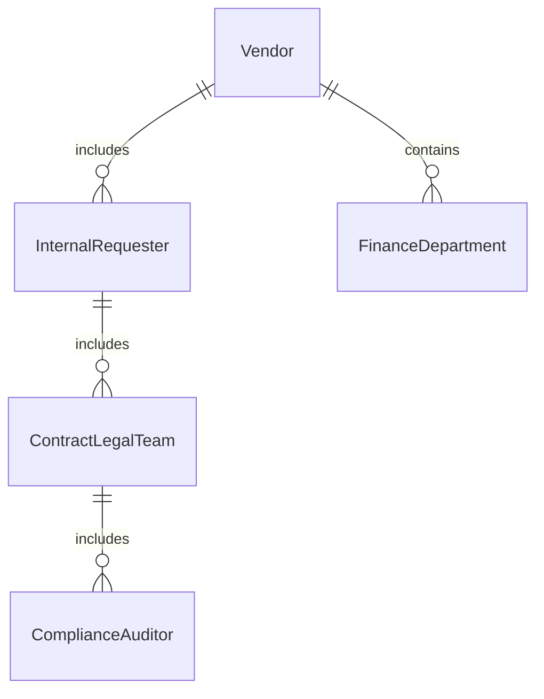
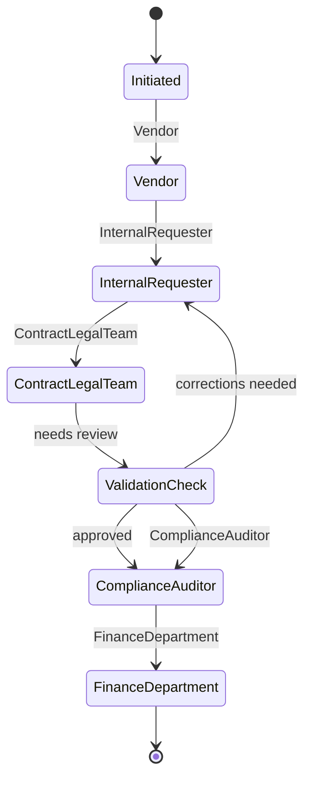
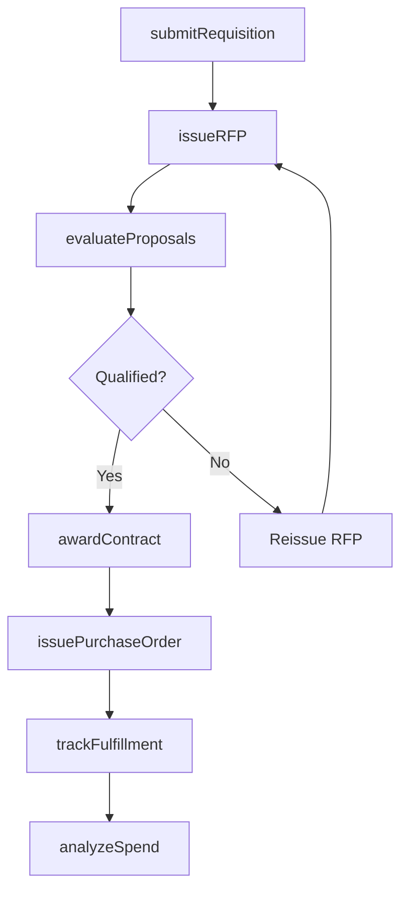
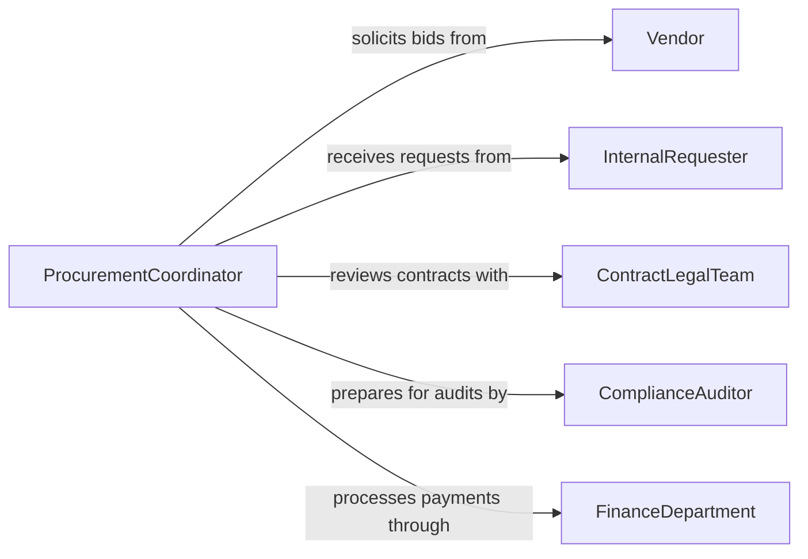

# Coordinate Resource Procurement Activities

> Business-as-Code definition for coordinating resource procurement activities. Models the oversight of purchasing processes including vendor selection, bid evaluation, contract negotiation, and supply chain coordination.

## Overview

Coordinating resource procurement activities involves overseeing the sourcing, evaluation, and acquisition of goods, services, and materials needed for organizational operations. This definition provides actions for managing requisitions, evaluating vendor proposals, negotiating contracts, and tracking purchase order fulfillment. It enables automation of approval routing, vendor scoring, and procurement spend analysis workflows.

## Actors

| Actor | Description |
|-------|-------------|
| Vendor | Provides goods or services in response to procurement requests |
| InternalRequester | Department or individual submitting a purchase requisition |
| ContractLegalTeam | Reviews and approves procurement contract terms |
| ComplianceAuditor | Verifies procurement activities follow organizational policies |
| FinanceDepartment | Approves funding and processes vendor payments |

## Roles

| Role | Description |
|------|-------------|
| ProcurementCoordinator | Oversees the end-to-end procurement process |
| BuyerAnalyst | Evaluates vendor proposals and negotiates pricing |
| ContractAdministrator | Manages contract lifecycle from execution through renewal |
| ReceivingClerk | Verifies delivered goods against purchase order specifications |

## Entities

| Entity | Description |
|--------|-------------|
| PurchaseRequisition | A formal request for goods or services from an internal department |
| RequestForProposal | A solicitation document sent to vendors for competitive bidding |
| VendorProposal | A supplier response to an RFP with pricing and terms |
| PurchaseOrder | An authorized commitment to buy from a selected vendor |
| ProcurementContract | A binding agreement defining supply terms and conditions |
| VendorScorecard | Performance rating for a supplier based on quality, delivery, and cost |
| SpendAnalysis | Assessment of procurement spending by category, vendor, or period |

## Actions

| Action | Description |
|--------|-------------|
| submitRequisition | Create a formal request for goods or services |
| issueRFP | Distribute a solicitation document to qualified vendors |
| evaluateProposals | Score and compare vendor responses to an RFP |
| awardContract | Select a vendor and finalize procurement terms |
| issuePurchaseOrder | Create an authorized order for goods or services |
| trackFulfillment | Monitor delivery status against purchase order terms |
| analyzeSpend | Assess procurement spending patterns and identify savings |

## Events

| Event | Description |
|-------|-------------|
| requisitionSubmitted | A purchase request has been created by an internal department |
| rfpIssued | A solicitation document has been distributed to vendors |
| proposalsEvaluated | Vendor responses have been scored and compared |
| contractAwarded | A vendor has been selected and terms finalized |
| purchaseOrderIssued | An authorized order has been created |
| fulfillmentCompleted | Delivered goods have been verified against order specifications |
| spendThresholdExceeded | Procurement spending has surpassed a budget category limit |

## Searches

| Search | Description |
|--------|-------------|
| getRequisitions | Retrieve purchase requests by department, status, or category |
| getVendorProposals | List vendor responses for an active RFP |
| getPurchaseOrders | Check order status by vendor, date, or fulfillment state |
| getVendorScorecard | Review supplier performance ratings |
| getSpendAnalysis | Retrieve procurement spending by category or period |


## Entity Relationships



## State Diagram



## Workflow



## Actor Relationships



## Usage

### Calling Actions

```typescript
import { coordinateResourceProcurementActivities } from '@headlessly/coordinate-resource-procurement-activities'

const procurement = coordinateResourceProcurementActivities()

// Submit a requisition
const requisition = await procurement.submitRequisition({
  department: 'engineering',
  category: 'cloud-infrastructure',
  description: 'Annual cloud hosting renewal',
  estimatedValue: 240000,
  requiredBy: '2026-06-01'
})

// Issue an RFP
await procurement.issueRFP({
  requisitionId: requisition.id,
  vendors: ['aws', 'azure', 'gcp'],
  responseDeadline: '2026-04-30',
  evaluationCriteria: ['price', 'sla-uptime', 'support-response-time']
})

// Check spend analysis
const spend = await procurement.getSpendAnalysis({
  category: 'cloud-infrastructure',
  period: '2026-Q1',
  groupBy: 'vendor'
})
```

### Event-Driven Automation

```typescript
// Auto-route requisitions for approval
procurement.requisitionSubmitted(async ({ requisitionId, estimatedValue }) => {
  const approver = estimatedValue > 50000 ? 'vp-finance' : 'department-manager'
  await notify({
    to: approver,
    message: `Purchase requisition ${requisitionId} requires approval ($${estimatedValue})`
  })
})

// Alert on spend threshold
procurement.spendThresholdExceeded(async ({ category, spent, budget }) => {
  await notify({
    to: 'procurement-coordinator',
    message: `${category} spend ($${spent}) exceeds budget ($${budget})`
  })
})
```
