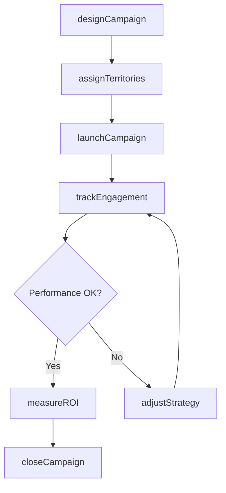
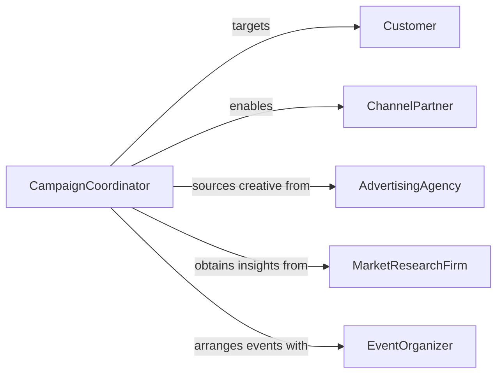

# Coordinate Sales Campaigns

> Business-as-Code definition for coordinating sales campaigns. Models the planning, execution, and performance tracking of targeted sales initiatives across channels and teams.

## Overview

Coordinating sales campaigns involves aligning sales teams, marketing assets, and channel partners around structured selling initiatives. This definition provides actions for designing campaign strategies, assigning territories, tracking prospect engagement, and measuring campaign ROI. It enables automation of campaign launch sequences, lead follow-up workflows, and performance dashboarding.

## Actors

| Actor | Description |
|-------|-------------|
| Customer | Target audience for the sales campaign |
| ChannelPartner | Resellers and distributors participating in the campaign |
| AdvertisingAgency | Creates promotional materials and media placements |
| MarketResearchFirm | Provides audience segmentation and competitive analysis |
| EventOrganizer | Coordinates trade shows, webinars, or launch events |

## Roles

| Role | Description |
|------|-------------|
| CampaignCoordinator | Plans and manages the overall campaign timeline |
| SalesManager | Directs sales representatives executing the campaign |
| MarketingSpecialist | Develops campaign messaging and creative assets |
| DataAnalyst | Tracks campaign performance metrics and generates reports |

## Entities

| Entity | Description |
|--------|-------------|
| Campaign | A structured sales initiative with defined goals and timeline |
| Territory | Geographic or account-based assignment for campaign execution |
| Prospect | A target account or individual within the campaign audience |
| CampaignAsset | Marketing collateral, presentations, or demo materials |
| PerformanceMetric | Tracked KPI such as conversion rate, pipeline value, or close rate |
| Incentive | Bonus or reward structure motivating campaign participation |
| CampaignBudget | Financial allocation for campaign activities and resources |

## Actions

| Action | Description |
|--------|-------------|
| designCampaign | Define campaign objectives, audience, and strategy |
| assignTerritories | Allocate geographic or account segments to sales reps |
| launchCampaign | Activate campaign across all participating channels |
| trackEngagement | Monitor prospect interactions with campaign touchpoints |
| measureROI | Calculate return on investment for the campaign |
| adjustStrategy | Modify campaign tactics based on performance data |
| closeCampaign | Finalize campaign and compile results |

## Events

| Event | Description |
|-------|-------------|
| campaignDesigned | Campaign strategy and plan have been finalized |
| territoriesAssigned | Sales territories have been allocated for the campaign |
| campaignLaunched | The sales campaign has been activated |
| engagementTracked | Prospect engagement data has been recorded |
| roiCalculated | Campaign return on investment has been computed |
| strategyAdjusted | Campaign tactics have been modified mid-flight |
| campaignClosed | The campaign has been finalized and archived |

## Searches

| Search | Description |
|--------|-------------|
| findCampaigns | List campaigns by status, product, or date range |
| getEngagementMetrics | Retrieve prospect interaction data by channel |
| getTerritoryPerformance | Compare sales results across assigned territories |
| getROIReport | Retrieve campaign return on investment summaries |
| findProspects | List prospects by engagement level or territory |

## Workflow



## Actor Relationships



## Usage

### Calling Actions

```typescript
import { coordinateSalesCampaigns } from '@headlessly/coordinate-sales-campaigns'

const campaigns = coordinateSalesCampaigns()

// Design a new sales campaign
const campaign = await campaigns.designCampaign({
  name: 'Q3 Enterprise Push',
  product: 'Platform Pro',
  audience: 'enterprise-accounts',
  budget: 200000,
  startDate: '2026-07-01',
  endDate: '2026-09-30'
})

// Assign territories to sales reps
await campaigns.assignTerritories({
  campaignId: campaign.id,
  assignments: [
    { rep: 'rep-east', territory: 'US-East' },
    { rep: 'rep-west', territory: 'US-West' },
    { rep: 'rep-central', territory: 'US-Central' }
  ]
})

// Track engagement during campaign
const engagement = await campaigns.trackEngagement({
  campaignId: campaign.id,
  channel: 'email'
})
```

### Event-Driven Automation

```typescript
// Auto-adjust underperforming campaigns
campaigns.engagementTracked(async ({ campaignId, conversionRate }) => {
  if (conversionRate < 0.02) {
    await campaigns.adjustStrategy({
      campaignId,
      changes: { increaseFrequency: true, addChannel: 'direct-mail' }
    })
  }
})

// Auto-generate ROI report on campaign close
campaigns.campaignClosed(async ({ campaignId }) => {
  await campaigns.measureROI({ campaignId })
})
```
