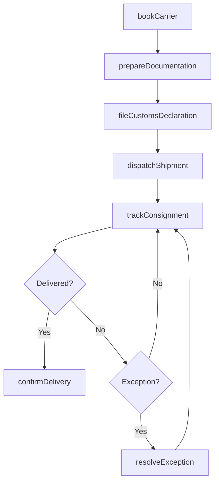
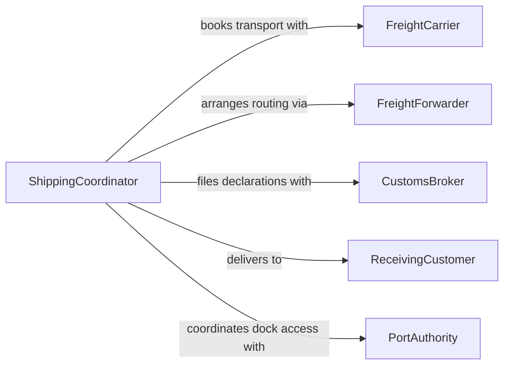

# Coordinate Shipping Activities with External Parties

> Business-as-Code definition for coordinating shipping activities with external parties. Models the orchestration of outbound and inbound shipments with carriers, freight forwarders, and customs authorities.

## Overview

Coordinating shipping activities with external parties involves managing the communication and logistics between an organization and its carriers, freight forwarders, customs brokers, and receiving customers. This definition provides actions for booking freight, sharing shipping documentation, tracking consignments, and resolving delivery exceptions. It enables automation of carrier notifications, document exchange, and shipment status updates across supply chain partners.

## Actors

| Actor | Description |
|-------|-------------|
| FreightCarrier | Transports goods by road, rail, air, or sea |
| FreightForwarder | Arranges multimodal transport and consolidation services |
| CustomsBroker | Handles import and export clearance documentation |
| ReceivingCustomer | End destination party accepting the shipment |
| PortAuthority | Manages dock and terminal operations for sea freight |

## Roles

| Role | Description |
|------|-------------|
| ShippingCoordinator | Manages day-to-day shipping operations and carrier relationships |
| ExportComplianceOfficer | Ensures shipments meet trade regulations and export controls |
| DocumentationSpecialist | Prepares and verifies shipping paperwork |
| TrafficManager | Oversees freight movement scheduling and carrier performance |

## Entities

| Entity | Description |
|--------|-------------|
| ShipmentOrder | A request to transport goods to a specified destination |
| BillOfLading | Legal transport document listing cargo details and terms |
| CommercialInvoice | Document declaring the value and description of shipped goods |
| TrackingRecord | Real-time location and status data for a shipment |
| CarrierBooking | Confirmed reservation of transport capacity with a carrier |
| CustomsDeclaration | Filing declaring goods for import or export clearance |
| DeliveryConfirmation | Proof that goods have been received at the destination |

## Actions

| Action | Description |
|--------|-------------|
| bookCarrier | Reserve transport capacity with a freight carrier |
| prepareDocumentation | Generate bills of lading, invoices, and customs forms |
| dispatchShipment | Release goods to the carrier for transport |
| trackConsignment | Monitor the real-time status of goods in transit |
| fileCustomsDeclaration | Submit import or export paperwork to customs authorities |
| confirmDelivery | Record proof of receipt at the destination |
| resolveException | Address delivery delays, damage claims, or routing issues |

## Events

| Event | Description |
|-------|-------------|
| carrierBooked | Transport capacity has been reserved |
| documentationPrepared | Shipping documents have been generated |
| shipmentDispatched | Goods have been released to the carrier |
| consignmentTracked | Shipment status has been updated |
| customsDeclared | Import or export paperwork has been submitted |
| deliveryConfirmed | Goods have been received at the destination |
| exceptionRaised | A shipping issue requiring resolution has been logged |

## Searches

| Search | Description |
|--------|-------------|
| findShipments | List shipment orders by status, carrier, or date |
| getTrackingStatus | Retrieve real-time location of a specific consignment |
| findPendingCustoms | List shipments awaiting customs clearance |
| getCarrierPerformance | Retrieve on-time delivery rates by carrier |
| getExceptions | List unresolved shipping exceptions by type |

## Workflow



## Actor Relationships



## Usage

### Calling Actions

```typescript
import { coordinateShippingActivitiesExternalParties } from '@headlessly/coordinate-shipping-activities-external-parties'

const shipping = coordinateShippingActivitiesExternalParties()

// Book a freight carrier
const booking = await shipping.bookCarrier({
  carrier: 'GlobalFreight',
  origin: 'Los Angeles',
  destination: 'Hamburg',
  mode: 'ocean',
  pickupDate: '2026-04-01'
})

// Prepare shipping documentation
await shipping.prepareDocumentation({
  bookingId: booking.id,
  documents: ['bill-of-lading', 'commercial-invoice', 'packing-list']
})

// Track the consignment
const status = await shipping.trackConsignment({ bookingId: booking.id })
```

### Event-Driven Automation

```typescript
// Auto-file customs when shipment is dispatched
shipping.shipmentDispatched(async ({ bookingId, destination }) => {
  await shipping.fileCustomsDeclaration({ bookingId, destination })
})

// Notify customer on delivery confirmation
shipping.deliveryConfirmed(async ({ bookingId, receivedBy, timestamp }) => {
  await notify({
    to: 'receiving-customer',
    message: `Shipment ${bookingId} delivered at ${timestamp}`
  })
})
```
