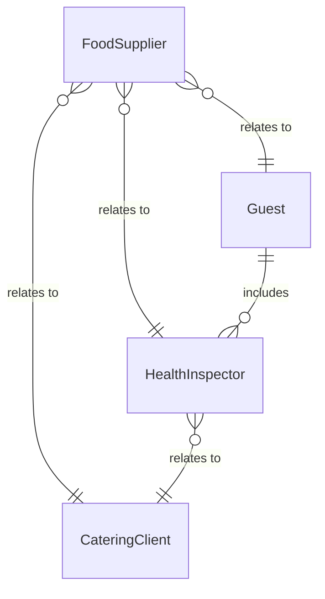
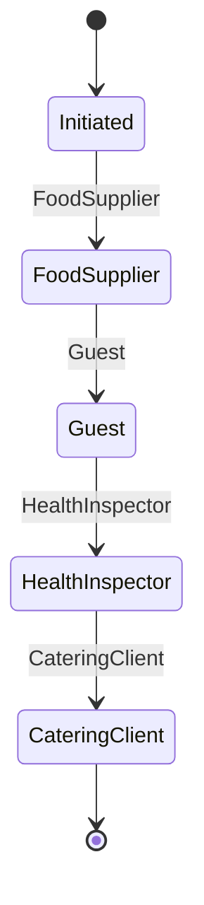
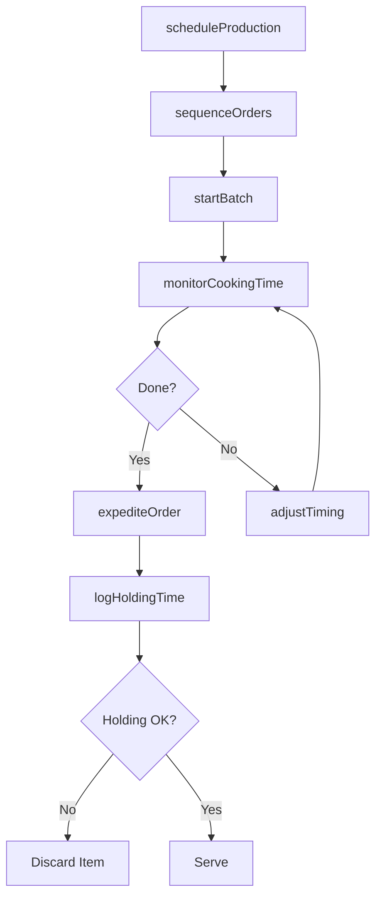
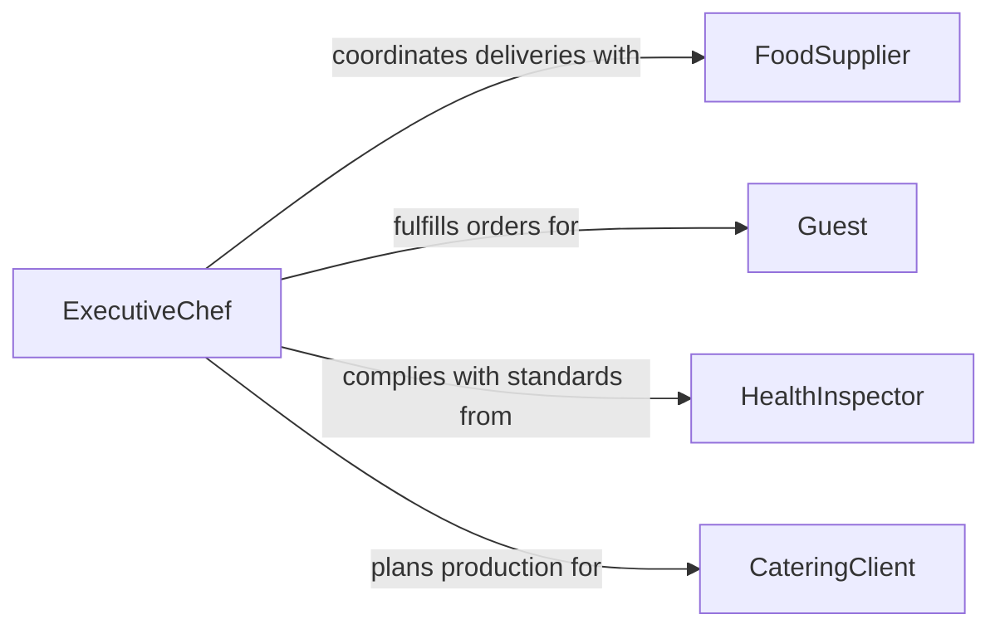

# Coordinate Timing of Food Production Activities

> Business-as-Code definition for coordinating the timing of food production activities. Models the synchronization of preparation, cooking, and plating sequences to deliver meals on schedule.

## Overview

Coordinating the timing of food production activities involves synchronizing the preparation, cooking, and assembly of menu items across kitchen stations to ensure timely meal delivery. This definition provides actions for sequencing production tasks, managing batch timing, coordinating expediting between kitchen and service, and tracking order fulfillment. It enables automation of prep scheduling, cooking timers, and ticket management workflows.

## Actors

| Actor | Description |
|-------|-------------|
| FoodSupplier | Delivers ingredients on schedule for production planning |
| Guest | Patron whose order dictates production timing |
| HealthInspector | Enforces food safety time and temperature requirements |
| CateringClient | External customer requiring bulk meal production on schedule |

## Roles

| Role | Description |
|------|-------------|
| ExecutiveChef | Sets production priorities and timing standards |
| SousChef | Coordinates station timing and expedites orders |
| PrepCook | Executes advance preparation tasks on schedule |
| Expeditor | Manages the flow of completed dishes to service |

## Entities

| Entity | Description |
|--------|-------------|
| ProductionSchedule | Timeline of batch preparation and cooking tasks |
| OrderTicket | A customer order requiring timed kitchen execution |
| PrepTask | An advance preparation step with target completion time |
| BatchRun | A scheduled production of a specific menu item quantity |
| CookingTimer | Time tracking for temperature-critical cooking steps |
| ExpeditingQueue | Ordered list of dishes awaiting final assembly and service |
| HoldingLog | Record of food items in hot or cold holding with timestamps |

## Actions

| Action | Description |
|--------|-------------|
| scheduleProduction | Plan batch preparation and cooking timelines |
| sequenceOrders | Arrange order tickets for optimal kitchen flow |
| startBatch | Initiate a timed production run for a menu item |
| monitorCookingTime | Track elapsed time for temperature-critical items |
| expediteOrder | Coordinate final assembly and dispatch of completed dishes |
| logHoldingTime | Record food safety holding times for prepared items |
| adjustTiming | Modify production sequence based on service pace changes |

## Events

| Event | Description |
|-------|-------------|
| productionScheduled | Batch production timelines have been established |
| orderSequenced | Order tickets have been arranged for kitchen execution |
| batchStarted | A menu item production run has begun |
| cookingTimeElapsed | A timed cooking step has reached completion |
| orderExpedited | A completed dish has been dispatched to service |
| holdingTimeExceeded | A food item has exceeded safe holding duration |
| timingAdjusted | Production sequence has been modified |

## Searches

| Search | Description |
|--------|-------------|
| getProductionSchedule | Retrieve planned production timelines by date or shift |
| getActiveOrders | List in-progress order tickets by station or priority |
| getHoldingStatus | Check food items currently in holding with elapsed times |
| getBatchProgress | Monitor completion status of active production runs |


## Entity Relationships



## State Diagram



## Workflow



## Actor Relationships



## Usage

### Calling Actions

```typescript
import { coordinateTimingFoodProductionActivities } from '@headlessly/coordinate-timing-food-production-activities'

const production = coordinateTimingFoodProductionActivities()

// Schedule daily production batches
await production.scheduleProduction({
  date: '2026-03-20',
  batches: [
    { item: 'soup-du-jour', quantity: 40, startTime: '09:00' },
    { item: 'house-bread', quantity: 60, startTime: '07:00' },
    { item: 'dessert-platter', quantity: 25, startTime: '14:00' }
  ]
})

// Sequence dinner orders
await production.sequenceOrders({
  tickets: ['ticket-101', 'ticket-102', 'ticket-103'],
  strategy: 'fire-by-course'
})

// Monitor cooking times
const timers = await production.monitorCookingTime({
  station: 'grill',
  activeItems: true
})
```

### Event-Driven Automation

```typescript
// Alert when holding time approaches limit
production.holdingTimeExceeded(async ({ item, holdingMinutes, maxMinutes }) => {
  await notify({
    to: 'sous-chef',
    message: `${item} held for ${holdingMinutes}min, max is ${maxMinutes}min`
  })
})

// Auto-expedite when cooking completes
production.cookingTimeElapsed(async ({ ticketId, item }) => {
  await production.expediteOrder({ ticketId, item })
})
```
