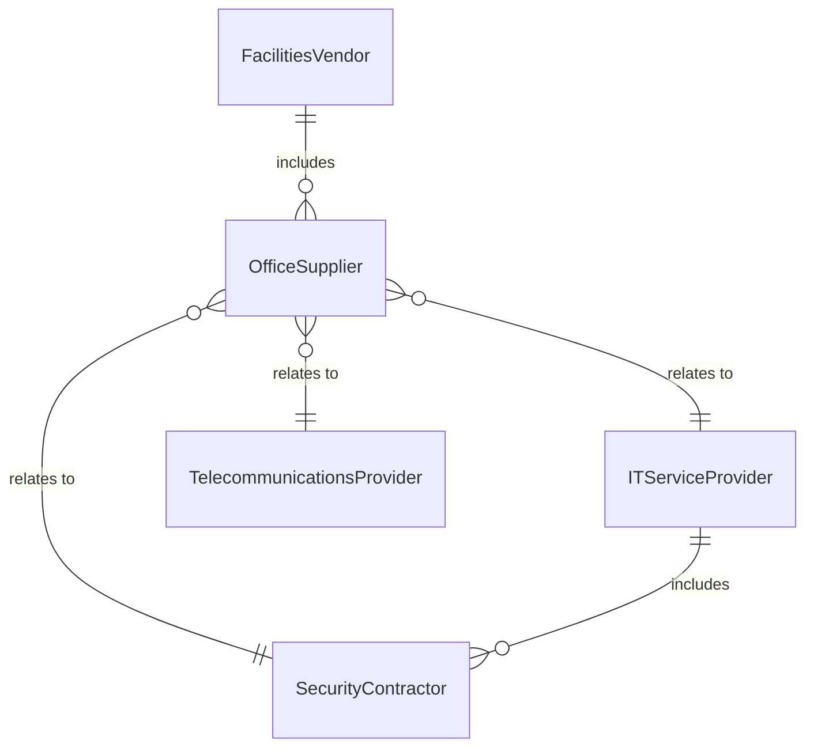
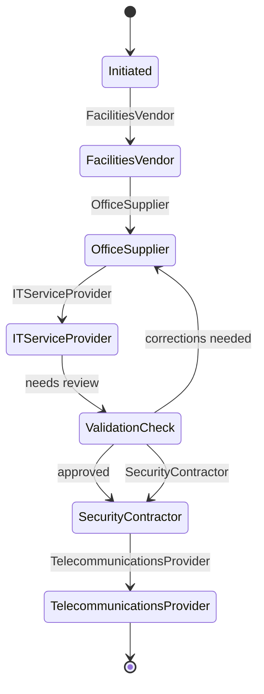
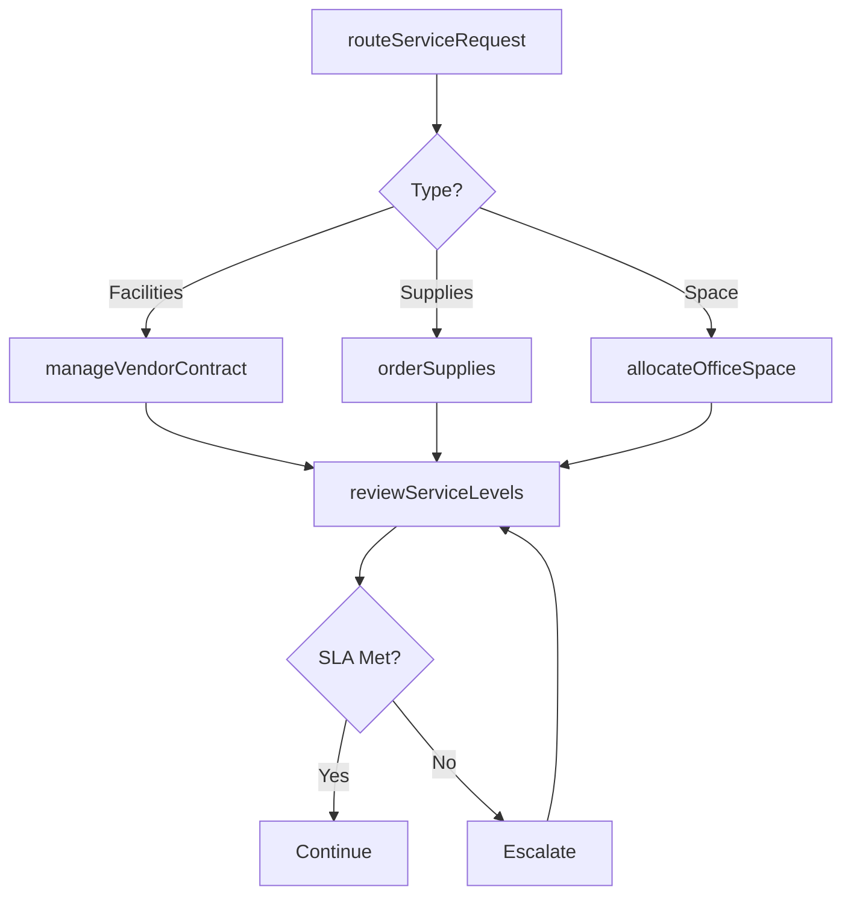
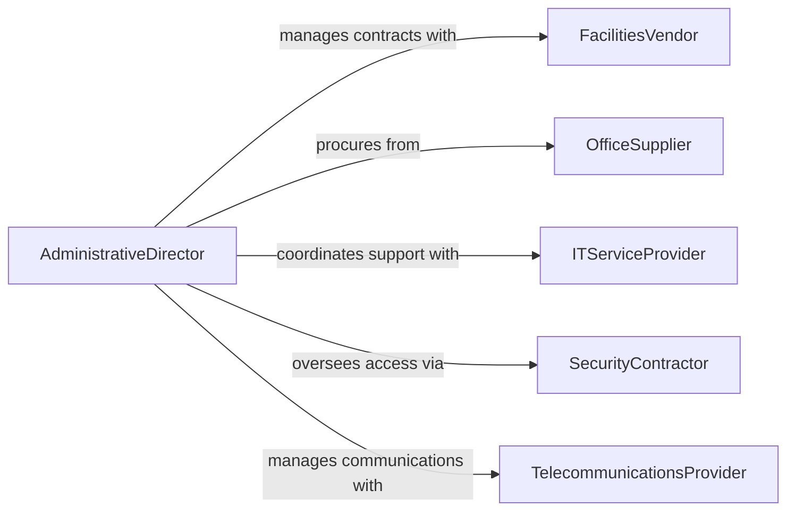

# Direct Administrative or Support Services

> Business-as-Code definition for directing administrative and support services. Models the management of office operations, facilities support, and back-office functions that enable core business activities.

## Overview

Directing administrative and support services involves overseeing the office operations, facilities management, and back-office functions that support an organization's core mission. This definition provides actions for managing office workflows, coordinating support staff, overseeing facility services, and tracking service-level performance. It enables automation of service request routing, vendor management, and administrative task tracking.

## Actors

| Actor | Description |
|-------|-------------|
| FacilitiesVendor | Provides building maintenance, cleaning, and related services |
| OfficeSupplier | Delivers office supplies, furniture, and equipment |
| ITServiceProvider | Supports technology infrastructure and help desk services |
| SecurityContractor | Provides physical security and access control services |
| TelecommunicationsProvider | Delivers phone, internet, and communication services |

## Roles

| Role | Description |
|------|-------------|
| AdministrativeDirector | Oversees all administrative and support service operations |
| OfficeManager | Manages daily office operations and staff coordination |
| FacilitiesCoordinator | Coordinates building services and space management |
| ExecutiveAssistant | Provides high-level administrative support to leadership |

## Entities

| Entity | Description |
|--------|-------------|
| ServiceRequest | A documented request for administrative or facility support |
| VendorContract | Agreement with an external service provider |
| OfficeSpace | Physical workspace allocation and configuration |
| SupplyOrder | Requisition for office supplies or equipment |
| MeetingRoom | Bookable conference or meeting space |
| ServiceLevelAgreement | Defined performance standards for support services |
| ExpenseReport | Documentation of incurred administrative costs |
| PolicyDocument | Organizational policy or procedure requiring distribution |

## Actions

| Action | Description |
|--------|-------------|
| routeServiceRequest | Direct an incoming support request to the appropriate team |
| manageVendorContract | Administer external service provider agreements |
| allocateOfficeSpace | Assign workspace to departments or individuals |
| orderSupplies | Requisition office materials and equipment |
| bookMeetingRoom | Reserve conference or meeting space |
| reviewServiceLevels | Assess support service performance against agreements |
| processExpenseReport | Review and approve administrative expense submissions |
| distributePolicy | Publish and distribute organizational policy updates |

## Events

| Event | Description |
|-------|-------------|
| serviceRequestRouted | A support request has been directed to a team |
| vendorContractUpdated | A service provider agreement has been modified |
| officeSpaceAllocated | Workspace has been assigned |
| suppliesOrdered | Office materials have been requisitioned |
| meetingRoomBooked | Conference space has been reserved |
| serviceLevelsReviewed | Support performance assessment is complete |
| expenseReportProcessed | An administrative expense has been approved |
| policyDistributed | An organizational policy has been published |

## Searches

| Search | Description |
|--------|-------------|
| findServiceRequests | List support requests by status, type, or department |
| getVendorContracts | Retrieve vendor agreements by provider or expiration |
| getSpaceUtilization | Check office space occupancy and availability |
| findPendingExpenses | List expense reports awaiting approval |
| getMeetingRoomAvailability | Check conference room availability by date and time |


## Entity Relationships



## State Diagram



## Workflow



## Actor Relationships



## Usage

### Calling Actions

```typescript
import { directAdministrativeSupportServices } from '@headlessly/direct-administrative-support-services'

const admin = directAdministrativeSupportServices()

// Route a new service request
await admin.routeServiceRequest({
  type: 'facilities',
  description: 'HVAC maintenance needed in Building B, 3rd floor',
  priority: 'medium',
  requestedBy: 'dept-engineering'
})

// Order office supplies
await admin.orderSupplies({
  items: [
    { name: 'printer-paper', quantity: 50, unit: 'reams' },
    { name: 'toner-cartridge', quantity: 10, unit: 'units' }
  ],
  department: 'marketing'
})

// Review service level performance
const review = await admin.reviewServiceLevels({
  vendor: 'facilities-vendor-01',
  period: '2026-Q1'
})
```

### Event-Driven Automation

```typescript
// Auto-reorder supplies when stock is low
admin.suppliesOrdered(async ({ item, remainingStock, reorderThreshold }) => {
  if (remainingStock < reorderThreshold) {
    await admin.orderSupplies({
      items: [{ name: item, quantity: reorderThreshold * 2 }]
    })
  }
})

// Notify on vendor contract expiration
admin.vendorContractUpdated(async ({ vendorId, expirationDate }) => {
  const daysUntilExpiry = daysBetween(new Date(), expirationDate)
  if (daysUntilExpiry < 60) {
    await notify({
      to: 'admin-director',
      message: `Vendor contract expiring in ${daysUntilExpiry} days`
    })
  }
})
```
