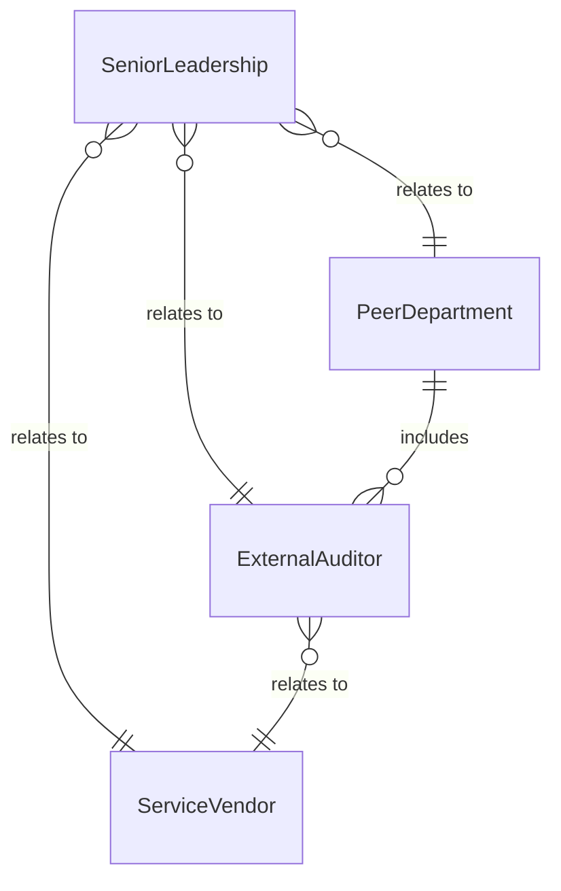
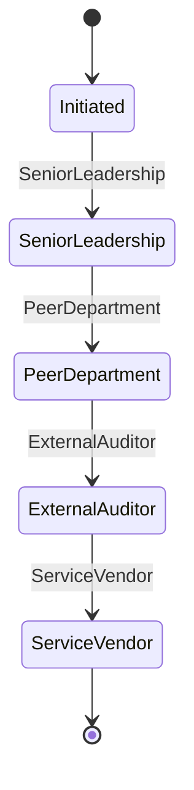
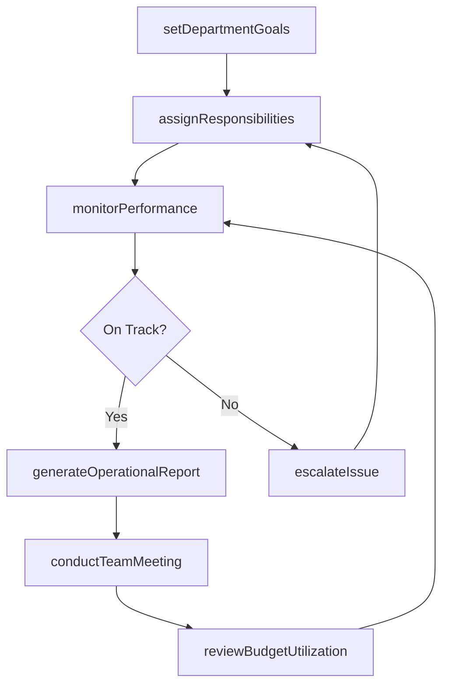
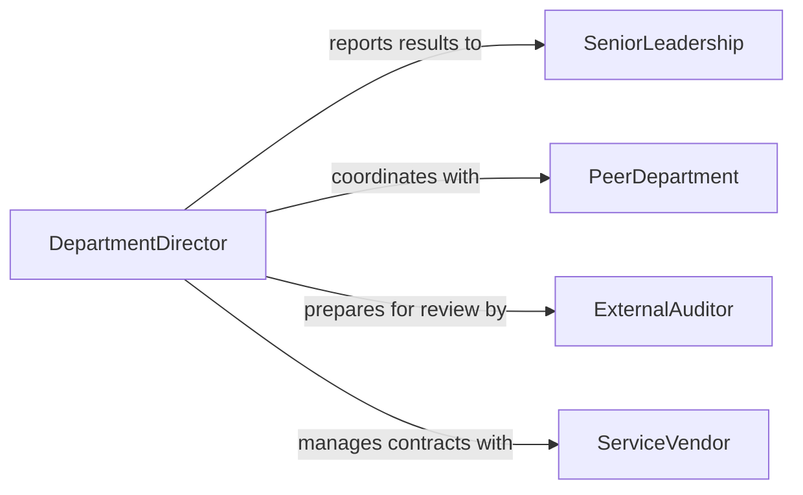

# Direct Department Activities

> Business-as-Code definition for directing department activities. Models the general oversight of a functional department including goal setting, performance management, resource coordination, and operational reporting.

## Overview

Directing department activities involves overseeing the day-to-day operations of a functional organizational unit, setting departmental goals, managing staff performance, coordinating resources, and reporting on results. This definition provides actions for establishing objectives, assigning responsibilities, monitoring progress, and escalating issues. It enables automation of performance tracking, meeting scheduling, and departmental reporting workflows.

## Actors

| Actor | Description |
|-------|-------------|
| SeniorLeadership | Sets organizational strategy and reviews departmental performance |
| PeerDepartment | Adjacent functional unit requiring coordination and collaboration |
| ExternalAuditor | Reviews departmental operations for compliance or efficiency |
| ServiceVendor | Provides outsourced services or tools used by the department |

## Roles

| Role | Description |
|------|-------------|
| DepartmentDirector | Oversees all activities and performance of the department |
| TeamLead | Manages a subset of department staff and daily task execution |
| OperationsAnalyst | Tracks departmental metrics and prepares performance reports |
| AdministrativeCoordinator | Handles scheduling, correspondence, and logistical support |

## Entities

| Entity | Description |
|--------|-------------|
| DepartmentGoal | A measurable objective for the department within a defined period |
| PerformanceMetric | A tracked indicator of departmental output or efficiency |
| StaffAssignment | Allocation of team members to specific responsibilities or projects |
| OperationalReport | Periodic summary of departmental activities and results |
| MeetingAgenda | Planned topics and decisions for a departmental meeting |
| EscalationTicket | An issue raised to leadership requiring resolution beyond the department |
| BudgetAllocation | Funds assigned to the department for a fiscal period |

## Actions

| Action | Description |
|--------|-------------|
| setDepartmentGoals | Define measurable objectives for the department |
| assignResponsibilities | Allocate tasks and projects to team members |
| monitorPerformance | Track departmental metrics against established goals |
| conductTeamMeeting | Facilitate regular departmental meetings for alignment |
| generateOperationalReport | Produce periodic summaries of departmental results |
| escalateIssue | Raise unresolved problems to senior leadership |
| reviewBudgetUtilization | Assess departmental spending against allocated funds |

## Events

| Event | Description |
|-------|-------------|
| departmentGoalsSet | Measurable objectives have been defined for the period |
| responsibilitiesAssigned | Tasks and projects have been allocated to staff |
| performanceReviewed | Departmental metrics have been assessed against goals |
| teamMeetingConducted | A departmental alignment meeting has been held |
| operationalReportGenerated | A periodic results summary has been produced |
| issueEscalated | A problem has been raised to senior leadership |
| budgetVarianceIdentified | Departmental spending has deviated from plan |

## Searches

| Search | Description |
|--------|-------------|
| getDepartmentGoals | Retrieve objectives by status, period, or owner |
| getPerformanceMetrics | Check departmental KPIs by metric or period |
| getStaffAssignments | Review task allocations by team member or project |
| getOperationalReports | List departmental reports by period or topic |
| getBudgetStatus | Check spending against allocated departmental funds |


## Entity Relationships



## State Diagram



## Workflow



## Actor Relationships



## Usage

### Calling Actions

```typescript
import { directDepartmentActivities } from '@headlessly/direct-department-activities'

const department = directDepartmentActivities()

// Set quarterly goals
await department.setDepartmentGoals({
  department: 'customer-success',
  period: '2026-Q2',
  goals: [
    { name: 'Reduce churn rate', target: 3.5, unit: 'percent' },
    { name: 'Improve NPS score', target: 72, unit: 'points' },
    { name: 'Complete onboarding automation', target: 100, unit: 'percent' }
  ]
})

// Monitor performance
const metrics = await department.getPerformanceMetrics({
  department: 'customer-success',
  period: '2026-Q2',
  metrics: ['churn-rate', 'nps-score', 'time-to-value']
})

// Generate operational report
await department.generateOperationalReport({
  department: 'customer-success',
  period: '2026-04',
  sections: ['goal-progress', 'staffing', 'budget']
})
```

### Event-Driven Automation

```typescript
// Alert when performance falls below target
department.performanceReviewed(async ({ department, metric, actual, target }) => {
  if (actual < target * 0.85) {
    await notify({
      to: 'department-director',
      message: `${department} ${metric}: ${actual} is below 85% of target (${target})`
    })
  }
})

// Auto-report budget variances
department.budgetVarianceIdentified(async ({ department, variance, threshold }) => {
  if (Math.abs(variance) > threshold) {
    await department.escalateIssue({
      department,
      type: 'budget-variance',
      details: `Spending ${variance > 0 ? 'over' : 'under'} by ${Math.abs(variance)}%`
    })
  }
})
```
