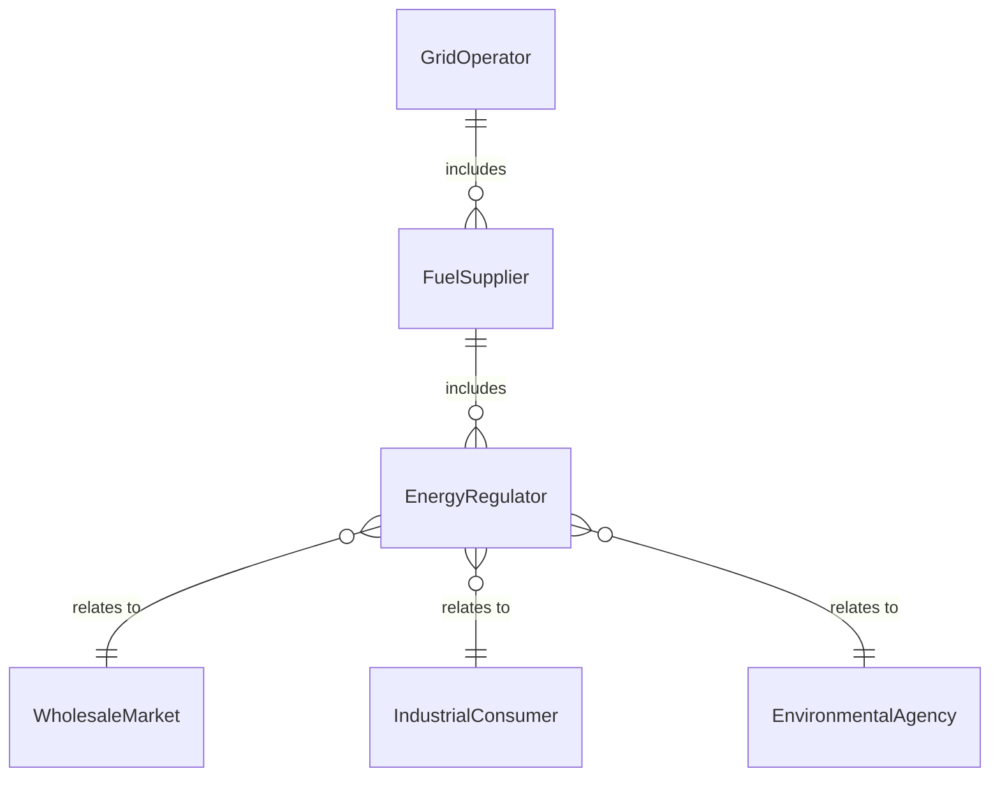
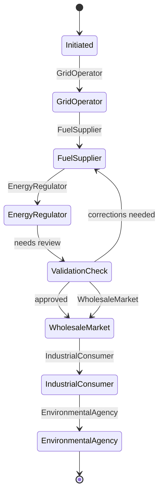
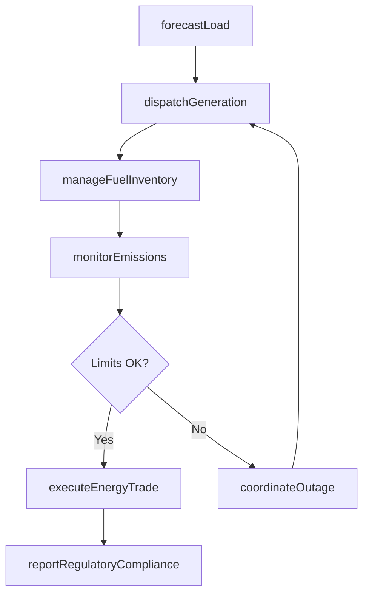
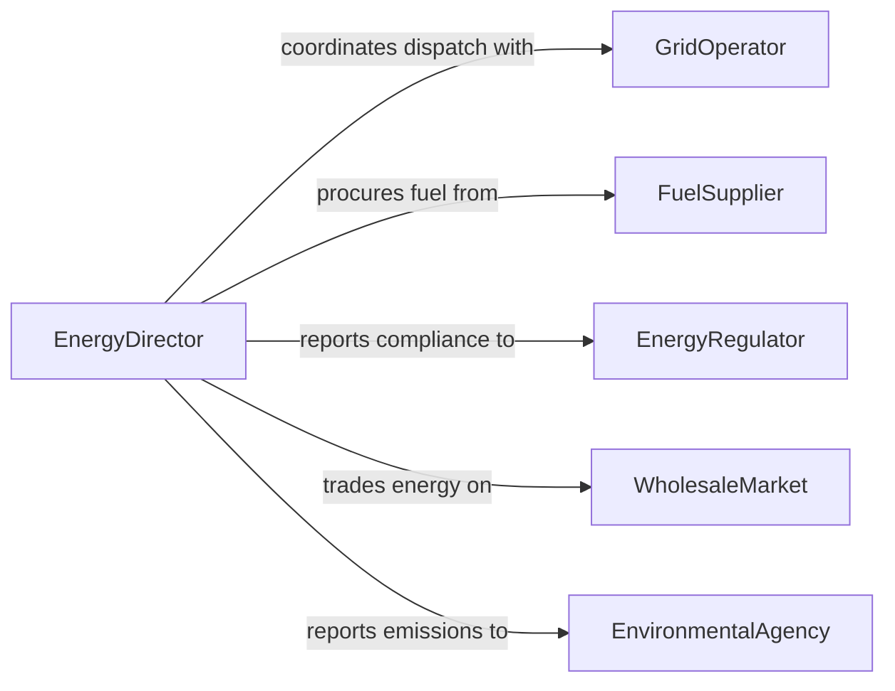

# Direct Energy Production Management Activities

> Business-as-Code definition for directing energy production or management activities. Models the oversight of power generation, transmission, and distribution operations across conventional and renewable energy sources.

## Overview

Directing energy production or management activities involves overseeing the generation, transmission, and distribution of electrical power from fossil fuel, nuclear, and renewable sources. This definition provides actions for managing generation dispatch, monitoring grid stability, coordinating fuel procurement, and ensuring regulatory compliance. It enables automation of load forecasting, outage management, and emissions reporting workflows.

## Actors

| Actor | Description |
|-------|-------------|
| GridOperator | Manages regional transmission and power balancing |
| FuelSupplier | Provides natural gas, coal, uranium, or other generation fuels |
| EnergyRegulator | Enforces generation standards, pricing rules, and environmental limits |
| WholesaleMarket | Facilitates energy trading and price discovery |
| IndustrialConsumer | Large-scale electricity customer with demand contracts |
| EnvironmentalAgency | Monitors emissions and enforces environmental compliance |

## Roles

| Role | Description |
|------|-------------|
| EnergyDirector | Oversees all generation and distribution strategy |
| PlantOperationsManager | Manages day-to-day power plant operations |
| DispatchController | Coordinates real-time generation output with grid demand |
| ComplianceManager | Ensures adherence to energy regulations and emissions limits |
| FuelProcurementLead | Manages fuel sourcing, contracting, and inventory |

## Entities

| Entity | Description |
|--------|-------------|
| GenerationUnit | A power-producing asset such as a turbine, reactor, or solar field |
| DispatchSchedule | Planned generation output by unit and time interval |
| FuelContract | Agreement for supply of generation fuel at specified terms |
| EmissionsRecord | Documented pollutant output by unit and period |
| OutageReport | Record of planned or unplanned generation unit downtime |
| LoadForecast | Predicted electricity demand by region and time period |
| TransmissionConstraint | Identified bottleneck in power delivery infrastructure |
| EnergyTrade | A buy or sell transaction on the wholesale energy market |

## Actions

| Action | Description |
|--------|-------------|
| dispatchGeneration | Schedule and adjust power output across generation units |
| forecastLoad | Predict electricity demand for upcoming periods |
| manageFuelInventory | Track fuel stocks and coordinate procurement deliveries |
| monitorEmissions | Record and analyze pollutant output against permitted levels |
| coordinateOutage | Plan and communicate generation unit maintenance downtime |
| executeEnergyTrade | Place buy or sell orders on the wholesale energy market |
| reportRegulatoryCompliance | Submit required filings to energy and environmental regulators |

## Events

| Event | Description |
|-------|-------------|
| generationDispatched | Power output has been scheduled across generation units |
| loadForecasted | Electricity demand predictions have been generated |
| fuelInventoryUpdated | Fuel stock levels have been adjusted |
| emissionsThresholdApproached | Pollutant output is nearing permitted limits |
| outageScheduled | A generation unit maintenance window has been planned |
| energyTradeExecuted | A wholesale market transaction has been completed |
| regulatoryComplianceReported | Required filings have been submitted to regulators |

## Searches

| Search | Description |
|--------|-------------|
| getGenerationOutput | Retrieve power output by unit, fuel type, or period |
| getLoadForecast | Check projected demand by region and time interval |
| getFuelInventory | Review current fuel stock levels by type and location |
| getEmissionsData | Retrieve pollutant output records by unit or period |
| getOutageSchedule | List planned and unplanned outages by unit or date |


## Entity Relationships



## State Diagram



## Workflow



## Actor Relationships



## Usage

### Calling Actions

```typescript
import { directEnergyProductionManagementActivities } from '@headlessly/direct-energy-production-management-activities'

const energy = directEnergyProductionManagementActivities()

// Forecast next-day load
const forecast = await energy.forecastLoad({
  region: 'midwest-iso',
  period: '2026-04-08',
  granularity: 'hourly'
})

// Dispatch generation to meet demand
await energy.dispatchGeneration({
  forecastId: forecast.id,
  units: [
    { id: 'coal-plant-1', output: 450, unit: 'MW' },
    { id: 'gas-turbine-2', output: 200, unit: 'MW' },
    { id: 'wind-farm-3', output: 150, unit: 'MW' }
  ]
})

// Check emissions status
const emissions = await energy.getEmissionsData({
  unit: 'coal-plant-1',
  period: '2026-Q1',
  pollutants: ['SO2', 'NOx', 'CO2']
})
```

### Event-Driven Automation

```typescript
// Alert on emissions threshold
energy.emissionsThresholdApproached(async ({ unit, pollutant, current, limit }) => {
  await notify({
    to: 'compliance-manager',
    message: `${unit} ${pollutant} at ${current}/${limit} tons - approaching permit limit`
  })
})

// Auto-trade surplus generation
energy.generationDispatched(async ({ totalOutput, forecastedDemand }) => {
  const surplus = totalOutput - forecastedDemand
  if (surplus > 50) {
    await energy.executeEnergyTrade({
      type: 'sell',
      quantity: surplus,
      market: 'day-ahead'
    })
  }
})
```
