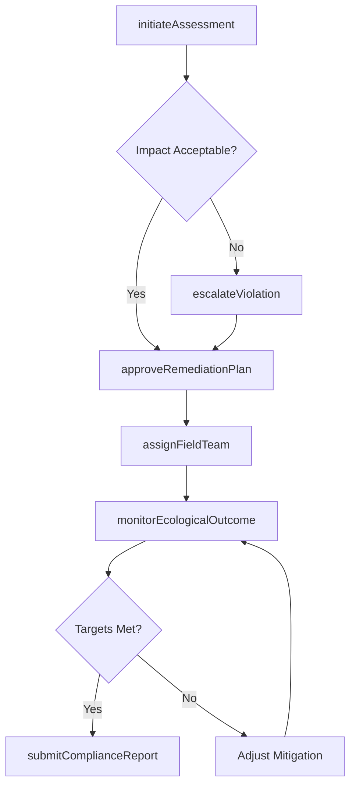
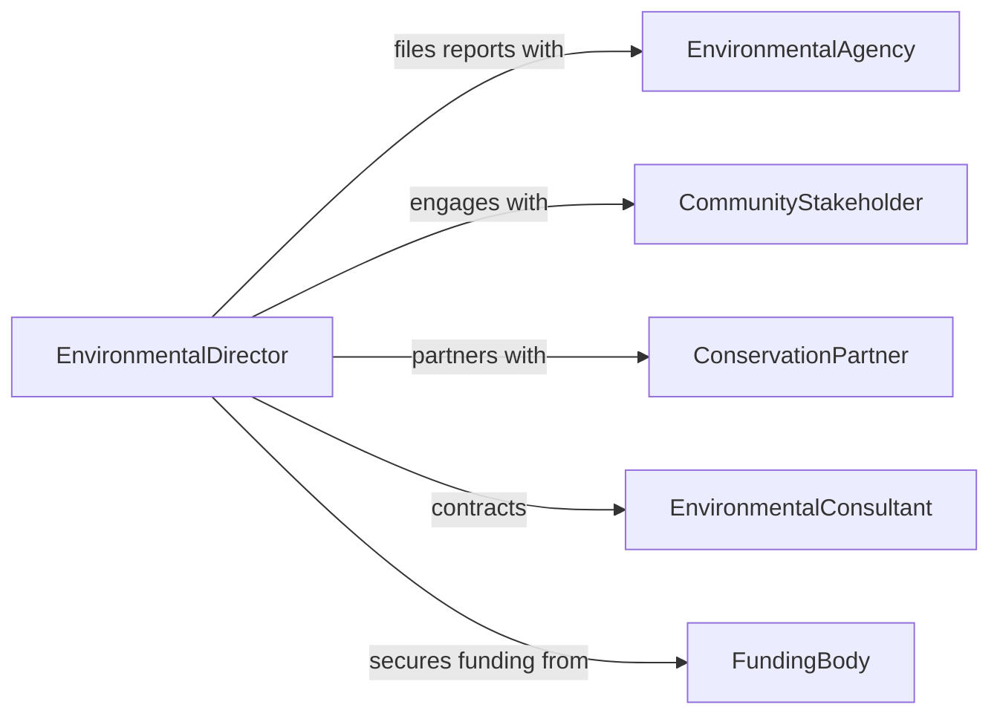

# Direct Environmental Development Activities

> Business-as-Code definition for directing environmental development activities. Models the leadership of sustainability initiatives, conservation programs, and environmental remediation projects.

## Overview

Directing environmental development activities involves overseeing projects and programs focused on environmental conservation, sustainability, and ecological restoration. This definition provides actions for initiating environmental assessments, coordinating remediation efforts, managing compliance reporting, and tracking ecological outcomes. It enables organizations to automate environmental project workflows and maintain regulatory adherence.

## Actors

| Actor | Description |
|-------|-------------|
| EnvironmentalAgency | Regulatory body that sets and enforces environmental standards |
| CommunityStakeholder | Local residents and groups affected by environmental projects |
| ConservationPartner | NGOs and organizations collaborating on ecological initiatives |
| EnvironmentalConsultant | External specialist providing technical environmental guidance |
| FundingBody | Grants agencies and investors supporting environmental programs |
| LandOwner | Property holders involved in conservation or remediation sites |

## Roles

| Role | Description |
|------|-------------|
| EnvironmentalDirector | Oversees all environmental development programs |
| ProjectManager | Manages individual environmental project timelines and deliverables |
| ComplianceOfficer | Ensures adherence to environmental regulations and permits |
| FieldSupervisor | Leads on-site environmental assessment and remediation teams |

## Entities

| Entity | Description |
|--------|-------------|
| EnvironmentalProject | A defined initiative for conservation or remediation |
| ImpactAssessment | Analysis of environmental effects of proposed activities |
| RemediationPlan | Strategy for addressing environmental contamination or damage |
| ComplianceReport | Documentation of regulatory adherence and environmental metrics |
| Permit | Authorization from regulatory agencies for environmental activities |
| EcologicalSurvey | Field study documenting species, habitats, or conditions |
| MitigationMeasure | Action taken to reduce negative environmental impact |

## Actions

| Action | Description |
|--------|-------------|
| initiateAssessment | Begin an environmental impact assessment for a site or project |
| approveRemediationPlan | Authorize a remediation strategy for execution |
| assignFieldTeam | Deploy personnel to conduct environmental surveys or work |
| submitComplianceReport | File regulatory compliance documentation with agencies |
| monitorEcologicalOutcome | Track environmental recovery or impact metrics |
| escalateViolation | Report an environmental compliance breach for resolution |
| renewPermit | Initiate the renewal process for an environmental permit |

## Events

| Event | Description |
|-------|-------------|
| assessmentInitiated | A new environmental impact assessment has started |
| remediationApproved | A remediation plan has been authorized |
| fieldTeamDeployed | Environmental field personnel have been assigned |
| complianceReportSubmitted | A regulatory compliance report has been filed |
| ecologicalTargetMet | An environmental recovery metric has been achieved |
| violationDetected | An environmental compliance violation has been identified |
| permitExpiring | An environmental permit is approaching its expiration date |

## Searches

| Search | Description |
|--------|-------------|
| findProjects | List environmental projects by status, type, or location |
| getAssessments | Retrieve impact assessments by site or date range |
| getComplianceStatus | Check compliance standing for a project or site |
| findPermits | List environmental permits by expiration or jurisdiction |
| getEcologicalMetrics | Retrieve environmental monitoring data by indicator |

## Workflow



## Actor Relationships



## Usage

### Calling Actions

```typescript
import { directEnvironmentalDevelopmentActivities } from '@headlessly/direct-environmental-development-activities'

const envDev = directEnvironmentalDevelopmentActivities()

// Start an environmental impact assessment
const assessment = await envDev.initiateAssessment({
  site: 'Riverside Corridor',
  type: 'wetland-restoration',
  scope: 'full'
})

// Deploy field survey team
await envDev.assignFieldTeam({
  projectId: assessment.projectId,
  team: ['ecologist-01', 'hydrologist-02'],
  startDate: '2026-04-15'
})

// Monitor ecological recovery
const metrics = await envDev.monitorEcologicalOutcome({
  projectId: assessment.projectId,
  indicators: ['species-diversity', 'water-quality']
})
```

### Event-Driven Automation

```typescript
// Alert on permit expiration
envDev.permitExpiring(async ({ permitId, expirationDate, projectId }) => {
  await envDev.renewPermit({ permitId })
  await notify({ to: 'compliance-team', message: `Permit ${permitId} expiring ${expirationDate}` })
})

// Auto-report when ecological targets are met
envDev.ecologicalTargetMet(async ({ projectId, indicator, value }) => {
  await envDev.submitComplianceReport({
    projectId,
    type: 'milestone',
    findings: `${indicator} target achieved: ${value}`
  })
})
```
