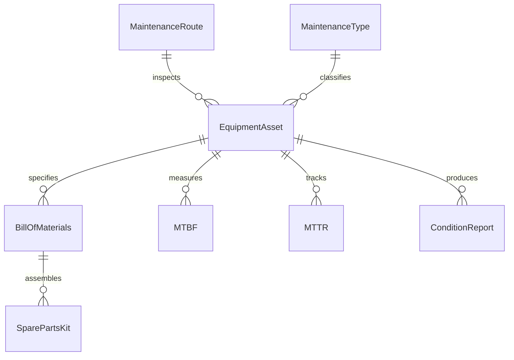
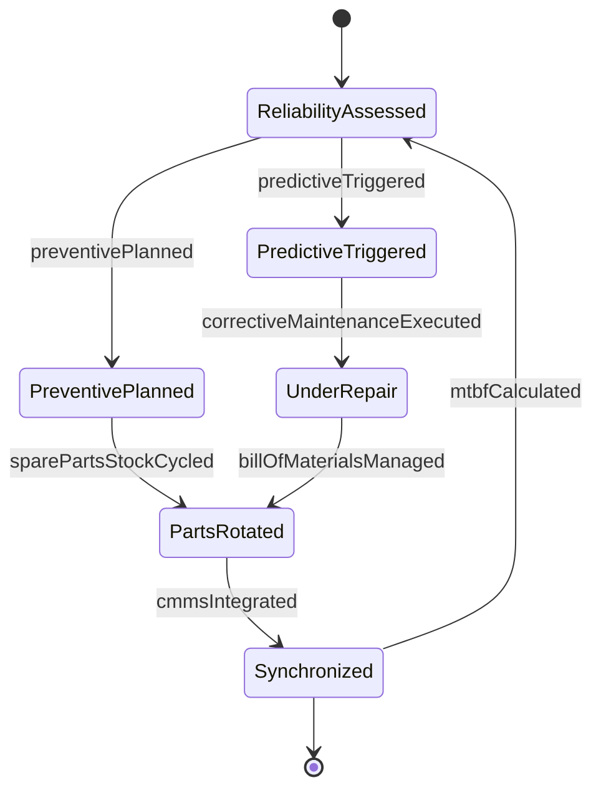
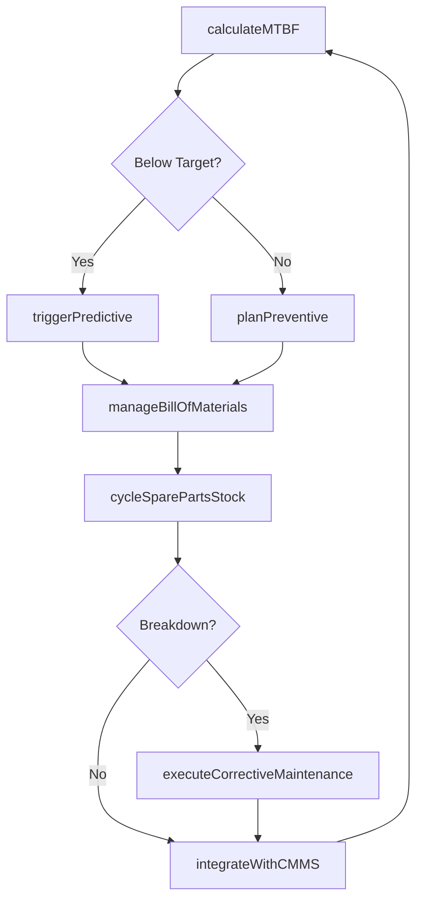
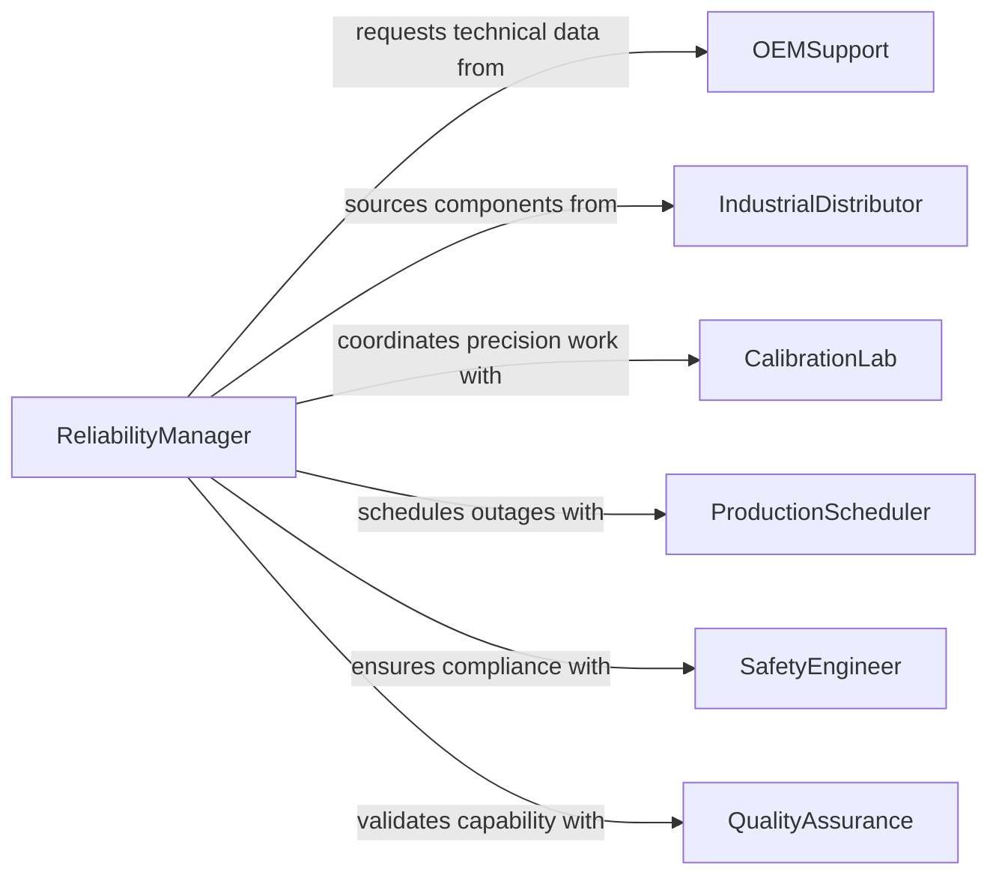

# Direct Equipment Maintenance and Repair Activities

> Business-as-Code definition for directing equipment maintenance and repair activities. Models the management of preventive maintenance schedules, corrective repairs, and equipment lifecycle tracking.

## Overview

Directing equipment maintenance and repair activities involves managing industrial machinery reliability through preventive, predictive, and corrective maintenance strategies. This definition provides actions for CMMS integration, Mean Time Between Failures tracking, spare parts lifecycle management, and equipment-specific maintenance protocol execution. It enables automation of condition-based maintenance triggers, OEM warranty administration, and production uptime optimization.

## Actors

| Actor | Description |
|-------|-------------|
| OEMSupport | Original equipment manufacturer providing technical documentation and parts |
| IndustrialDistributor | Supplies aftermarket components, bearings, and consumables |
| CalibrationLab | Performs precision measurement and certification services |
| ProductionScheduler | Coordinates maintenance windows to minimize production disruption |
| SafetyEngineer | Ensures lockout-tagout and machine guarding compliance |
| QualityAssurance | Validates equipment capability after maintenance interventions |

## Roles

| Role | Description |
|------|-------------|
| ReliabilityManager | Directs maintenance strategy focused on maximizing equipment uptime |
| CMWSAdministrator | Manages computerized maintenance management system and data integrity |
| MaintenancePlanner | Develops preventive maintenance schedules based on OEM intervals and failure history |
| ConditionMonitoringTechnician | Analyzes vibration, thermography, and oil samples for predictive insights |

## Entities

| Entity | Description |
|--------|-------------|
| EquipmentAsset | Industrial machinery with bill of materials and maintenance history |
| MaintenanceType | Classification of work as preventive, predictive, or corrective |
| MTBF | Mean Time Between Failures metric for reliability tracking |
| MTTR | Mean Time To Repair metric for maintenance efficiency |
| BillOfMaterials | Structured list of components and assemblies for an equipment asset |
| SparePartsKit | Pre-assembled component sets for common repair scenarios |
| ConditionReport | Vibration analysis, oil analysis, or thermographic inspection results |
| MaintenanceRoute | Defined path and checklist for routine equipment inspections |

## Actions

| Action | Description |
|--------|-------------|
| calculateMTBF | Compute mean time between failures for reliability benchmarking |
| planPreventive | Schedule time-based maintenance per OEM recommendations and operating hours |
| triggerPredictive | Initiate condition-based maintenance from sensor or inspection thresholds |
| executeCorrectiveMaintenance | Perform breakdown repair with root cause analysis and documentation |
| manageBillOfMaterials | Maintain component hierarchies and sourcing data for equipment assets |
| cycleSparePartsStock | Rotate time-sensitive components and track shelf life expiration |
| integrateWithCMMS | Synchronize work orders, asset data, and maintenance history with system |

## Events

| Event | Description |
|-------|-------------|
| mtbfCalculated | Reliability metric updated with latest failure data |
| preventivePlanned | Time-based maintenance scheduled per operating hours or calendar |
| predictiveTriggered | Condition monitoring threshold exceeded, intervention recommended |
| correctiveMaintenanceExecuted | Breakdown repair completed with root cause documented |
| billOfMaterialsManaged | Component structure updated with latest sourcing information |
| sparePartsStockCycled | Inventory rotated to prevent expiration or obsolescence |
| cmmsIntegrated | Maintenance data synchronized with enterprise system |

## Searches

| Search | Description |
|--------|-------------|
| getReliabilityMetrics | Retrieve MTBF, MTTR, and availability by equipment class or asset |
| getMaintenanceBacklog | List overdue preventive tasks or pending corrective work |
| getConditionAlerts | Check equipment with condition monitoring thresholds exceeded |
| getSparePartsExpiration | Find time-sensitive components approaching shelf life limits |
| getCriticalEquipment | Identify assets with highest production impact or failure frequency |


## Entity Relationships



## State Diagram



## Workflow



## Actor Relationships



## Usage

### Calling Actions

```typescript
import { directEquipmentMaintenanceRepairActivities } from '@headlessly/direct-equipment-maintenance-repair-activities'

const reliability = directEquipmentMaintenanceRepairActivities()

// Calculate reliability metrics for asset class
const metrics = await reliability.calculateMTBF({
  equipmentClass: 'CNC-Machining-Center',
  period: { start: '2025-01-01', end: '2026-01-01' },
  includeMetrics: ['mtbf', 'mttr', 'availability']
})

// Trigger predictive maintenance from vibration alert
await reliability.triggerPredictive({
  assetId: 'CNC-Mill-04',
  condition: 'vibration-anomaly',
  severity: 'high',
  measurementValue: 12.5,
  threshold: 10.0,
  unit: 'mm/s-rms'
})

// Execute corrective maintenance with root cause
await reliability.executeCorrectiveMaintenance({
  assetId: 'CNC-Mill-04',
  failure: 'spindle-bearing-seizure',
  rootCause: 'inadequate-lubrication-interval',
  repairActions: ['replace-bearing-set', 'update-pm-schedule'],
  downtimeHours: 4.5
})
```

### Event-Driven Automation

```typescript
// Auto-trigger predictive on condition threshold
reliability.predictiveTriggered(async ({ assetId, condition, severity }) => {
  const bom = await reliability.manageBillOfMaterials({ assetId, component: condition })
  const spares = await reliability.getSparePartsExpiration({ components: bom })

  await notify({
    to: 'maintenance-planner',
    message: `${assetId} ${condition} threshold exceeded, spares: ${spares.available}`
  })
})

// Alert on MTBF degradation
reliability.mtbfCalculated(async ({ equipmentClass, currentMTBF, targetMTBF }) => {
  if (currentMTBF < targetMTBF * 0.8) {
    await notify({
      to: 'reliability-manager',
      message: `${equipmentClass} MTBF ${currentMTBF}h is ${Math.round((1 - currentMTBF/targetMTBF) * 100)}% below target`
    })
  }
})
```
