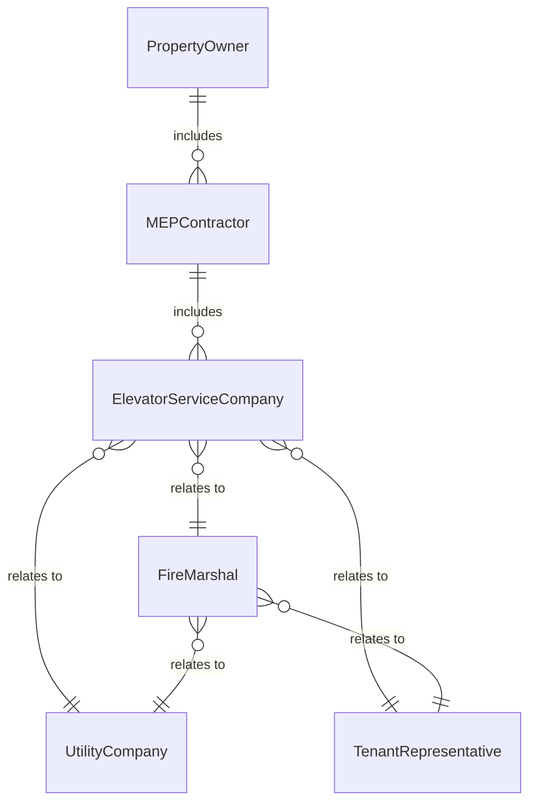
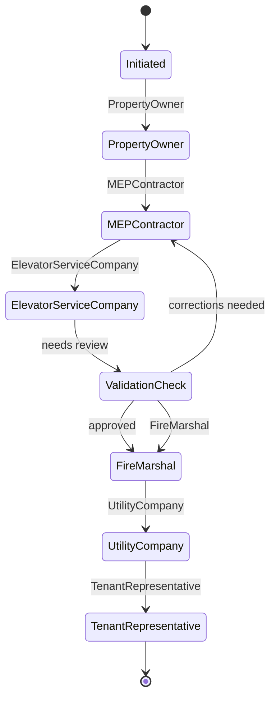
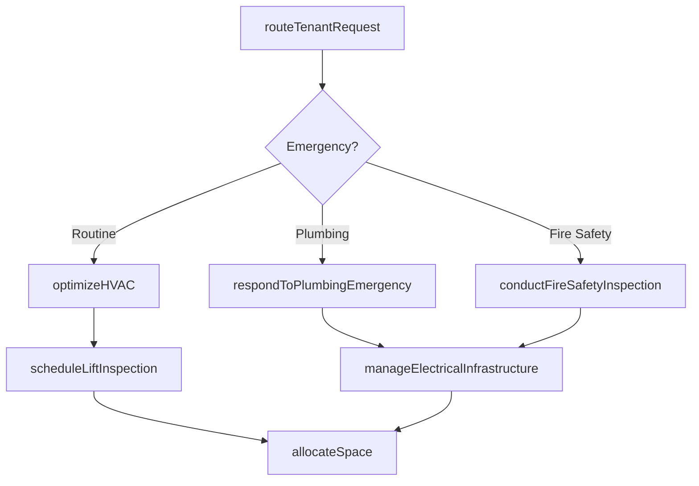
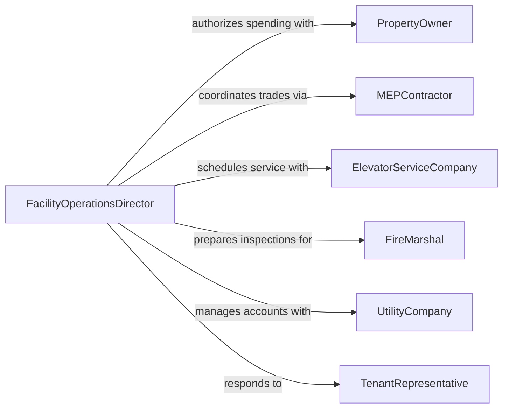

# Direct Facility Maintenance Repair Activities

> Business-as-Code definition for directing facility maintenance or repair activities. Models the oversight of building systems, structural upkeep, and infrastructure repairs across commercial, industrial, and institutional facilities.

## Overview

Directing facility maintenance and repair activities involves managing building systems, structural upkeep, and occupant services across commercial, industrial, and institutional properties. This definition provides actions for HVAC system optimization, elevator safety compliance, plumbing emergency response, electrical infrastructure management, fire safety inspections, and space utilization planning. It enables automation of tenant request routing, building code compliance tracking, energy consumption monitoring, and occupancy-driven maintenance scheduling.

## Actors

| Actor | Description |
|-------|-------------|
| PropertyOwner | Authorizes capital expenditures and sets facility operating budgets |
| MEPContractor | Provides mechanical, electrical, and plumbing trade services |
| ElevatorServiceCompany | Performs specialized vertical transportation maintenance and inspections |
| FireMarshal | Conducts code compliance reviews for life safety systems |
| UtilityCompany | Delivers electricity, natural gas, water, and sewer services |
| TenantRepresentative | Submits occupant requests and coordinates access for repairs |

## Roles

| Role | Description |
|------|-------------|
| FacilityOperationsDirector | Directs building systems performance and occupant satisfaction |
| BuildingAutomationEngineer | Manages BMS controls, setpoints, and energy optimization |
| TenantServicesCoordinator | Triages occupant requests and communicates maintenance schedules |
| CodeComplianceSpecialist | Ensures facility operations meet local building and fire codes |

## Entities

| Entity | Description |
|--------|-------------|
| BuildingSystem | HVAC, electrical, plumbing, elevator, or fire protection infrastructure |
| TenantRequest | Occupant-submitted maintenance need with location and urgency |
| InspectionSchedule | Mandated building code and fire safety inspection calendar |
| EnergyConsumption | Utility usage tracking for cost allocation and efficiency initiatives |
| SpaceAllocation | Floor plans with tenant assignments and vacancy status |
| EmergencyProtocol | Defined response procedures for system failures affecting safety or operations |
| AccessCoordination | Scheduled entry permissions for contractors and maintenance staff |

## Actions

| Action | Description |
|--------|-------------|
| routeTenantRequest | Triage occupant maintenance needs to appropriate building trade or contractor |
| optimizeHVAC | Adjust building automation system setpoints for comfort and energy efficiency |
| scheduleLiftInspection | Plan elevator safety tests per code requirements and service contracts |
| respondToPlumbingEmergency | Dispatch immediate response for water leaks or sewer backups |
| manageElectricalInfrastructure | Coordinate power distribution maintenance and emergency generator testing |
| conductFireSafetyInspection | Verify sprinkler, alarm, egress, and extinguisher compliance |
| allocateSpace | Assign or reassign building areas based on tenant needs and vacancy |

## Events

| Event | Description |
|-------|-------------|
| tenantRequestRouted | Occupant maintenance need assigned to responsible trade or contractor |
| hvacOptimized | Building automation setpoints adjusted for seasonal or occupancy changes |
| liftInspectionScheduled | Elevator safety test planned per regulatory interval |
| plumbingEmergencyResponded | Water or sewer emergency dispatch initiated |
| electricalInfrastructureManaged | Power system maintenance or generator test completed |
| fireSafetyInspectionConducted | Life safety systems compliance review performed |
| spaceAllocated | Building area assigned or reassigned to tenant or department |

## Searches

| Search | Description |
|--------|-------------|
| getPendingTenantRequests | List open occupant maintenance requests by building, floor, or urgency |
| getSystemPerformance | Check HVAC temperatures, elevator availability, or power quality metrics |
| getInspectionDueDates | Retrieve upcoming building code and fire safety inspection deadlines |
| getEnergyUsage | Analyze utility consumption by building, system, or tenant allocation |
| getVacantSpaces | Find unassigned building areas available for tenant placement |


## Entity Relationships



## State Diagram



## Workflow



## Actor Relationships



## Usage

### Calling Actions

```typescript
import { directFacilityMaintenanceRepairActivities } from '@headlessly/direct-facility-maintenance-repair-activities'

const facility = directFacilityMaintenanceRepairActivities()

// Route tenant request to appropriate trade
const request = await facility.routeTenantRequest({
  building: 'corporate-tower-a',
  floor: 12,
  tenant: 'acme-corp',
  issue: 'conference-room-temperature-too-warm',
  priority: 'standard'
})

// Optimize HVAC for seasonal change
await facility.optimizeHVAC({
  building: 'corporate-tower-a',
  season: 'cooling',
  setpoints: { cooling: 72, heating: 68, deadband: 2 },
  schedule: 'occupied-6am-6pm'
})

// Schedule elevator inspection
await facility.scheduleLiftInspection({
  building: 'corporate-tower-a',
  elevators: ['elevator-01', 'elevator-02', 'elevator-03'],
  inspectionType: 'annual-safety-test',
  regulatoryDeadline: '2026-06-30'
})
```

### Event-Driven Automation

```typescript
// Auto-dispatch plumbing emergencies
facility.tenantRequestRouted(async ({ requestId, issue, building, floor }) => {
  if (issue.includes('water-leak') || issue.includes('sewer-backup')) {
    await facility.respondToPlumbingEmergency({
      requestId,
      building,
      floor,
      dispatchTime: 'immediate'
    })
  }
})

// Alert on inspection deadline approaching
facility.liftInspectionScheduled(async ({ building, elevators, regulatoryDeadline }) => {
  const daysUntilDeadline = Math.ceil((new Date(regulatoryDeadline) - new Date()) / 86400000)
  if (daysUntilDeadline <= 30) {
    await notify({
      to: 'code-compliance-specialist',
      message: `${building} elevator inspection due in ${daysUntilDeadline} days`
    })
  }
})
```
