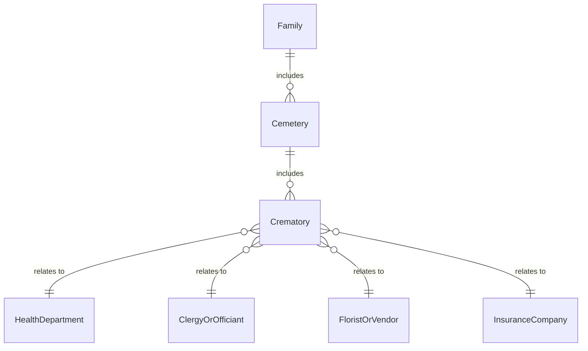
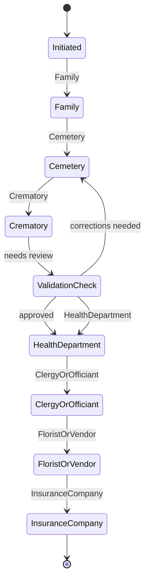
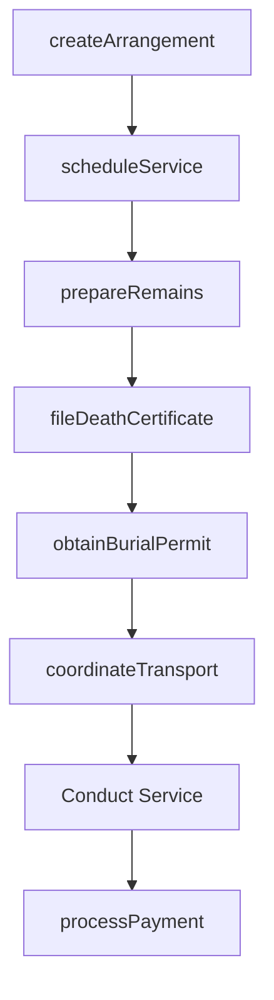
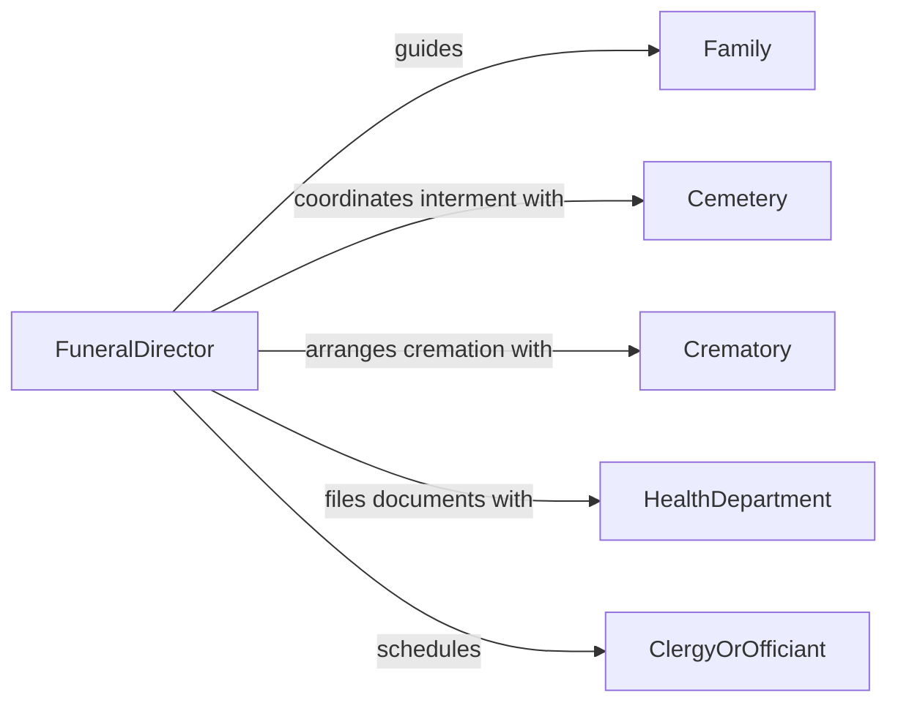

# Direct Funeral or Mortuary Activities

> Business-as-Code definition for directing funeral and mortuary operations. Models the coordination of memorial services, remains preparation, and family support from initial arrangement through final disposition.

## Overview

Directing funeral and mortuary activities involves managing the full lifecycle of death care services including body preparation, memorial planning, regulatory compliance, and family coordination. This definition exposes actions for scheduling services, coordinating with cemeteries and crematories, managing documentation, and tracking service delivery. It enables automation of arrangement workflows, permit filings, and family communication sequences.

## Actors

| Actor | Description |
|-------|-------------|
| Family | Bereaved family members making arrangement decisions |
| Cemetery | Facility providing burial plots and interment services |
| Crematory | Facility performing cremation services |
| HealthDepartment | Issues death certificates and burial permits |
| ClergyOrOfficiant | Conducts memorial or religious services |
| FloristOrVendor | Provides floral arrangements, caskets, and memorial goods |
| InsuranceCompany | Processes pre-need policies or assignment of benefits |

## Roles

| Role | Description |
|------|-------------|
| FuneralDirector | Oversees all funeral service operations and arrangements |
| Embalmer | Prepares remains for viewing and preservation |
| ArrangementsCoordinator | Works directly with families to plan services |
| TransportSpecialist | Manages transfer and transport of remains |

## Entities

| Entity | Description |
|--------|-------------|
| ServiceArrangement | The complete plan for funeral or memorial services |
| Decedent | Record of the deceased individual and vital statistics |
| DeathCertificate | Official legal document certifying cause and manner of death |
| BurialPermit | Authorization for interment or cremation |
| CasketSelection | Chosen casket or urn with specifications |
| ServiceSchedule | Timeline of visitation, ceremony, and disposition events |
| PreNeedContract | Pre-arranged and pre-funded funeral service agreement |
| TransportOrder | Request for transfer of remains between locations |

## Actions

| Action | Description |
|--------|-------------|
| createArrangement | Initiate a new funeral service arrangement with family |
| scheduleService | Set dates and times for visitation, ceremony, and burial |
| prepareRemains | Coordinate embalming, dressing, and cosmetology |
| fileDeathCertificate | Submit death certificate to the health department |
| obtainBurialPermit | Secure authorization for interment or cremation |
| coordinateTransport | Arrange transfer of remains to chapel, church, or cemetery |
| processPayment | Handle service billing and insurance assignments |

## Events

| Event | Description |
|-------|-------------|
| arrangementCreated | A new funeral arrangement has been initiated |
| serviceScheduled | Funeral service dates and times have been confirmed |
| remainsPrepared | Body preparation has been completed |
| deathCertificateFiled | Death certificate has been submitted to authorities |
| burialPermitObtained | Authorization for disposition has been secured |
| transportCompleted | Remains have been transferred to the designated location |
| paymentProcessed | Service payment or insurance claim has been settled |

## Searches

| Search | Description |
|--------|-------------|
| findArrangements | List funeral arrangements by status, date, or family |
| getServiceSchedule | Retrieve upcoming services by date or location |
| findPreNeedContracts | List pre-arranged contracts by holder or status |
| getDeathCertificates | Retrieve filed death certificates by date or jurisdiction |
| getPendingTransports | List scheduled remains transfers by date |


## Entity Relationships



## State Diagram



## Workflow



## Actor Relationships



## Usage

### Calling Actions

```typescript
import { directFuneralMortuaryActivities } from '@headlessly/direct-funeral-mortuary-activities'

const funeral = directFuneralMortuaryActivities()

// Create a new funeral arrangement
const arrangement = await funeral.createArrangement({
  decedentName: 'John Smith',
  familyContact: 'Jane Smith',
  serviceType: 'traditional-burial',
  dateOfDeath: '2026-03-15'
})

// Schedule the service
await funeral.scheduleService({
  arrangementId: arrangement.id,
  visitation: { date: '2026-03-18', time: '14:00', location: 'Main Chapel' },
  ceremony: { date: '2026-03-19', time: '10:00', location: 'Main Chapel' },
  interment: { date: '2026-03-19', time: '13:00', location: 'Oakwood Cemetery' }
})

// File death certificate
await funeral.fileDeathCertificate({
  arrangementId: arrangement.id,
  jurisdiction: 'County Health Department'
})
```

### Event-Driven Automation

```typescript
// Auto-obtain burial permit after death certificate filing
funeral.deathCertificateFiled(async ({ arrangementId, certificateNumber }) => {
  await funeral.obtainBurialPermit({ arrangementId, certificateNumber })
})

// Notify family when transport is complete
funeral.transportCompleted(async ({ arrangementId, destination }) => {
  await notify({
    to: 'family-contact',
    message: `Transfer to ${destination} has been completed`
  })
})
```
