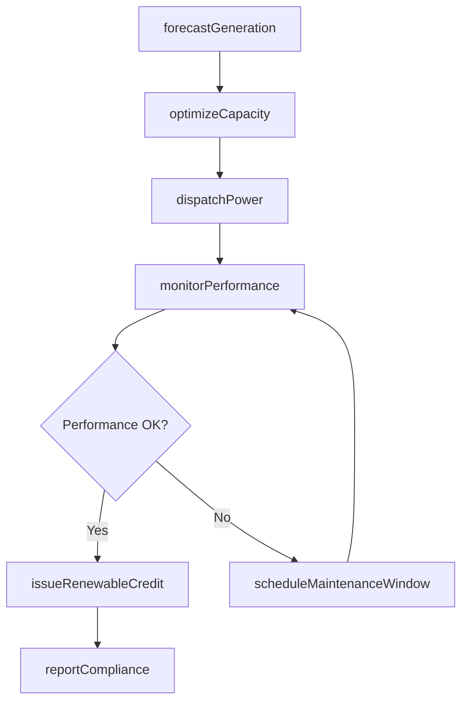
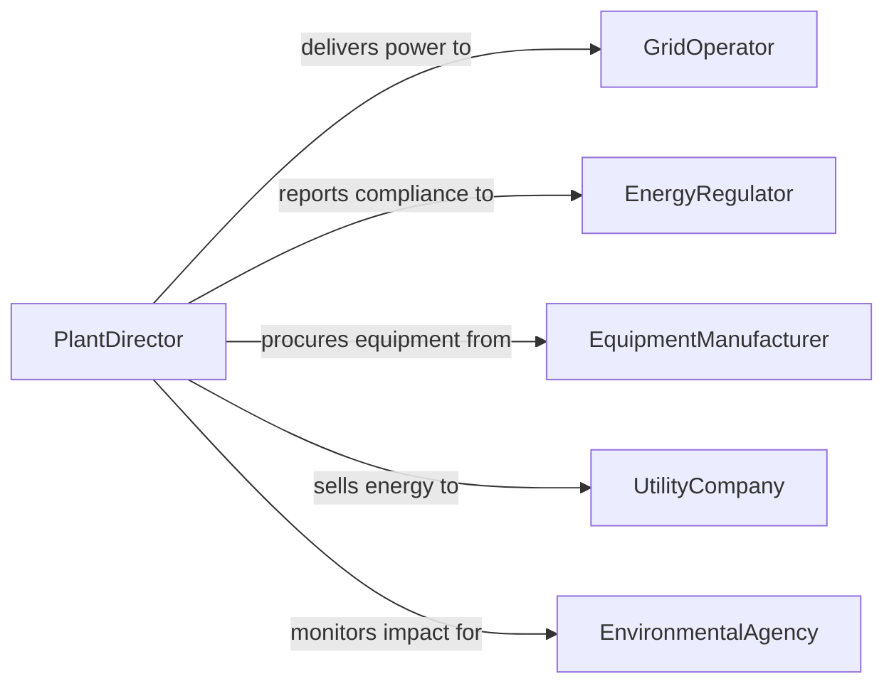

# Direct Green Energy Production Operations

> Business-as-Code definition for directing green energy production operations. Models the management of renewable energy generation from solar, wind, and other clean sources through capacity planning, grid integration, and performance optimization.

## Overview

Directing green energy production operations involves overseeing the generation of electricity from renewable sources including solar, wind, hydroelectric, and biomass facilities. This definition provides actions for managing generation capacity, monitoring turbine and panel performance, coordinating grid interconnection, and ensuring regulatory compliance for renewable energy credits. It enables automation of production forecasting, maintenance scheduling, and energy output reporting.

## Actors

| Actor | Description |
|-------|-------------|
| GridOperator | Manages electrical grid interconnection and dispatch |
| EnergyRegulator | Enforces renewable energy standards and certifications |
| EquipmentManufacturer | Supplies turbines, panels, inverters, and related components |
| UtilityCompany | Purchases generated power under power purchase agreements |
| EnvironmentalAgency | Monitors ecological impact of energy generation facilities |
| FinancialInvestor | Provides capital for renewable energy projects |

## Roles

| Role | Description |
|------|-------------|
| PlantDirector | Oversees all green energy production facility operations |
| GenerationManager | Manages daily energy output and equipment performance |
| GridIntegrationEngineer | Coordinates power delivery to the electrical grid |
| MaintenanceSupervisor | Schedules and oversees equipment maintenance activities |

## Entities

| Entity | Description |
|--------|-------------|
| GenerationUnit | An individual turbine, panel array, or generator producing energy |
| ProductionForecast | Predicted energy output based on weather and capacity |
| PowerPurchaseAgreement | Contract for selling generated electricity |
| RenewableEnergyCredit | Tradable certificate representing clean energy generation |
| GridConnection | Technical interface between facility and electrical grid |
| CapacityFactor | Ratio of actual output to maximum possible output |
| WeatherData | Meteorological conditions affecting energy production |
| ComplianceCertificate | Documentation proving adherence to renewable standards |

## Actions

| Action | Description |
|--------|-------------|
| forecastGeneration | Predict energy output based on weather and capacity models |
| dispatchPower | Route generated electricity to the grid or storage |
| monitorPerformance | Track real-time output of generation units |
| scheduleMaintenanceWindow | Plan downtime for equipment servicing |
| issueRenewableCredit | Generate renewable energy certificates for trading |
| optimizeCapacity | Adjust generation settings for maximum efficiency |
| reportCompliance | Submit regulatory reports on generation and emissions |

## Events

| Event | Description |
|-------|-------------|
| generationForecasted | Energy production predictions have been calculated |
| powerDispatched | Electricity has been delivered to the grid |
| performanceThresholdBreached | A generation unit is underperforming |
| maintenanceWindowScheduled | Equipment downtime has been planned |
| renewableCreditIssued | A renewable energy certificate has been generated |
| capacityOptimized | Generation settings have been adjusted for efficiency |
| complianceReported | Regulatory generation report has been submitted |

## Searches

| Search | Description |
|--------|-------------|
| getGenerationOutput | Retrieve energy production data by unit or period |
| findUnderperformingUnits | List generation units below capacity thresholds |
| getForecasts | Retrieve energy production predictions by date range |
| findRenewableCredits | List issued certificates by period or buyer |
| getMaintenanceSchedule | Check planned maintenance windows by facility |

## Workflow



## Actor Relationships



## Usage

### Calling Actions

```typescript
import { directGreenEnergyProductionOperations } from '@headlessly/direct-green-energy-production-operations'

const energy = directGreenEnergyProductionOperations()

// Forecast tomorrow's generation
const forecast = await energy.forecastGeneration({
  facility: 'Wind-Farm-NorthRidge',
  date: '2026-04-15',
  weatherSource: 'national-weather-service'
})

// Monitor real-time performance
const performance = await energy.monitorPerformance({
  facility: 'Wind-Farm-NorthRidge',
  units: ['turbine-01', 'turbine-02', 'turbine-03']
})

// Issue renewable energy credits
await energy.issueRenewableCredit({
  facility: 'Wind-Farm-NorthRidge',
  period: '2026-Q1',
  megawattHours: 12500
})
```

### Event-Driven Automation

```typescript
// Auto-schedule maintenance for underperforming units
energy.performanceThresholdBreached(async ({ unitId, capacityFactor, threshold }) => {
  await energy.scheduleMaintenanceWindow({
    unitId,
    reason: `Capacity factor ${capacityFactor} below threshold ${threshold}`
  })
})

// Auto-report compliance after credit issuance
energy.renewableCreditIssued(async ({ facility, period, megawattHours }) => {
  await energy.reportCompliance({ facility, period })
})
```
