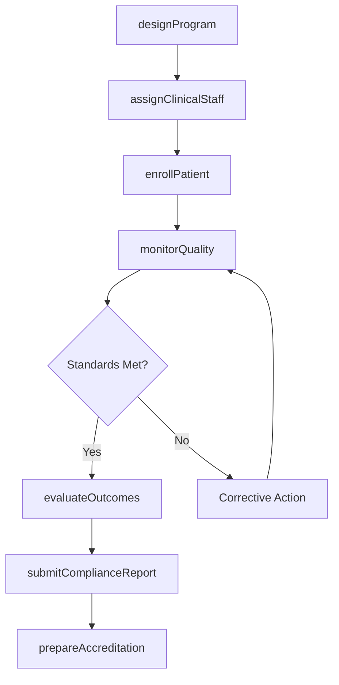
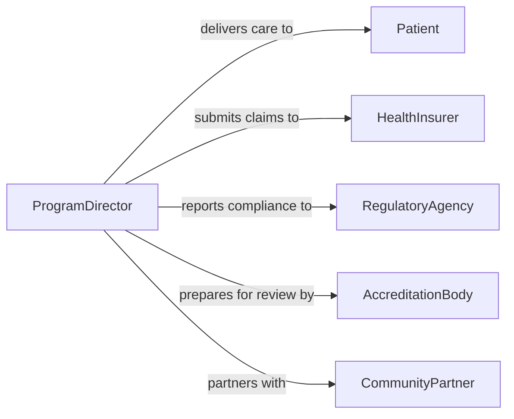

# Direct Healthcare Delivery Programs

> Business-as-Code definition for directing healthcare delivery programs. Models the management of clinical services, patient care workflows, and health program administration from design through outcomes measurement.

## Overview

Directing healthcare delivery programs involves overseeing the planning, implementation, and evaluation of clinical services and health programs across hospitals, clinics, and community settings. This definition provides actions for designing care delivery models, managing clinical staff assignments, tracking patient outcomes, and ensuring regulatory compliance. It enables automation of program enrollment, quality metrics reporting, and accreditation workflows.

## Actors

| Actor | Description |
|-------|-------------|
| Patient | Individual receiving care through a healthcare delivery program |
| HealthInsurer | Provides coverage and reimbursement for delivered services |
| RegulatoryAgency | Enforces healthcare delivery standards and licensing requirements |
| AccreditationBody | Evaluates and certifies healthcare program quality standards |
| CommunityPartner | Collaborates on population health and outreach initiatives |
| PharmaceuticalSupplier | Provides medications and therapeutic supplies |

## Roles

| Role | Description |
|------|-------------|
| ProgramDirector | Oversees healthcare delivery program design and performance |
| ClinicalManager | Manages clinical staff and day-to-day care delivery |
| QualityOfficer | Monitors care quality metrics and compliance standards |
| CareCoordinator | Manages patient navigation through care pathways |

## Entities

| Entity | Description |
|--------|-------------|
| HealthProgram | A structured care delivery initiative with defined scope |
| CarePathway | Standardized clinical workflow for a condition or service |
| PatientEnrollment | Registration of a patient in a healthcare program |
| QualityMetric | Measured clinical outcome or process indicator |
| ComplianceReport | Documentation of adherence to healthcare regulations |
| StaffCredential | Clinical licensure and certification records for providers |
| AccreditationRecord | Documentation of program accreditation status |
| OutcomeReport | Assessment of patient health outcomes from a program |

## Actions

| Action | Description |
|--------|-------------|
| designProgram | Create a healthcare delivery program with scope and goals |
| enrollPatient | Register a patient in a care delivery program |
| assignClinicalStaff | Allocate providers to program roles and care teams |
| monitorQuality | Track clinical quality metrics and patient outcomes |
| submitComplianceReport | File regulatory compliance documentation |
| prepareAccreditation | Gather documentation for program accreditation review |
| evaluateOutcomes | Assess patient health results against program goals |

## Events

| Event | Description |
|-------|-------------|
| programDesigned | A healthcare delivery program has been created |
| patientEnrolled | A patient has been registered in a program |
| clinicalStaffAssigned | Providers have been allocated to program roles |
| qualityMetricTracked | A clinical quality indicator has been recorded |
| complianceReportSubmitted | Regulatory compliance documentation has been filed |
| accreditationPrepared | Accreditation documentation is ready for review |
| outcomesEvaluated | Patient health outcomes have been assessed |

## Searches

| Search | Description |
|--------|-------------|
| findPrograms | List healthcare programs by status, type, or facility |
| getEnrollment | Retrieve patient enrollment data by program or date |
| getQualityMetrics | Check clinical quality indicators by program or period |
| getStaffCredentials | Verify clinical licensure and certification status |
| getOutcomeReports | Retrieve patient outcomes by program or cohort |

## Workflow



## Actor Relationships



## Usage

### Calling Actions

```typescript
import { directHealthcareDeliveryPrograms } from '@headlessly/direct-healthcare-delivery-programs'

const healthcare = directHealthcareDeliveryPrograms()

// Design a new chronic care management program
const program = await healthcare.designProgram({
  name: 'Diabetes Management Initiative',
  type: 'chronic-care',
  facility: 'Community Health Center',
  targetPopulation: 'type-2-diabetes-patients'
})

// Enroll a patient
await healthcare.enrollPatient({
  programId: program.id,
  patientId: 'patient-5521',
  referralSource: 'primary-care-physician'
})

// Monitor quality metrics
const quality = await healthcare.monitorQuality({
  programId: program.id,
  metrics: ['hba1c-control-rate', 'appointment-adherence', 'readmission-rate']
})
```

### Event-Driven Automation

```typescript
// Auto-assign care coordinator on enrollment
healthcare.patientEnrolled(async ({ programId, patientId }) => {
  await healthcare.assignClinicalStaff({
    programId,
    role: 'care-coordinator',
    patientId
  })
})

// Alert on quality metric deviation
healthcare.qualityMetricTracked(async ({ programId, metric, value, threshold }) => {
  if (value < threshold) {
    await notify({
      to: 'quality-officer',
      message: `${metric} below threshold: ${value} vs ${threshold}`
    })
  }
})
```
