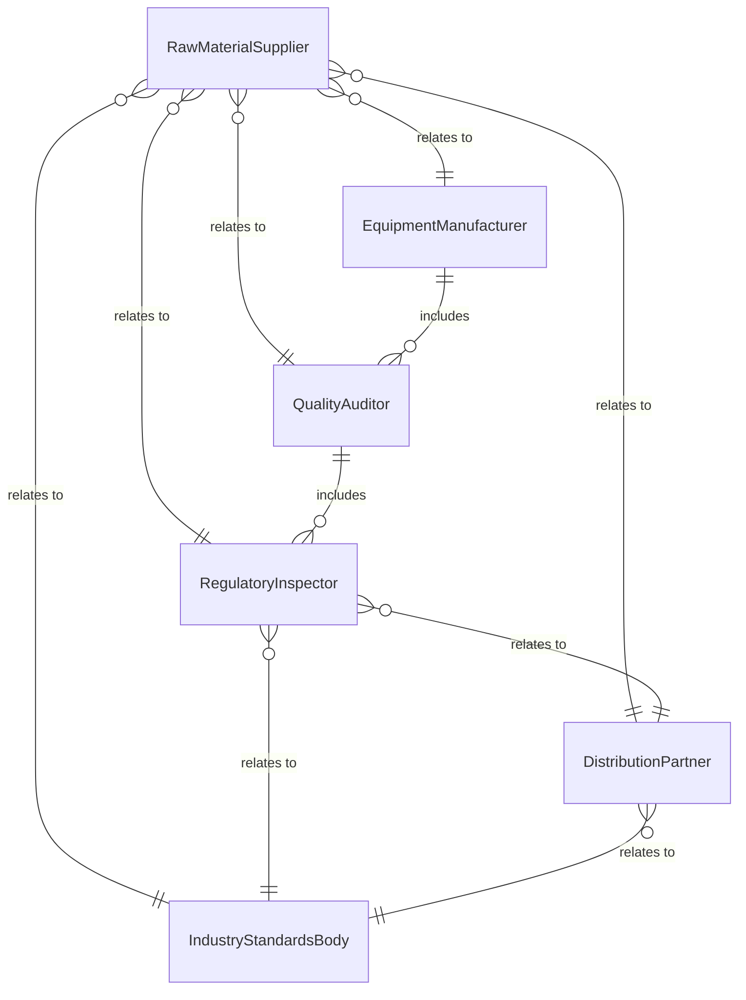
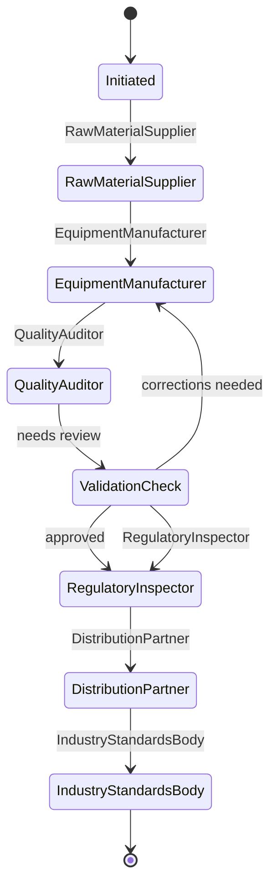
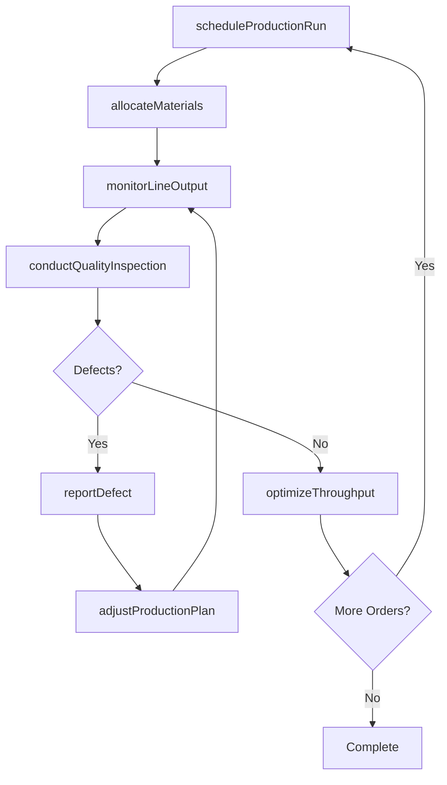
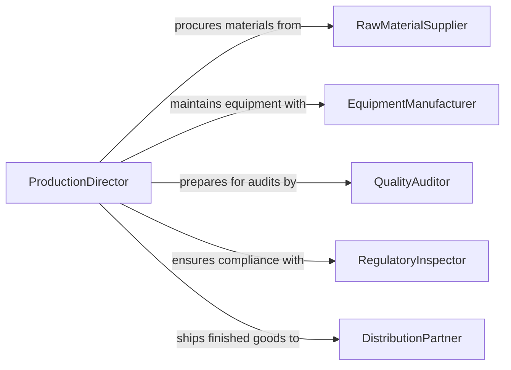

# Direct Industrial Production Activities

> Business-as-Code definition for directing industrial production activities. Models the oversight of manufacturing, assembly, and fabrication operations from production planning through quality assurance and output optimization.

## Overview

Directing industrial production activities involves overseeing the planning, execution, and optimization of manufacturing and fabrication processes across plant operations. This definition provides actions for managing production schedules, controlling output quality, coordinating raw material flows, and monitoring equipment utilization. It enables automation of production line balancing, defect tracking, and throughput optimization workflows.

## Actors

| Actor | Description |
|-------|-------------|
| RawMaterialSupplier | Provides feedstock and components for production |
| EquipmentManufacturer | Supplies and services production machinery |
| QualityAuditor | Conducts external quality certifications and inspections |
| RegulatoryInspector | Enforces industrial safety and environmental regulations |
| DistributionPartner | Receives finished goods for warehousing and delivery |
| IndustryStandardsBody | Sets manufacturing process and product quality standards |

## Roles

| Role | Description |
|------|-------------|
| ProductionDirector | Oversees all industrial production operations and strategy |
| PlantManager | Manages day-to-day manufacturing floor operations |
| QualityControlManager | Ensures product conformance to specifications |
| ProductionPlanner | Schedules production runs and allocates resources |
| ProcessEngineer | Optimizes manufacturing processes and workflows |

## Entities

| Entity | Description |
|--------|-------------|
| ProductionOrder | A scheduled manufacturing run for a specific product |
| ProductionLine | A configured sequence of workstations for assembly or fabrication |
| QualityInspection | A recorded check of product conformance to specifications |
| BillOfMaterials | List of raw materials and components required for production |
| DefectReport | Documented product nonconformance with root cause analysis |
| OutputMetric | Measured production volume, yield, or efficiency indicator |
| MaintenanceWindow | Scheduled downtime for equipment servicing |
| WorkInProgress | Partially completed goods moving through production stages |

## Actions

| Action | Description |
|--------|-------------|
| scheduleProductionRun | Plan and sequence manufacturing orders on production lines |
| allocateMaterials | Assign raw materials and components to production orders |
| monitorLineOutput | Track real-time production volume and yield metrics |
| conductQualityInspection | Perform conformance checks on in-process or finished goods |
| adjustProductionPlan | Modify schedules in response to demand or capacity changes |
| reportDefect | Document a product nonconformance and initiate root cause analysis |
| optimizeThroughput | Analyze and improve production line efficiency |

## Events

| Event | Description |
|-------|-------------|
| productionRunScheduled | A manufacturing order has been planned and sequenced |
| materialsAllocated | Raw materials have been assigned to a production order |
| lineOutputRecorded | Production volume data has been captured |
| qualityInspectionCompleted | A conformance check has been performed |
| productionPlanAdjusted | Manufacturing schedule has been modified |
| defectReported | A product nonconformance has been documented |
| throughputOptimized | Production efficiency improvements have been applied |

## Searches

| Search | Description |
|--------|-------------|
| getProductionSchedule | Retrieve production orders by line, date, or status |
| getOutputMetrics | Check production volume and yield by line or period |
| findDefects | List product nonconformances by type, line, or severity |
| getMaterialAvailability | Check raw material stock levels against production needs |
| getLineUtilization | Retrieve equipment utilization rates by production line |


## Entity Relationships



## State Diagram



## Workflow



## Actor Relationships



## Usage

### Calling Actions

```typescript
import { directIndustrialProductionActivities } from '@headlessly/direct-industrial-production-activities'

const production = directIndustrialProductionActivities()

// Schedule a production run
const run = await production.scheduleProductionRun({
  product: 'hydraulic-valve-assembly',
  line: 'line-3',
  quantity: 5000,
  startDate: '2026-04-07',
  priority: 'standard'
})

// Allocate materials
await production.allocateMaterials({
  productionOrderId: run.id,
  billOfMaterials: 'bom-hydraulic-valve-v4',
  warehouse: 'raw-materials-east'
})

// Monitor output metrics
const output = await production.getOutputMetrics({
  line: 'line-3',
  period: '2026-04-07',
  metrics: ['units-produced', 'yield-rate', 'cycle-time']
})
```

### Event-Driven Automation

```typescript
// Alert on defect rate spike
production.defectReported(async ({ line, defectRate, threshold }) => {
  if (defectRate > threshold) {
    await notify({
      to: 'quality-control-manager',
      message: `Defect rate on ${line} at ${defectRate}%, exceeds ${threshold}% threshold`
    })
  }
})

// Auto-adjust plan when materials run low
production.materialsAllocated(async ({ productionOrderId, shortages }) => {
  if (shortages.length > 0) {
    await production.adjustProductionPlan({
      productionOrderId,
      reason: 'material-shortage',
      affectedComponents: shortages
    })
  }
})
```
