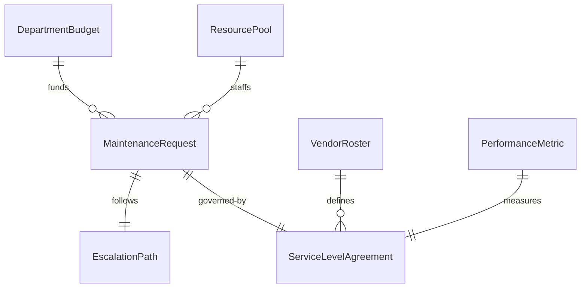
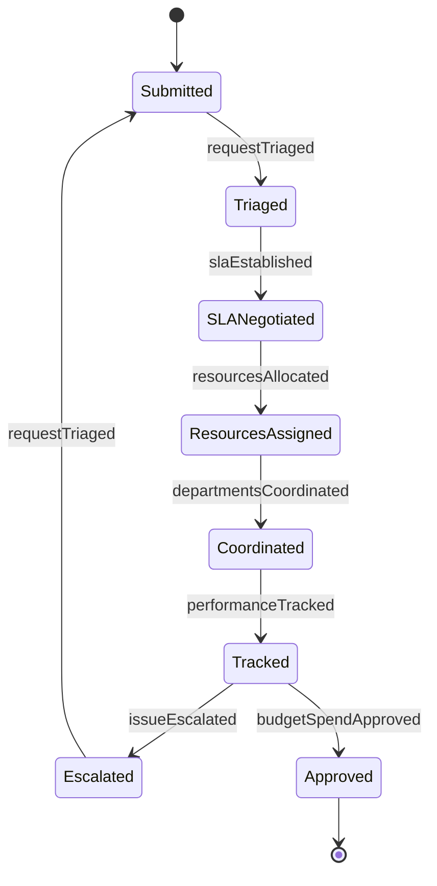
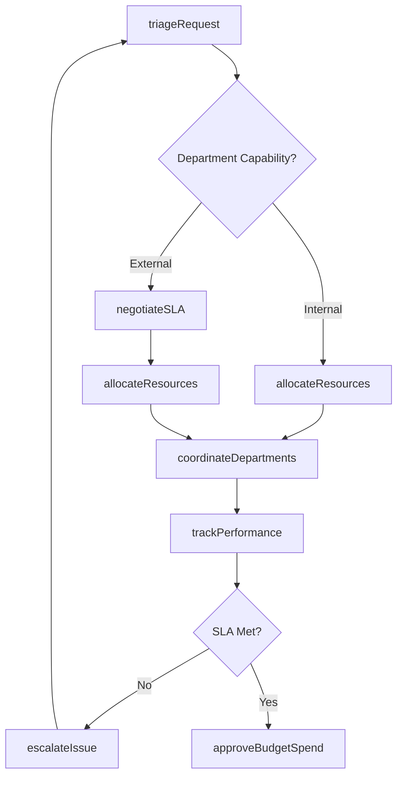
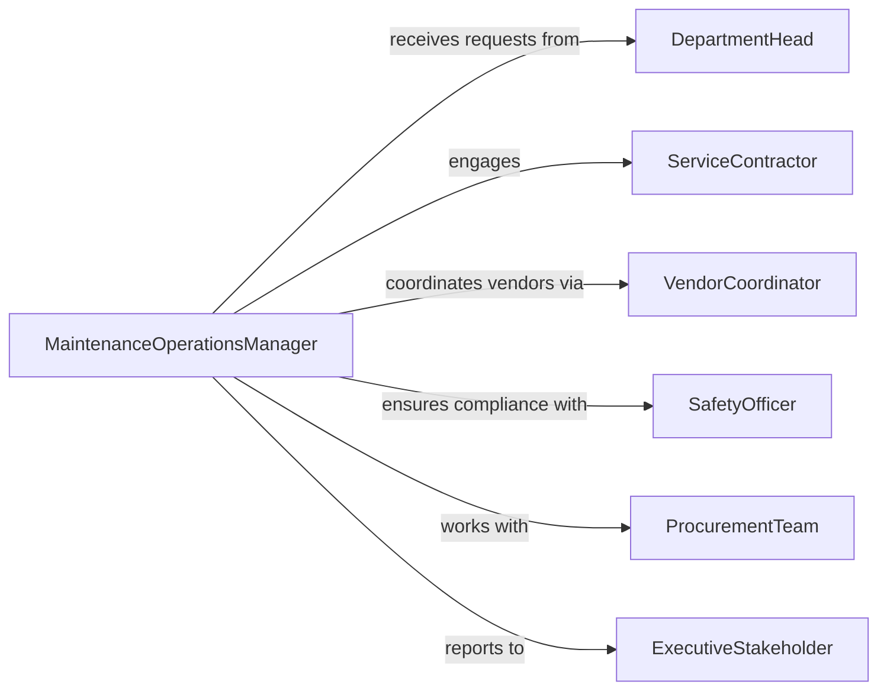

# Direct Maintenance or Repair Activities

> Business-as-Code definition for directing general maintenance and repair activities. Models the oversight of building systems, infrastructure, and general asset maintenance from work order creation through completion tracking.

## Overview

Directing maintenance and repair activities involves coordinating cross-functional maintenance operations across multiple departments, facilities, and service providers. This definition provides actions for triaging incoming work requests, managing contractor relationships, tracking service level agreements, and optimizing resource allocation across diverse maintenance portfolios. It enables automation of work order routing, vendor performance monitoring, and department-level budget tracking.

## Actors

| Actor | Description |
|-------|-------------|
| DepartmentHead | Submits maintenance requests and approves departmental budgets |
| ServiceContractor | Multi-trade contractor providing on-demand repair services |
| VendorCoordinator | Manages relationships with multiple service providers |
| SafetyOfficer | Reviews maintenance activities for occupational safety compliance |
| ProcurementTeam | Handles purchasing and vendor contract negotiations |
| ExecutiveStakeholder | Approves capital expenditures and strategic maintenance investments |

## Roles

| Role | Description |
|------|-------------|
| MaintenanceOperationsManager | Directs enterprise-wide maintenance strategy and coordination |
| ServiceDispatcher | Routes work orders to appropriate departments or contractors |
| ContractAdministrator | Manages vendor contracts, SLAs, and performance metrics |
| CrossFunctionalCoordinator | Aligns maintenance activities across departments |

## Entities

| Entity | Description |
|--------|-------------|
| MaintenanceRequest | Cross-departmental work request requiring triage and routing |
| ServiceLevelAgreement | Contract defining response times and service standards |
| VendorRoster | Qualified contractor list with specialties and availability |
| DepartmentBudget | Allocated maintenance spending by organizational unit |
| EscalationPath | Defined workflow for priority changes and emergency handling |
| PerformanceMetric | Measured contractor or department service quality indicators |
| ResourcePool | Available internal staff and contractor capacity |

## Actions

| Action | Description |
|--------|-------------|
| triageRequest | Categorize and route maintenance request to appropriate department or vendor |
| negotiateSLA | Establish service level agreements with contractors |
| allocateResources | Assign internal staff or contractors based on workload and expertise |
| trackPerformance | Monitor vendor compliance with SLAs and quality standards |
| coordinateDepartments | Synchronize maintenance activities across organizational units |
| approveBudgetSpend | Authorize departmental maintenance expenditures |
| escalateIssue | Elevate unresolved or high-priority maintenance situations |

## Events

| Event | Description |
|-------|-------------|
| requestTriaged | Maintenance request routed to responsible department or vendor |
| slaEstablished | Service level agreement negotiated with contractor |
| resourcesAllocated | Staff or contractor capacity assigned to work queue |
| performanceTracked | Vendor service metrics updated with completion data |
| departmentsCoordinated | Cross-functional maintenance activity synchronized |
| budgetSpendApproved | Departmental maintenance expenditure authorized |
| issueEscalated | High-priority maintenance situation elevated for resolution |

## Searches

| Search | Description |
|--------|-------------|
| findPendingRequests | List unassigned maintenance requests by department or priority |
| getContractorPerformance | Retrieve SLA compliance metrics for vendors |
| getDepartmentSpending | Check maintenance budget utilization by organizational unit |
| getResourceAvailability | View current capacity of internal staff and contractors |
| getEscalatedIssues | List high-priority unresolved maintenance situations |


## Entity Relationships



## State Diagram



## Workflow



## Actor Relationships



## Usage

### Calling Actions

```typescript
import { directMaintenanceRepairActivities } from '@headlessly/direct-maintenance-repair-activities'

const operations = directMaintenanceRepairActivities()

// Triage cross-departmental request
const request = await operations.triageRequest({
  description: 'IT server room cooling failure affecting multiple departments',
  submittedBy: 'department-head-it',
  affectedDepartments: ['IT', 'Finance', 'Operations'],
  priority: 'critical'
})

// Negotiate SLA with contractor
await operations.negotiateSLA({
  vendor: 'multi-trade-services-inc',
  services: ['HVAC', 'electrical', 'plumbing'],
  responseTime: '4-hour-emergency',
  regularResponseTime: '24-hour-standard',
  penaltyTerms: { percentPerHour: 2, maxPenalty: 10 }
})

// Coordinate departments for scheduled work
await operations.coordinateDepartments({
  maintenanceWindow: { start: '2026-03-15T22:00', end: '2026-03-16T06:00' },
  affectedDepartments: ['IT', 'Security', 'Facilities'],
  coordination: 'power-shutdown-required'
})
```

### Event-Driven Automation

```typescript
// Auto-escalate SLA violations
operations.performanceTracked(async ({ vendorId, slaCompliance, requestId }) => {
  if (slaCompliance < 0.9) {
    await operations.escalateIssue({
      requestId,
      reason: 'sla-violation',
      escalateTo: 'contract-administrator'
    })
  }
})

// Alert on budget threshold
operations.budgetSpendApproved(async ({ department, currentSpend, budgetLimit }) => {
  const percentUsed = (currentSpend / budgetLimit) * 100
  if (percentUsed > 80) {
    await notify({
      to: `department-head-${department}`,
      message: `Maintenance budget ${percentUsed}% depleted for ${department}`
    })
  }
})
```
