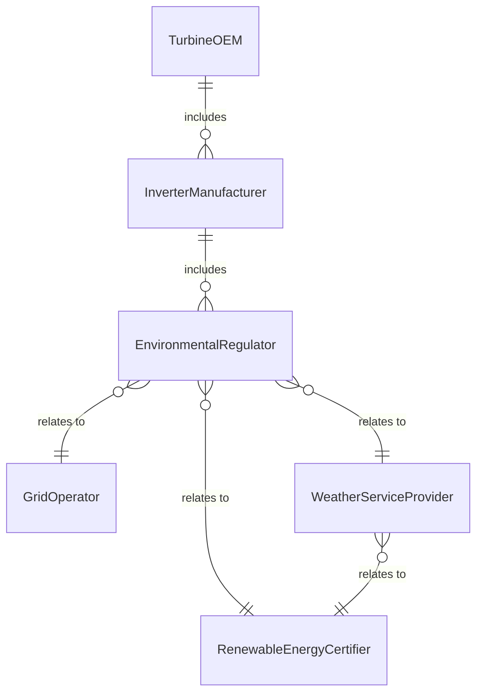
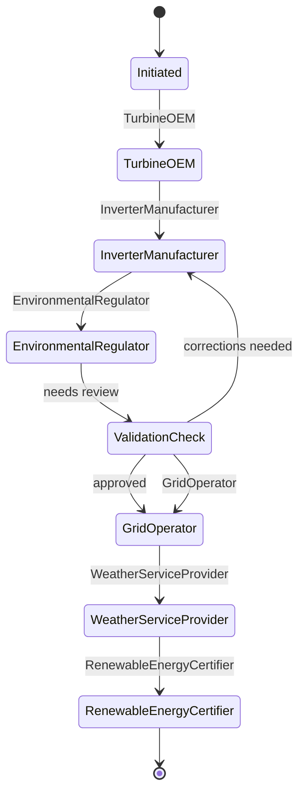
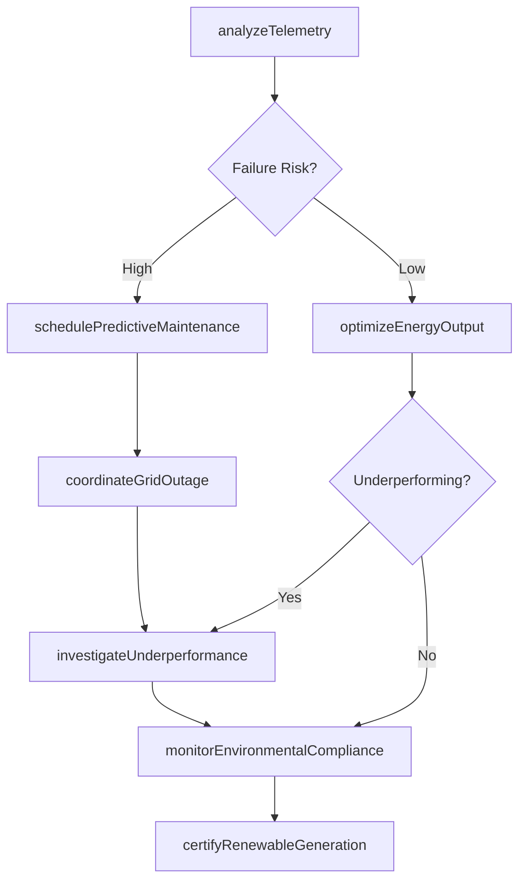
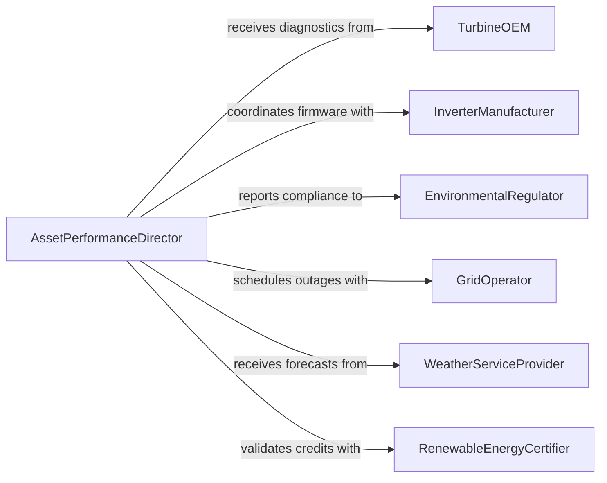

# Direct Maintenance Repair Activities Green

> Business-as-Code definition for directing maintenance and repair activities in green energy production facilities. Models the oversight of preventive and corrective maintenance for wind, solar, geothermal, and other renewable energy assets.

## Overview

Directing maintenance and repair activities in green energy production facilities involves managing renewable energy asset performance through IoT-enabled predictive maintenance, environmental compliance, and energy output optimization. This definition provides actions for sensor-driven health monitoring, renewable technology troubleshooting, environmental permit adherence, and power generation maximization. It enables automation of predictive failure alerts, regulatory reporting, grid interconnection coordination, and renewable energy certificate tracking.

## Actors

| Actor | Description |
|-------|-------------|
| TurbineOEM | Original equipment manufacturer providing turbine-specific diagnostics and parts |
| InverterManufacturer | Supplies power conversion equipment and firmware updates |
| EnvironmentalRegulator | Issues permits for land use, wildlife protection, and emissions |
| GridOperator | Coordinates generation schedules and interconnection requirements |
| WeatherServiceProvider | Supplies forecasts for solar irradiance and wind speed predictions |
| RenewableEnergyCertifier | Validates environmental attributes for renewable energy credits |

## Roles

| Role | Description |
|------|-------------|
| AssetPerformanceDirector | Directs renewable energy asset optimization and predictive maintenance |
| PredictiveMaintenanceEngineer | Analyzes sensor telemetry to forecast component failures |
| EnvironmentalComplianceOfficer | Ensures operations meet environmental permit conditions |
| EnergyOutputAnalyst | Monitors generation efficiency and identifies underperformance |

## Entities

| Entity | Description |
|--------|-------------|
| SensorTelemetry | Real-time IoT data streams from turbines, panels, and inverters |
| PredictiveAlert | Machine learning-generated forecast of component failure risk |
| EnvironmentalPermit | Regulatory authorization with operational restrictions and reporting requirements |
| GenerationForecast | Predicted energy output based on weather and equipment status |
| ComponentLifecycle | Expected operational lifespan and degradation curve for renewable assets |
| GridCurtailment | Scheduled reduction in generation due to grid operator requirements |
| RenewableEnergyCredit | Tradable certificate representing environmental attributes of generation |

## Actions

| Action | Description |
|--------|-------------|
| analyzeTelemetry | Process sensor data to detect performance anomalies and predict failures |
| schedulePredictiveMaintenance | Plan interventions based on failure risk models before breakdowns occur |
| monitorEnvironmentalCompliance | Track operations against permit limits for noise, wildlife, and land use |
| optimizeEnergyOutput | Adjust turbine pitch, panel tracking, or inverter settings for maximum generation |
| coordinateGridOutage | Schedule maintenance during low-generation periods or grid-requested curtailments |
| certifyRenewableGeneration | Document energy production for renewable energy credit issuance |
| investigateUnderperformance | Diagnose generation shortfalls relative to weather-adjusted forecasts |

## Events

| Event | Description |
|-------|-------------|
| telemetryAnalyzed | Sensor data processed and performance benchmarks updated |
| predictiveMaintenanceScheduled | Intervention planned based on failure probability exceeding threshold |
| environmentalComplianceMonitored | Permit conditions checked and compliance status updated |
| energyOutputOptimized | Generation parameters adjusted to maximize power production |
| gridOutageCoordinated | Maintenance window synchronized with grid operator or low-wind forecast |
| renewableGenerationCertified | Energy production validated for renewable energy credit issuance |
| underperformanceInvestigated | Root cause analysis completed for generation below forecast |

## Searches

| Search | Description |
|--------|-------------|
| getPredictiveAlerts | Retrieve upcoming failure forecasts by asset, severity, or probability |
| getEnvironmentalStatus | Check compliance status for permits by facility or regulation type |
| getGenerationPerformance | Compare actual versus forecasted output by asset or time period |
| getMaintenanceWindows | List optimal intervention times based on weather and grid schedules |
| getRenewableCertificates | Retrieve issued renewable energy credits by period or facility |


## Entity Relationships



## State Diagram



## Workflow



## Actor Relationships



## Usage

### Calling Actions

```typescript
import { directMaintenanceRepairActivitiesGreen } from '@headlessly/direct-maintenance-repair-activities-green'

const renewable = directMaintenanceRepairActivitiesGreen()

// Analyze turbine telemetry for predictive maintenance
const alerts = await renewable.analyzeTelemetry({
  facility: 'North Ridge Wind Farm',
  assets: ['turbine-NR-001', 'turbine-NR-002'],
  sensors: ['gearbox-vibration', 'generator-temperature', 'blade-strain'],
  analysisWindow: '72-hours'
})

// Schedule predictive maintenance based on failure risk
await renewable.schedulePredictiveMaintenance({
  assetId: 'turbine-NR-017',
  component: 'gearbox-bearing',
  failureProbability: 0.78,
  recommendedWindow: { start: '2026-04-10', end: '2026-04-12' },
  estimatedDowntime: '6-hours'
})

// Optimize solar array output
await renewable.optimizeEnergyOutput({
  facility: 'Desert Sun Solar Farm',
  optimization: 'panel-tracking-adjustment',
  currentIrradiance: 850,
  forecast: { hours: 4, expectedIrradiance: 920 }
})
```

### Event-Driven Automation

```typescript
// Auto-schedule maintenance on high failure risk
renewable.telemetryAnalyzed(async ({ assetId, failureRisk, component }) => {
  if (failureRisk > 0.7) {
    const forecast = await renewable.getMaintenanceWindows({ assetId, days: 14 })
    await renewable.schedulePredictiveMaintenance({
      assetId,
      component,
      failureProbability: failureRisk,
      recommendedWindow: forecast.optimalWindows[0]
    })
  }
})

// Alert on environmental compliance threshold
renewable.environmentalComplianceMonitored(async ({ permit, metric, value, limit }) => {
  const percentOfLimit = (value / limit) * 100
  if (percentOfLimit > 90) {
    await notify({
      to: 'environmental-compliance-officer',
      message: `${permit} ${metric} at ${percentOfLimit}% of permitted limit`
    })
  }
})
```
