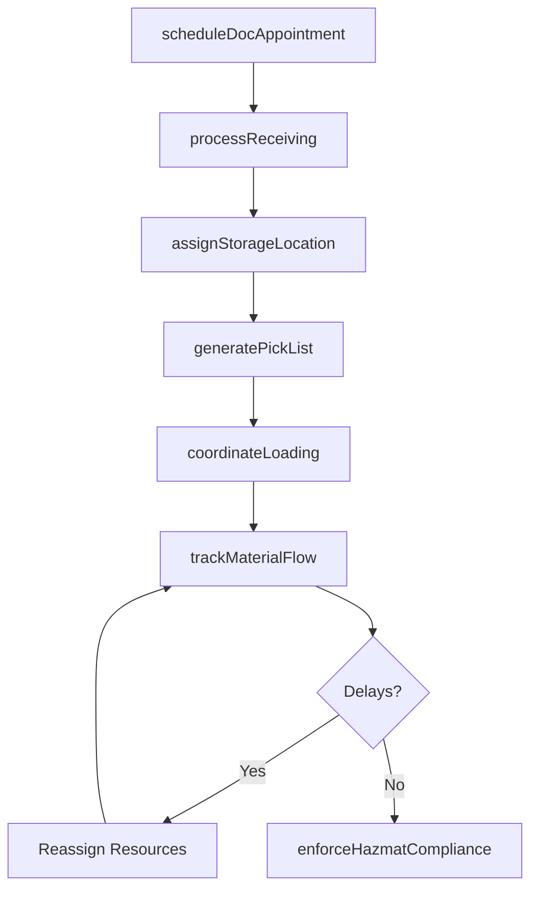
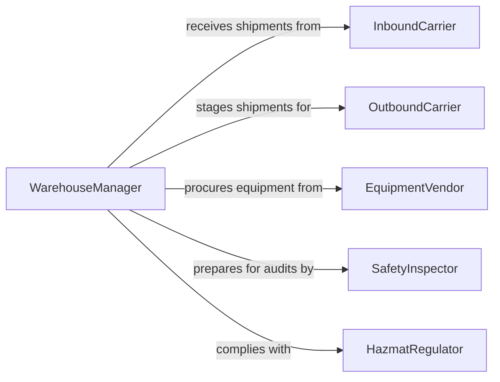

# Direct Material Handling Moving Activities

> Business-as-Code definition for directing material handling or moving activities. Models the oversight of warehouse operations, loading and unloading, internal transport, and inventory staging across distribution and manufacturing environments.

## Overview

Directing material handling or moving activities involves overseeing the physical movement, storage, and staging of materials within warehouses, distribution centers, and manufacturing facilities. This definition provides actions for managing receiving operations, coordinating forklift and conveyor workflows, optimizing storage locations, and ensuring safe handling of hazardous materials. It enables automation of dock scheduling, put-away optimization, and material flow tracking.

## Actors

| Actor | Description |
|-------|-------------|
| InboundCarrier | Delivers incoming shipments to the receiving dock |
| OutboundCarrier | Picks up staged shipments for outbound delivery |
| EquipmentVendor | Supplies forklifts, conveyors, and material handling equipment |
| SafetyInspector | Audits material handling practices and workplace safety |
| HazmatRegulator | Enforces regulations for hazardous material storage and handling |

## Roles

| Role | Description |
|------|-------------|
| WarehouseManager | Oversees all material handling operations within the facility |
| DockSupervisor | Coordinates loading and unloading at receiving and shipping docks |
| InventoryController | Manages storage locations and material placement |
| MaterialHandler | Operates equipment and physically moves materials |
| SafetyLead | Ensures material handling activities comply with safety standards |

## Entities

| Entity | Description |
|--------|-------------|
| ReceivingOrder | An inbound shipment scheduled for dock arrival |
| StorageLocation | A designated bin, rack, or zone within the warehouse |
| PickList | A set of items to be retrieved from storage for an order |
| LoadPlan | The arrangement of goods in a vehicle for outbound shipment |
| HandlingEquipment | Forklifts, pallet jacks, and conveyors used for material movement |
| DockAppointment | A scheduled time slot for a carrier at the loading dock |
| HazmatRecord | Documentation for hazardous material classification and handling |

## Actions

| Action | Description |
|--------|-------------|
| scheduleDocAppointment | Assign receiving and shipping dock time slots to carriers |
| processReceiving | Inspect, count, and log inbound shipments against purchase orders |
| assignStorageLocation | Place materials in optimized warehouse locations |
| generatePickList | Create item retrieval lists for outbound orders |
| coordinateLoading | Oversee the arrangement and loading of outbound shipments |
| trackMaterialFlow | Monitor the movement of goods through the facility in real time |
| enforceHazmatCompliance | Ensure hazardous materials meet storage and handling regulations |

## Events

| Event | Description |
|-------|-------------|
| dockAppointmentScheduled | A carrier has been assigned a dock time slot |
| shipmentReceived | An inbound delivery has been processed and logged |
| storageLocationAssigned | Materials have been placed in a warehouse location |
| pickListGenerated | Item retrieval instructions have been created |
| loadingCompleted | An outbound shipment has been loaded onto a vehicle |
| materialFlowDelayed | Movement of goods through the facility has stalled |
| hazmatViolationDetected | A hazardous material handling regulation has been breached |

## Searches

| Search | Description |
|--------|-------------|
| getDockSchedule | Retrieve dock appointments by date, carrier, or direction |
| getStorageUtilization | Check warehouse capacity and bin occupancy rates |
| findPendingPicks | List pick lists awaiting fulfillment by zone or priority |
| getMaterialLocation | Track current position of specific materials in the facility |
| getHandlingEquipmentStatus | Check equipment availability and maintenance status |

## Workflow



## Actor Relationships



## Usage

### Calling Actions

```typescript
import { directMaterialHandlingMovingActivities } from '@headlessly/direct-material-handling-moving-activities'

const materials = directMaterialHandlingMovingActivities()

// Schedule a dock appointment
await materials.scheduleDocAppointment({
  carrier: 'ABC Freight',
  direction: 'inbound',
  date: '2026-04-10',
  timeSlot: '08:00-09:00',
  dock: 'dock-3'
})

// Process a receiving shipment
await materials.processReceiving({
  purchaseOrder: 'PO-2026-4410',
  carrier: 'ABC Freight',
  itemCount: 240,
  inspectionRequired: true
})

// Check storage utilization
const utilization = await materials.getStorageUtilization({
  zone: 'zone-A',
  metrics: ['bin-occupancy', 'cubic-utilization', 'pick-density']
})
```

### Event-Driven Automation

```typescript
// Alert on material flow delays
materials.materialFlowDelayed(async ({ zone, cause, duration }) => {
  if (duration > 30) {
    await notify({
      to: 'warehouse-manager',
      message: `Material flow delayed in ${zone}: ${cause} for ${duration} minutes`
    })
  }
})

// Auto-escalate hazmat violations
materials.hazmatViolationDetected(async ({ location, material, violation }) => {
  await notify({
    to: 'safety-lead',
    message: `Hazmat violation at ${location}: ${material} - ${violation}`,
    priority: 'urgent'
  })
})
```
