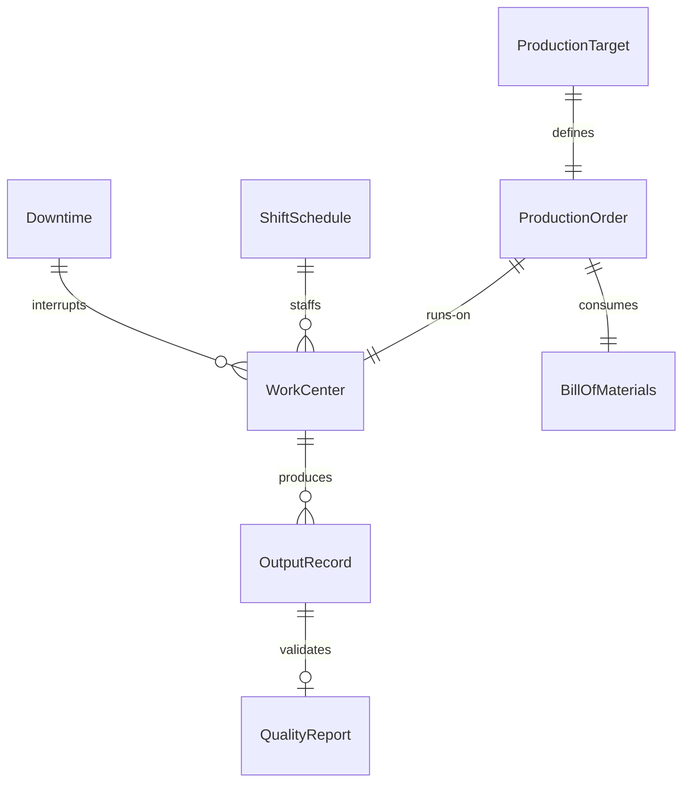
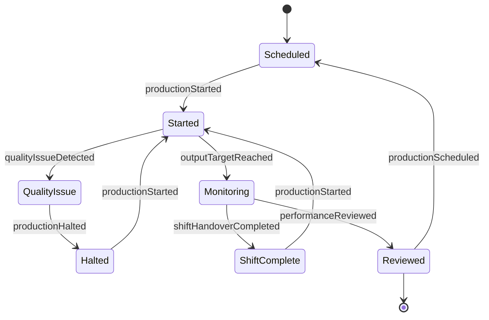
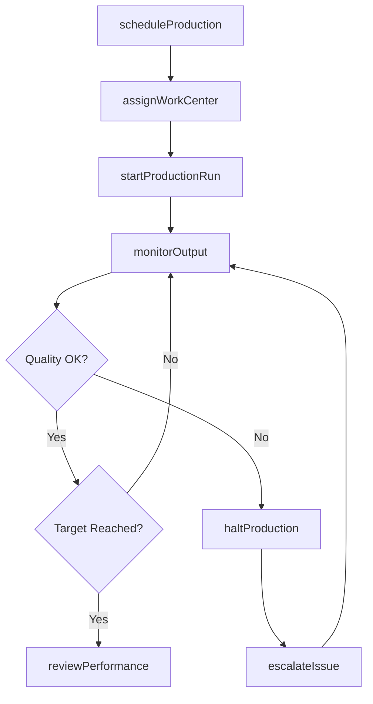
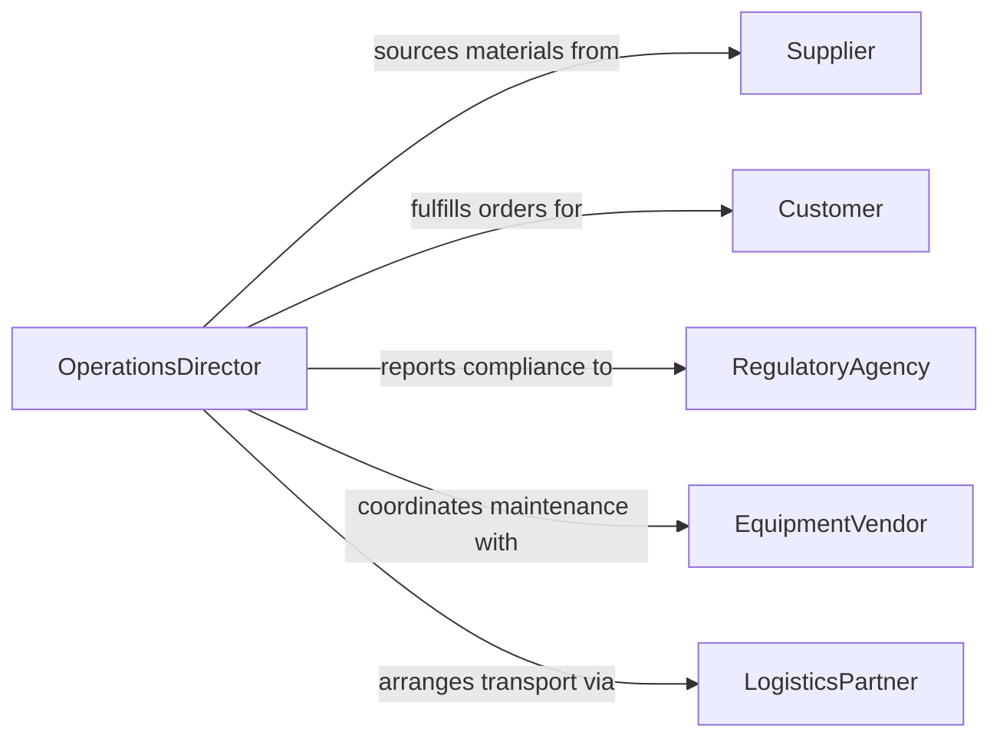

# Direct Operational and Production Activities

> Business-as-Code definition for directing operational and production activities. Models the oversight of manufacturing, processing, and operational workflows from planning through execution and performance review.

## Overview

Directing operational and production activities encompasses the leadership and management of day-to-day manufacturing, assembly, and processing workflows. This definition provides actions for production planning, resource coordination, quality oversight, and throughput optimization. It enables automation of production scheduling, shift management, and real-time output monitoring across operational environments.

## Actors

| Actor | Description |
|-------|-------------|
| Supplier | Provides raw materials and components for production |
| Customer | Receives finished goods and defines demand requirements |
| RegulatoryAgency | Enforces safety and environmental compliance standards |
| EquipmentVendor | Supplies and services production machinery |
| LogisticsPartner | Handles inbound and outbound material transport |
| QualityAuditor | Conducts independent production quality assessments |

## Roles

| Role | Description |
|------|-------------|
| OperationsDirector | Oversees all production and operational activities |
| ProductionManager | Manages daily production schedules and output targets |
| ShiftSupervisor | Leads production teams during assigned shifts |
| QualityController | Monitors product quality and compliance standards |
| ProcessEngineer | Optimizes production workflows and equipment utilization |

## Entities

| Entity | Description |
|--------|-------------|
| ProductionOrder | A scheduled batch or run of product manufacturing |
| WorkCenter | A defined area or station where production occurs |
| ShiftSchedule | Time-based assignment of personnel to production lines |
| OutputRecord | Log of quantities produced per period |
| QualityReport | Assessment of product conformance to specifications |
| Downtime | Recorded period of production stoppage with cause |
| BillOfMaterials | List of components required for a production run |
| ProductionTarget | Defined output goal for a given period |

## Actions

| Action | Description |
|--------|-------------|
| scheduleProduction | Create or update production run schedules |
| assignWorkCenter | Allocate personnel and equipment to work centers |
| startProductionRun | Initiate a scheduled production batch |
| monitorOutput | Track real-time production quantities and rates |
| haltProduction | Stop production for safety or quality issues |
| reviewPerformance | Analyze production metrics against targets |
| escalateIssue | Route production problems to appropriate leadership |
| approveChangeover | Authorize production line changeover between products |

## Events

| Event | Description |
|-------|-------------|
| productionScheduled | A new production run has been scheduled |
| productionStarted | A production run has begun execution |
| outputTargetReached | Production output meets the defined target |
| qualityIssueDetected | A product quality deviation has been identified |
| productionHalted | Production has been stopped due to an issue |
| shiftHandoverCompleted | Shift transition and handover is complete |
| downtimeRecorded | An unplanned production stoppage has been logged |
| performanceReviewed | Production performance analysis is complete |

## Searches

| Search | Description |
|--------|-------------|
| findProductionOrders | List production orders by status, date, or product |
| getOutputMetrics | Retrieve production output data by period or line |
| getDowntimeEvents | Find production stoppages by cause or duration |
| findQualityReports | List quality assessments by product or date range |
| getWorkCenterStatus | Check current status and utilization of work centers |


## Entity Relationships



## State Diagram



## Workflow



## Actor Relationships



## Usage

### Calling Actions

```typescript
import { directOperationalProductionActivities } from '@headlessly/direct-operational-production-activities'

const operations = directOperationalProductionActivities()

// Schedule a new production run
const order = await operations.scheduleProduction({
  product: 'Widget-A',
  quantity: 5000,
  startDate: '2026-03-01',
  workCenter: 'Assembly-Line-2'
})

// Monitor real-time output
const metrics = await operations.monitorOutput({
  productionOrderId: order.id,
  interval: '15min'
})

// Review shift performance
const review = await operations.reviewPerformance({
  workCenter: 'Assembly-Line-2',
  period: '2026-03-01'
})
```

### Event-Driven Automation

```typescript
// Alert on quality deviations
operations.qualityIssueDetected(async ({ productionOrderId, defectType, severity }) => {
  if (severity === 'critical') {
    await operations.haltProduction({ productionOrderId })
    await notify({ to: 'quality-team', message: `Critical defect: ${defectType}` })
  }
})

// Auto-close completed production runs
operations.outputTargetReached(async ({ productionOrderId, actualOutput }) => {
  await operations.reviewPerformance({ productionOrderId })
})
```
