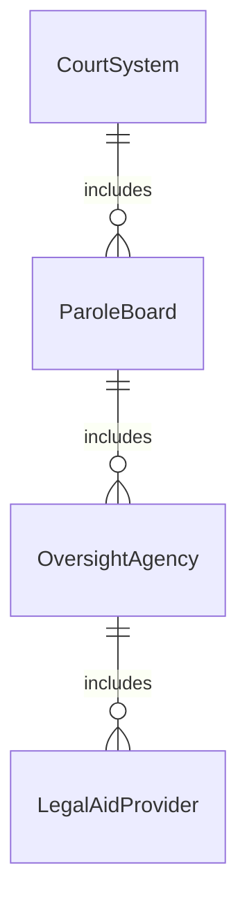
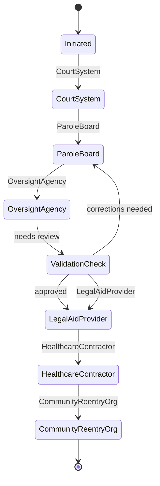
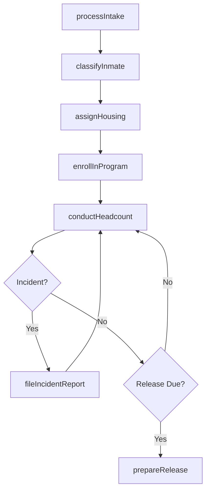
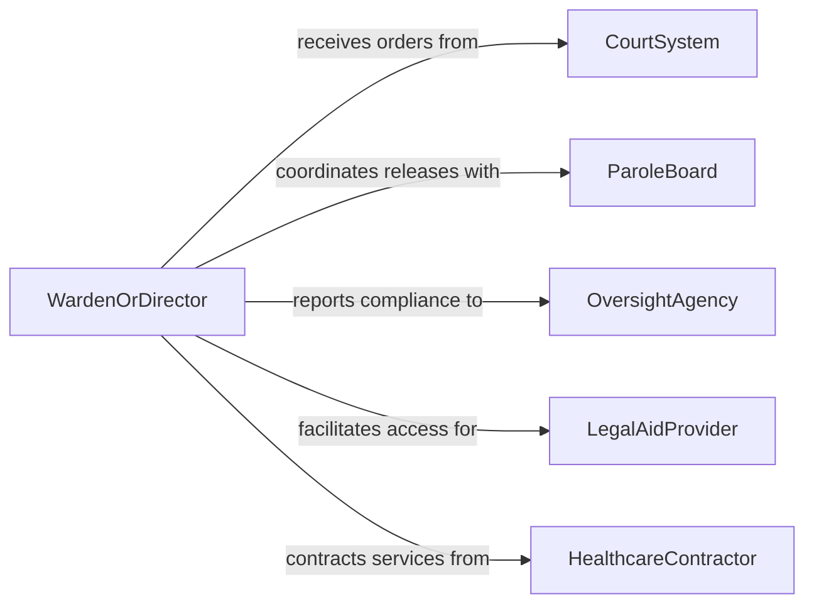

# Direct Operations of Correctional Facilities

> Business-as-Code definition for directing correctional facility operations. Models the management of inmate custody, facility security, rehabilitation programs, and compliance reporting within detention and correctional environments.

## Overview

Directing correctional facility operations encompasses the management of inmate intake, custody classification, facility security, rehabilitation programming, and release coordination. This definition provides actions for processing admissions, managing housing assignments, scheduling programs, and tracking compliance with correctional standards. It enables automation of headcount verification, incident reporting, and parole preparation workflows.

## Actors

| Actor | Description |
|-------|-------------|
| CourtSystem | Issues commitment orders and release directives |
| ParoleBoard | Reviews and decides on inmate early release eligibility |
| OversightAgency | Monitors facility conditions and compliance with standards |
| LegalAidProvider | Represents inmates in legal proceedings |
| HealthcareContractor | Delivers medical and mental health services to inmates |
| CommunityReentryOrg | Supports transition planning and post-release services |

## Roles

| Role | Description |
|------|-------------|
| WardenOrDirector | Oversees all facility operations and strategic direction |
| CustodySupervisor | Manages correctional officers and housing unit operations |
| ProgramCoordinator | Administers educational, vocational, and rehabilitation programs |
| ComplianceOfficer | Ensures adherence to correctional standards and regulations |

## Entities

| Entity | Description |
|--------|-------------|
| Inmate | An individual in custody at the correctional facility |
| HousingAssignment | Allocation of an inmate to a specific unit and cell |
| CustodyClassification | Security level assessment determining inmate placement |
| IncidentReport | Documentation of security events, violations, or disturbances |
| RehabilitationProgram | Structured educational, vocational, or behavioral program |
| ReleaseOrder | Court or parole directive authorizing inmate release |
| FacilityInspection | Formal review of facility conditions and operations |
| VisitationSchedule | Approved schedule for inmate visitor access |

## Actions

| Action | Description |
|--------|-------------|
| processIntake | Admit a new inmate and complete booking procedures |
| classifyInmate | Assess custody level and assign security classification |
| assignHousing | Allocate an inmate to appropriate housing unit |
| enrollInProgram | Register an inmate in a rehabilitation or educational program |
| fileIncidentReport | Document a security event or policy violation |
| prepareRelease | Coordinate discharge documentation and transition planning |
| conductHeadcount | Verify inmate population against facility records |
| scheduleVisitation | Manage approved visitor schedules and access |

## Events

| Event | Description |
|-------|-------------|
| intakeProcessed | A new inmate has been admitted to the facility |
| inmateClassified | An inmate custody classification has been completed |
| housingAssigned | An inmate has been placed in a housing unit |
| programEnrolled | An inmate has been registered in a program |
| incidentReported | A security event has been documented |
| releaseProcessed | An inmate has been discharged from custody |
| headcountCompleted | A facility population verification is complete |
| inspectionCompleted | A facility conditions review has been finished |

## Searches

| Search | Description |
|--------|-------------|
| findInmates | List inmates by classification, housing, or status |
| getIncidentReports | Retrieve incident documentation by type or date |
| getProgramEnrollment | Check inmate participation in rehabilitation programs |
| getHeadcountHistory | Retrieve population count records by date |
| findPendingReleases | List inmates with upcoming release dates |


## Entity Relationships



## State Diagram



## Workflow



## Actor Relationships



## Usage

### Calling Actions

```typescript
import { directOperationsCorrectionalFacilities } from '@headlessly/direct-operations-correctional-facilities'

const corrections = directOperationsCorrectionalFacilities()

// Process a new inmate intake
const inmate = await corrections.processIntake({
  name: 'Inmate Record',
  commitmentOrder: 'CO-2026-4521',
  bookingDate: '2026-03-15'
})

// Classify and assign housing
await corrections.classifyInmate({
  inmateId: inmate.id,
  assessmentScore: 18,
  classification: 'medium-security'
})

await corrections.assignHousing({
  inmateId: inmate.id,
  unit: 'Block-C',
  cell: 'C-214'
})
```

### Event-Driven Automation

```typescript
// Auto-enroll classified inmates in orientation program
corrections.inmateClassified(async ({ inmateId, classification }) => {
  await corrections.enrollInProgram({
    inmateId,
    program: 'facility-orientation',
    startDate: new Date().toISOString()
  })
})

// Notify parole board of upcoming releases
corrections.releaseProcessed(async ({ inmateId, releaseDate }) => {
  await notify({
    to: 'parole-board',
    message: `Inmate ${inmateId} release processed for ${releaseDate}`
  })
})
```
