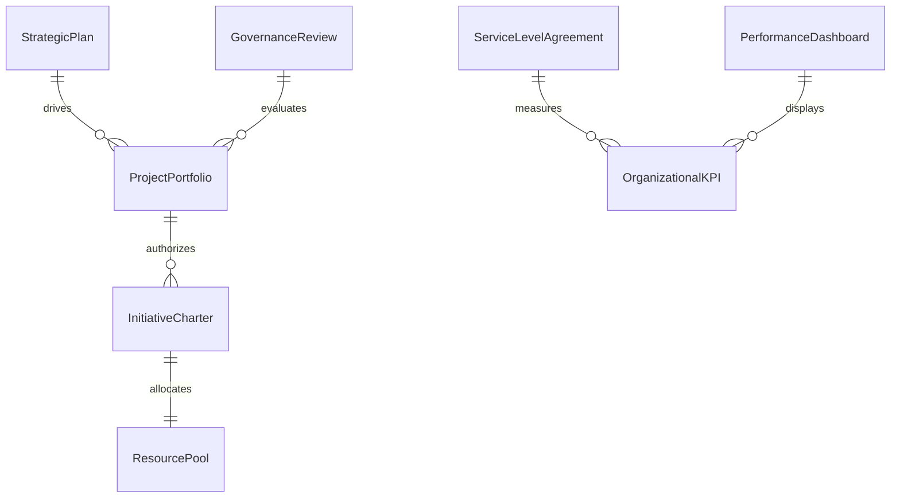
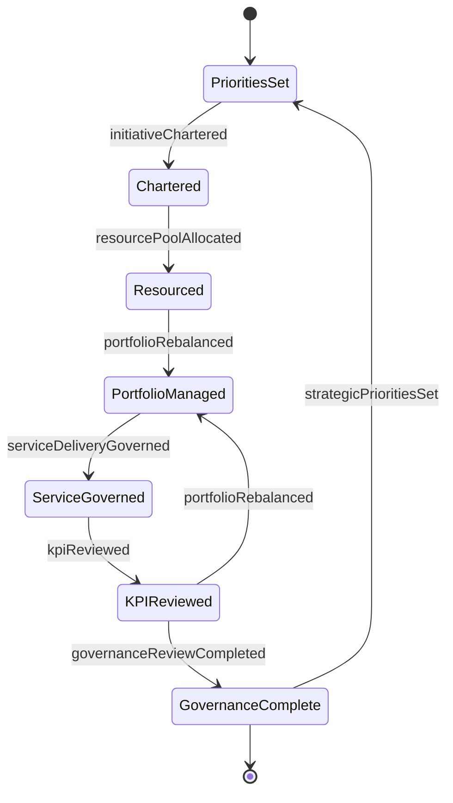
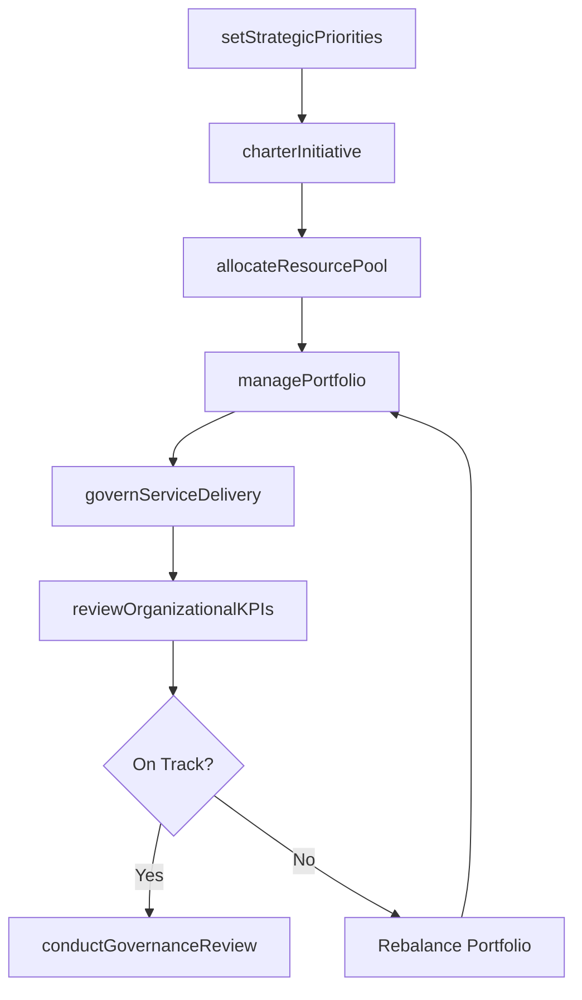
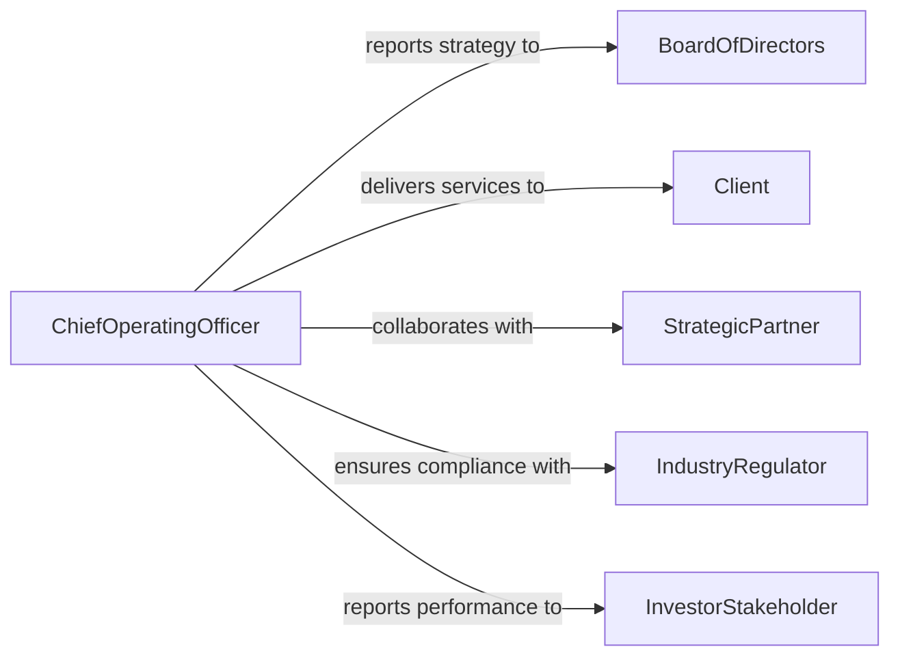

# Direct Organizational Operations Projects Services

> Business-as-Code definition for directing organizational operations, projects, or services. Models executive-level oversight of business units including strategic planning, portfolio management, service delivery governance, and organizational performance monitoring.

## Overview

Directing organizational operations, projects, or services involves executive-level oversight of business unit performance, project portfolio management, and service delivery governance. This definition provides actions for setting strategic priorities, allocating resources across initiatives, monitoring organizational KPIs, and governing service quality. It enables automation of portfolio reviews, performance dashboarding, and strategic initiative tracking workflows.

## Actors

| Actor | Description |
|-------|-------------|
| BoardOfDirectors | Approves strategic direction and major resource commitments |
| Client | Organization or individual receiving delivered services |
| StrategicPartner | External organization collaborating on joint initiatives |
| IndustryRegulator | Enforces standards governing organizational operations |
| InvestorStakeholder | Provides capital and requires performance accountability |

## Roles

| Role | Description |
|------|-------------|
| ChiefOperatingOfficer | Oversees all organizational operations and service delivery |
| PortfolioManager | Manages the mix of projects and initiatives across the organization |
| ServiceDeliveryDirector | Ensures client-facing services meet quality and SLA standards |
| StrategyAnalyst | Monitors market conditions and organizational performance data |
| ProgramManager | Coordinates related projects within a strategic initiative |

## Entities

| Entity | Description |
|--------|-------------|
| StrategicPlan | Organizational goals and initiatives for a multi-year period |
| ProjectPortfolio | Collection of active projects managed as a coordinated group |
| ServiceLevelAgreement | Defined quality and performance standards for service delivery |
| OrganizationalKPI | Key performance indicator tracked at the enterprise level |
| InitiativeCharter | Authorization document defining scope and resources for a strategic initiative |
| PerformanceDashboard | Real-time visualization of organizational metrics |
| GovernanceReview | Periodic assessment of project and service delivery health |
| ResourcePool | Shared personnel and budget available for allocation across initiatives |

## Actions

| Action | Description |
|--------|-------------|
| setStrategicPriorities | Define organizational goals and rank initiatives by importance |
| managePortfolio | Oversee the mix of active projects and balance resource allocation |
| governServiceDelivery | Monitor and enforce service quality against SLA standards |
| reviewOrganizationalKPIs | Assess enterprise performance against strategic benchmarks |
| charterInitiative | Authorize and scope a new strategic initiative |
| conductGovernanceReview | Perform periodic health checks on projects and services |
| allocateResourcePool | Distribute shared personnel and budget across initiatives |

## Events

| Event | Description |
|-------|-------------|
| strategicPrioritiesSet | Organizational goals and initiative rankings have been defined |
| portfolioRebalanced | Project mix and resource allocation have been adjusted |
| serviceDeliveryGoverned | Service quality has been assessed against SLA standards |
| kpiReviewed | Enterprise performance has been assessed against benchmarks |
| initiativeChartered | A new strategic initiative has been authorized |
| governanceReviewCompleted | Periodic project and service health check has been performed |
| resourcePoolAllocated | Shared personnel and budget have been distributed |

## Searches

| Search | Description |
|--------|-------------|
| getStrategicPlan | Retrieve organizational goals and initiative status |
| getPortfolioStatus | Check project health across the active portfolio |
| getServiceLevels | Review SLA performance by service or client |
| getOrganizationalKPIs | Retrieve enterprise metrics by category or period |
| getResourceAllocation | Check how shared resources are distributed across initiatives |


## Entity Relationships



## State Diagram



## Workflow



## Actor Relationships



## Usage

### Calling Actions

```typescript
import { directOrganizationalOperationsProjectsServices } from '@headlessly/direct-organizational-operations-projects-services'

const org = directOrganizationalOperationsProjectsServices()

// Set strategic priorities for the year
await org.setStrategicPriorities({
  period: 'FY2026',
  priorities: [
    { name: 'Digital Transformation', rank: 1, budget: 5000000 },
    { name: 'Market Expansion APAC', rank: 2, budget: 3000000 },
    { name: 'Operational Excellence', rank: 3, budget: 2000000 }
  ]
})

// Charter a new initiative
const initiative = await org.charterInitiative({
  name: 'Digital Transformation Phase 2',
  sponsor: 'cto',
  budget: 2500000,
  timeline: { start: '2026-04-01', end: '2026-12-31' },
  expectedOutcomes: ['50% process automation', 'customer portal launch']
})

// Review organizational KPIs
const kpis = await org.getOrganizationalKPIs({
  period: '2026-Q1',
  categories: ['revenue', 'customer-satisfaction', 'operational-efficiency']
})
```

### Event-Driven Automation

```typescript
// Alert on KPI deviation
org.kpiReviewed(async ({ kpi, actual, target, variance }) => {
  if (Math.abs(variance) > 10) {
    await notify({
      to: 'chief-operating-officer',
      message: `KPI ${kpi}: ${actual} vs target ${target} (${variance > 0 ? '+' : ''}${variance}%)`
    })
  }
})

// Auto-schedule governance review when portfolio changes
org.portfolioRebalanced(async ({ addedProjects, removedProjects }) => {
  if (addedProjects.length > 0 || removedProjects.length > 0) {
    await org.conductGovernanceReview({
      trigger: 'portfolio-change',
      scope: 'affected-initiatives'
    })
  }
})
```
