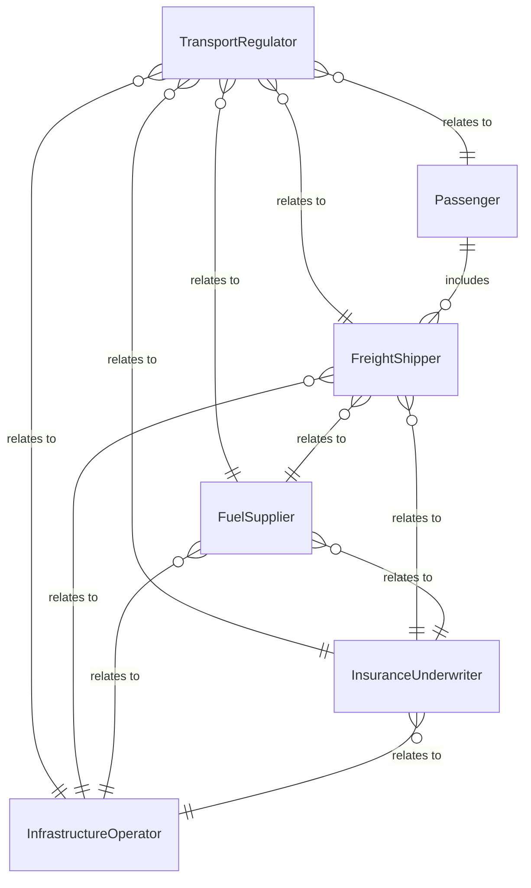
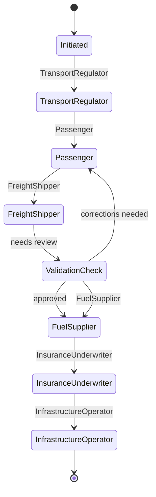
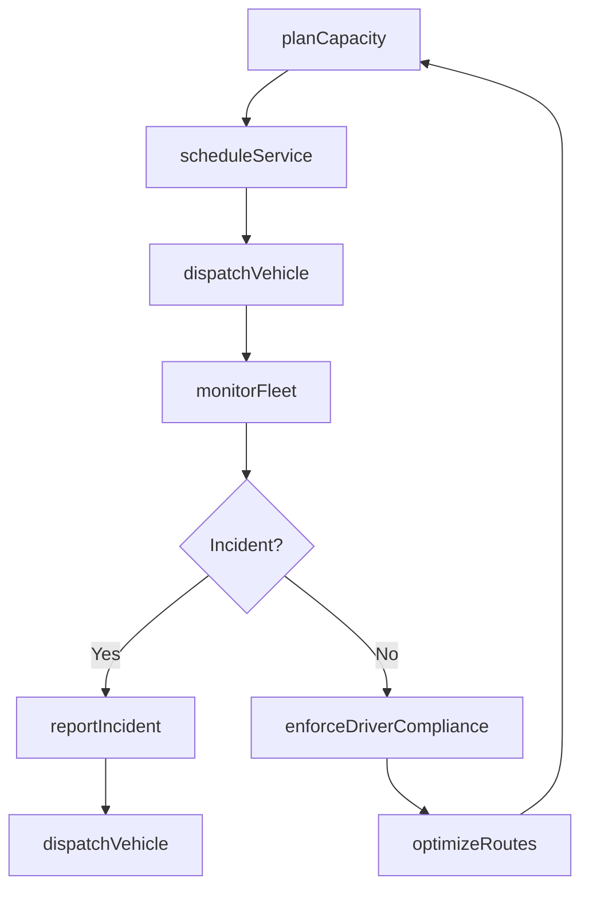
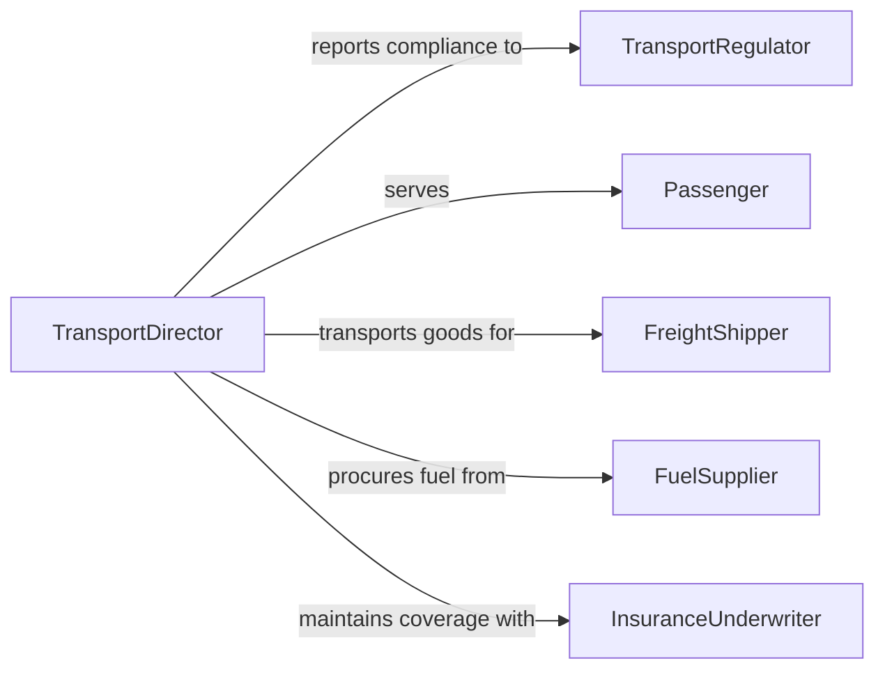

# Direct Passenger Freight Transport Activities

> Business-as-Code definition for directing passenger or freight transport activities. Models the oversight of transportation operations including fleet management, route planning, safety compliance, and service scheduling across rail, air, road, and maritime modes.

## Overview

Directing passenger or freight transport activities involves overseeing the movement of people and goods across transportation networks. This definition provides actions for managing fleet operations, scheduling services, ensuring safety compliance, and optimizing route efficiency. It enables automation of dispatch coordination, vehicle maintenance scheduling, and regulatory reporting workflows.

## Actors

| Actor | Description |
|-------|-------------|
| TransportRegulator | Enforces safety standards, licensing, and operational permits |
| Passenger | Individual traveling via the transportation service |
| FreightShipper | Organization sending goods for transport |
| FuelSupplier | Provides fuel or energy for fleet operations |
| InsuranceUnderwriter | Provides liability and cargo coverage for transport operations |
| InfrastructureOperator | Manages roads, rails, ports, or airports used by the fleet |

## Roles

| Role | Description |
|------|-------------|
| TransportDirector | Oversees all passenger and freight transport strategy |
| FleetManager | Manages vehicle acquisition, assignment, and maintenance |
| DispatchSupervisor | Coordinates real-time vehicle assignments and routing |
| SafetyOfficer | Ensures compliance with transportation safety regulations |
| SchedulePlanner | Designs service timetables and capacity allocations |

## Entities

| Entity | Description |
|--------|-------------|
| Vehicle | A bus, truck, train, aircraft, or vessel in the fleet |
| Route | A defined path between origin and destination points |
| ServiceSchedule | Timetable of departures and arrivals for a route |
| FreightManifest | List of cargo items with weights and handling requirements |
| DriverRecord | Operator credentials, hours of service, and safety history |
| MaintenanceLog | Vehicle service history and upcoming maintenance needs |
| IncidentReport | Documented safety event or service disruption |
| CapacityPlan | Projected passenger or cargo volume by route and period |

## Actions

| Action | Description |
|--------|-------------|
| scheduleService | Plan departure times and vehicle assignments for routes |
| dispatchVehicle | Assign a vehicle and operator to a specific run or shipment |
| monitorFleet | Track real-time vehicle locations, speeds, and conditions |
| enforceDriverCompliance | Verify operator hours of service and credential validity |
| optimizeRoutes | Analyze and improve route efficiency for time and fuel savings |
| reportIncident | Document safety events and service disruptions |
| planCapacity | Forecast passenger or freight volumes and adjust fleet size |

## Events

| Event | Description |
|-------|-------------|
| serviceScheduled | Departure times and vehicle assignments have been set |
| vehicleDispatched | A vehicle has been assigned and released for a run |
| fleetPositionUpdated | Real-time vehicle location data has been refreshed |
| driverComplianceViolation | An operator has exceeded hours or has an expired credential |
| routeOptimized | Route efficiency improvements have been applied |
| incidentReported | A safety event or disruption has been documented |
| capacityThresholdReached | Passenger or cargo volume has hit planning limits |

## Searches

| Search | Description |
|--------|-------------|
| getServiceSchedule | Retrieve timetables by route, date, or vehicle |
| getFleetStatus | Check real-time vehicle locations and operational status |
| getDriverRecords | Review operator compliance and safety history |
| findIncidents | List safety events by type, route, or severity |
| getCapacityUtilization | Check passenger or cargo load factors by route |


## Entity Relationships



## State Diagram



## Workflow



## Actor Relationships



## Usage

### Calling Actions

```typescript
import { directPassengerFreightTransportActivities } from '@headlessly/direct-passenger-freight-transport-activities'

const transport = directPassengerFreightTransportActivities()

// Schedule bus service for a route
await transport.scheduleService({
  route: 'route-42-downtown-express',
  departures: ['06:00', '07:00', '08:00', '17:00', '18:00'],
  vehicleType: 'articulated-bus',
  effectiveDate: '2026-04-01'
})

// Dispatch a freight vehicle
await transport.dispatchVehicle({
  vehicle: 'truck-FL-2204',
  operator: 'driver-1187',
  manifest: 'manifest-2026-0410',
  route: 'warehouse-to-distribution-center'
})

// Check fleet status
const fleet = await transport.getFleetStatus({
  region: 'northeast',
  vehicleType: 'all',
  status: 'in-service'
})
```

### Event-Driven Automation

```typescript
// Alert on driver compliance violation
transport.driverComplianceViolation(async ({ driverId, violation, route }) => {
  await notify({
    to: 'safety-officer',
    message: `Driver ${driverId} compliance violation: ${violation} on ${route}`
  })
})

// Auto-add capacity when threshold reached
transport.capacityThresholdReached(async ({ route, utilization, threshold }) => {
  if (utilization > threshold) {
    await transport.planCapacity({
      route,
      action: 'add-vehicle',
      reason: `Utilization at ${Math.round(utilization * 100)}%`
    })
  }
})
```
