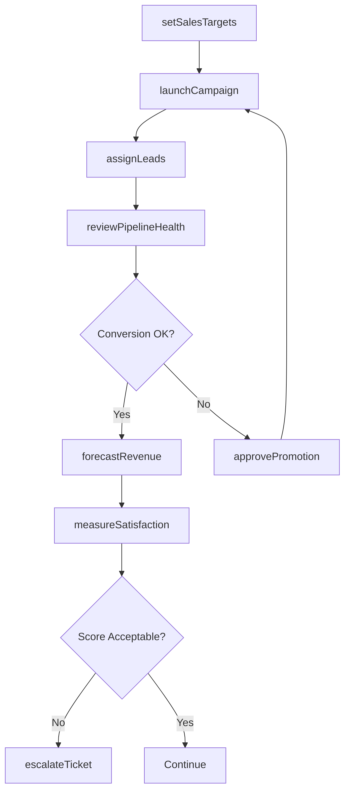
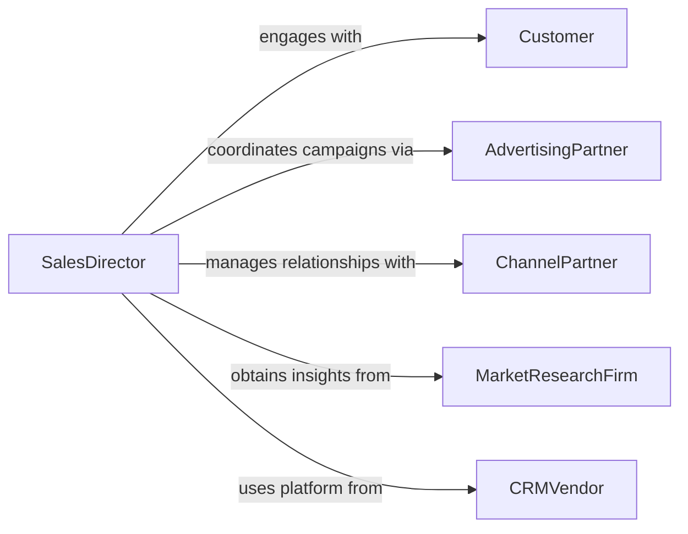

# Direct Sales, Marketing, or Customer Service Activities

> Business-as-Code definition for directing sales, marketing, and customer service operations. Models the coordination of revenue-generating teams from campaign planning through customer engagement and retention.

## Overview

Directing sales, marketing, and customer service activities encompasses the strategic leadership of teams responsible for revenue generation, brand positioning, and customer satisfaction. This definition exposes actions for managing sales pipelines, launching marketing campaigns, tracking customer service metrics, and optimizing the customer lifecycle. It enables automation of lead routing, campaign orchestration, and service-level monitoring.

## Actors

| Actor | Description |
|-------|-------------|
| Customer | End user or buyer of products and services |
| AdvertisingPartner | Media agencies and platforms executing ad placements |
| ChannelPartner | Resellers, distributors, and referral partners |
| MarketResearchFirm | Provides competitive intelligence and consumer insights |
| CRMVendor | Supplies customer relationship management tools and platforms |
| TradeAssociation | Industry groups that facilitate networking and standards |

## Roles

| Role | Description |
|------|-------------|
| SalesDirector | Oversees sales team strategy and revenue targets |
| MarketingManager | Plans and executes marketing campaigns and brand initiatives |
| CustomerServiceManager | Manages support operations and service-level agreements |
| AccountExecutive | Handles direct customer relationships and deal closures |
| CampaignAnalyst | Measures and reports on marketing campaign performance |

## Entities

| Entity | Description |
|--------|-------------|
| SalesPipeline | Staged funnel of prospective deals and their statuses |
| Campaign | A coordinated marketing initiative with defined goals |
| Lead | A prospective customer with qualifying information |
| ServiceTicket | A customer issue or request tracked through resolution |
| RevenueTarget | Defined sales goal for a team, region, or period |
| CustomerAccount | Profile and history of an active customer relationship |
| Promotion | A time-limited offer or discount for customer acquisition |
| SatisfactionSurvey | Feedback instrument measuring customer experience |

## Actions

| Action | Description |
|--------|-------------|
| setSalesTargets | Define revenue goals for teams, regions, or periods |
| launchCampaign | Activate a marketing campaign across chosen channels |
| assignLeads | Route qualified leads to appropriate sales representatives |
| escalateTicket | Elevate a customer service issue to senior support |
| reviewPipelineHealth | Analyze deal stages and conversion rates |
| approvePromotion | Authorize a promotional offer for market deployment |
| measureSatisfaction | Distribute and collect customer satisfaction surveys |
| forecastRevenue | Project future sales based on pipeline and trends |

## Events

| Event | Description |
|-------|-------------|
| salesTargetSet | Revenue goals have been established for a period |
| campaignLaunched | A marketing campaign has been activated |
| leadAssigned | A qualified lead has been routed to a representative |
| ticketEscalated | A customer service ticket has been elevated |
| pipelineReviewed | Sales pipeline analysis has been completed |
| promotionApproved | A promotional offer has been authorized |
| satisfactionCollected | Customer satisfaction survey results are available |
| revenueForecasted | Future revenue projections have been generated |

## Searches

| Search | Description |
|--------|-------------|
| findLeads | List leads by source, status, or assigned representative |
| getCampaignPerformance | Retrieve campaign metrics by channel or date range |
| getOpenTickets | Find unresolved customer service tickets by priority |
| getPipelineDeals | List deals by stage, value, or expected close date |
| getSatisfactionScores | Retrieve customer satisfaction data by segment |

## Workflow



## Actor Relationships



## Usage

### Calling Actions

```typescript
import { directSalesMarketingCustomerService } from '@headlessly/direct-sales-marketing-customer-service'

const revenue = directSalesMarketingCustomerService()

// Set quarterly sales targets
await revenue.setSalesTargets({
  period: 'Q2-2026',
  region: 'North America',
  target: 2500000
})

// Launch a new marketing campaign
const campaign = await revenue.launchCampaign({
  name: 'Summer Product Launch',
  channels: ['email', 'social', 'paid-search'],
  budget: 150000,
  startDate: '2026-06-01'
})

// Review sales pipeline health
const pipeline = await revenue.reviewPipelineHealth({
  period: 'Q2-2026',
  team: 'enterprise-sales'
})
```

### Event-Driven Automation

```typescript
// Auto-assign new leads from campaigns
revenue.campaignLaunched(async ({ campaignId }) => {
  const leads = await revenue.findLeads({ campaignId, status: 'new' })
  for (const lead of leads) {
    await revenue.assignLeads({ leadId: lead.id, strategy: 'round-robin' })
  }
})

// Escalate low satisfaction scores
revenue.satisfactionCollected(async ({ accountId, score }) => {
  if (score < 3) {
    await revenue.escalateTicket({
      accountId,
      priority: 'high',
      reason: `Low satisfaction score: ${score}/5`
    })
  }
})
```
