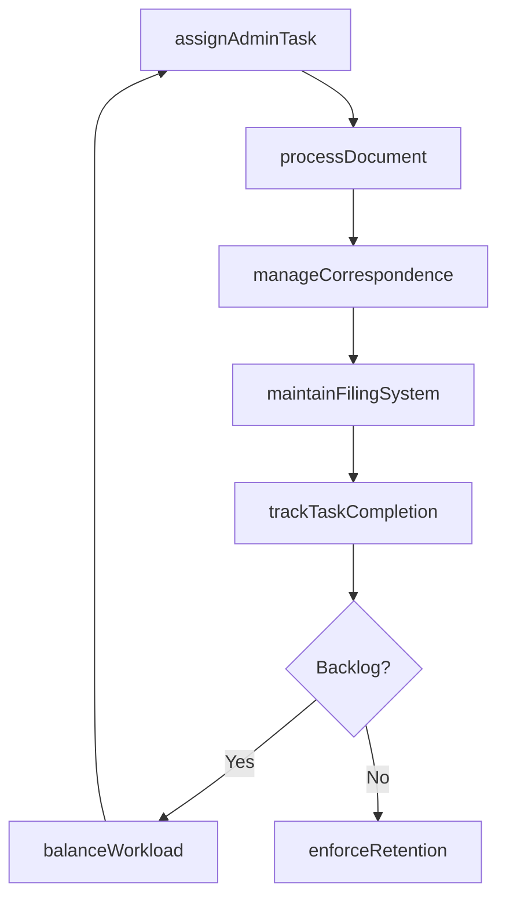
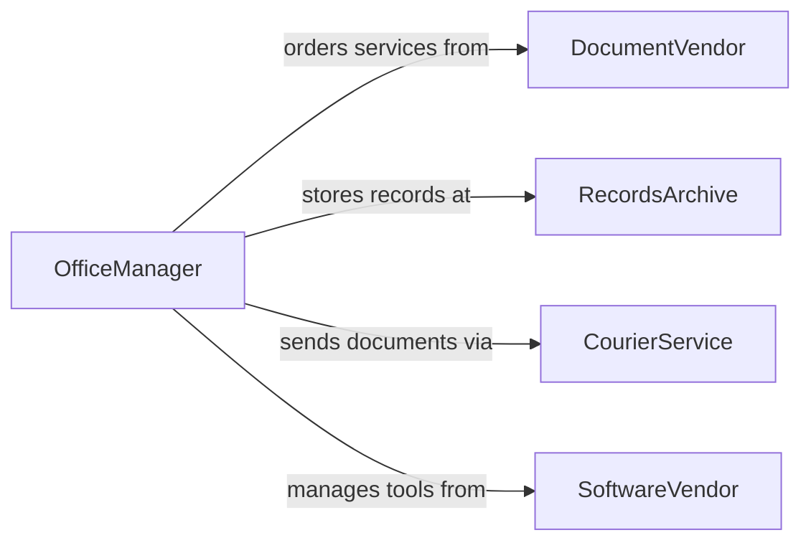

# Manage Clerical or Administrative Activities

> Business-as-Code definition for managing clerical and administrative activities. Models the coordination of document processing, records management, correspondence handling, and office workflow optimization.

## Overview

Managing clerical and administrative activities involves overseeing the document processing, records management, correspondence handling, and general office workflows that support organizational operations. This definition provides actions for managing document workflows, coordinating administrative staff, maintaining filing systems, and tracking task completion. It enables automation of document routing, deadline tracking, and administrative workload balancing.

## Actors

| Actor | Description |
|-------|-------------|
| DocumentVendor | Provides printing, binding, and document services |
| RecordsArchive | External storage facility for physical document retention |
| CourierService | Handles physical document delivery and pickup |
| SoftwareVendor | Provides office productivity and document management tools |

## Roles

| Role | Description |
|------|-------------|
| OfficeManager | Oversees all clerical and administrative operations |
| AdministrativeCoordinator | Assigns and monitors administrative task completion |
| RecordsManager | Maintains document filing, retrieval, and retention systems |
| ExecutiveAssistant | Handles correspondence and scheduling for leadership |

## Entities

| Entity | Description |
|--------|-------------|
| AdminTask | A tracked clerical or administrative work item |
| DocumentRecord | A filed document with metadata and retention schedule |
| CorrespondenceLog | Record of incoming and outgoing business communications |
| RetentionPolicy | Rules governing document storage duration and disposal |
| TaskQueue | Prioritized list of pending administrative assignments |
| FilingSystem | Organized structure for physical or digital document storage |
| WorkloadReport | Summary of administrative task volume by staff or period |

## Actions

| Action | Description |
|--------|-------------|
| assignAdminTask | Allocate a clerical task to an administrative staff member |
| processDocument | Route a document through review, approval, and filing |
| manageCorrespondence | Handle incoming and outgoing business communications |
| maintainFilingSystem | Organize and update document storage structures |
| trackTaskCompletion | Monitor progress of assigned administrative tasks |
| enforceRetention | Apply document retention policies and schedule disposals |
| balanceWorkload | Distribute tasks evenly across administrative staff |

## Events

| Event | Description |
|-------|-------------|
| adminTaskAssigned | A clerical task has been allocated to staff |
| documentProcessed | A document has been routed through its workflow |
| correspondenceHandled | A business communication has been processed |
| filingSystemUpdated | Document storage structure has been modified |
| taskCompleted | An administrative task has been finished |
| retentionEnforced | Document retention policies have been applied |
| workloadRebalanced | Administrative tasks have been redistributed |

## Searches

| Search | Description |
|--------|-------------|
| findAdminTasks | List administrative tasks by status, assignee, or priority |
| getDocumentRecords | Retrieve filed documents by type, date, or department |
| getCorrespondenceLog | List business communications by date or sender |
| getWorkloadDistribution | Check task allocation across administrative staff |
| findExpiredDocuments | List documents past their retention period |

## Workflow



## Actor Relationships



## Usage

### Calling Actions

```typescript
import { manageClericalAdministrativeActivities } from '@headlessly/manage-clerical-administrative-activities'

const admin = manageClericalAdministrativeActivities()

// Assign a document processing task
await admin.assignAdminTask({
  type: 'document-processing',
  description: 'Process Q1 vendor contracts for filing',
  assignee: 'admin-coordinator-01',
  deadline: '2026-04-15',
  priority: 'medium'
})

// Process an incoming document
await admin.processDocument({
  document: 'vendor-contract-2026-Q1',
  workflow: ['review', 'approve', 'file'],
  department: 'procurement'
})

// Check workload distribution
const workload = await admin.getWorkloadDistribution({
  team: 'admin-pool',
  period: '2026-04'
})
```

### Event-Driven Automation

```typescript
// Auto-rebalance when tasks pile up
admin.adminTaskAssigned(async ({ assignee, pendingCount }) => {
  if (pendingCount > 15) {
    await admin.balanceWorkload({ team: 'admin-pool' })
  }
})

// Auto-dispose expired documents
admin.retentionEnforced(async ({ expiredDocuments }) => {
  for (const doc of expiredDocuments) {
    await notify({
      to: 'records-manager',
      message: `Document ${doc.id} past retention period, ready for disposal`
    })
  }
})
```
