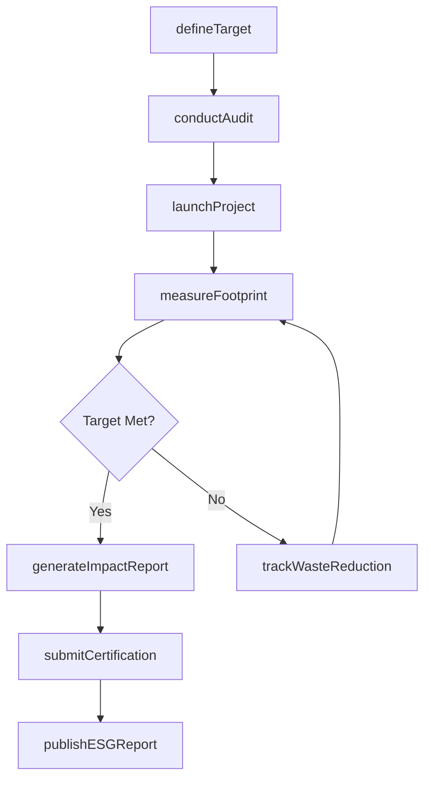
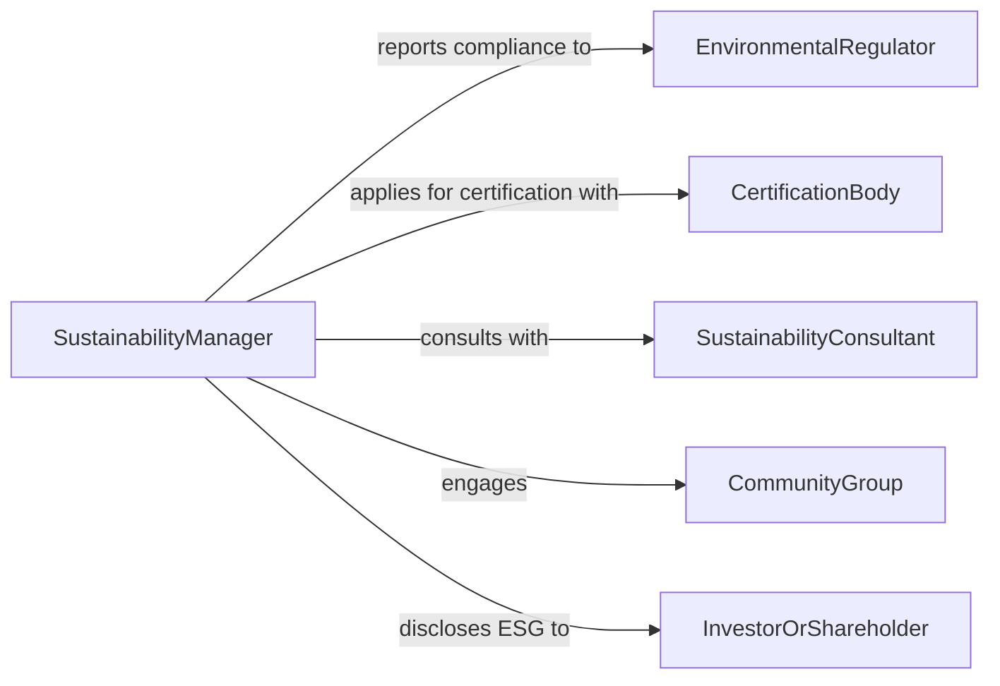

# Manage Environmental Sustainability Projects

> Business-as-Code definition for managing environmental sustainability projects. Models the planning, execution, and measurement of corporate sustainability initiatives from goal setting through impact reporting.

## Overview

Managing environmental sustainability projects involves overseeing initiatives that reduce organizational environmental impact, improve resource efficiency, and advance corporate sustainability goals. This definition provides actions for establishing sustainability targets, tracking carbon footprints, managing green certifications, and reporting on environmental performance. It enables automation of emissions monitoring, waste reduction tracking, and sustainability compliance workflows.

## Actors

| Actor | Description |
|-------|-------------|
| EnvironmentalRegulator | Government body setting sustainability standards and requirements |
| CertificationBody | Organization granting environmental certifications like ISO 14001 |
| SustainabilityConsultant | External advisor on green practices and compliance strategies |
| CommunityGroup | Local stakeholders affected by or interested in sustainability efforts |
| GreenTechnologyVendor | Supplier of sustainable technology solutions and equipment |
| InvestorOrShareholder | Stakeholders requiring ESG performance disclosure |

## Roles

| Role | Description |
|------|-------------|
| SustainabilityManager | Leads environmental sustainability strategy and project execution |
| EnvironmentalAnalyst | Collects and analyzes sustainability metrics and data |
| ProjectCoordinator | Manages individual sustainability initiative timelines |
| ComplianceSpecialist | Ensures adherence to environmental regulations and certifications |

## Entities

| Entity | Description |
|--------|-------------|
| SustainabilityProject | A defined initiative aimed at reducing environmental impact |
| CarbonFootprint | Measured greenhouse gas emissions for an organization or project |
| SustainabilityTarget | Quantified goal for emission reduction, waste, or energy use |
| CertificationRecord | Documentation of environmental certification status |
| ImpactReport | Periodic assessment of sustainability project outcomes |
| WasteReductionPlan | Strategy for minimizing solid waste and improving recycling |
| EnergyAudit | Assessment of energy consumption patterns and efficiency |
| ESGReport | Environmental, social, and governance performance disclosure |

## Actions

| Action | Description |
|--------|-------------|
| defineTarget | Establish a measurable sustainability goal |
| launchProject | Initiate a new sustainability initiative |
| measureFootprint | Calculate current carbon or environmental footprint |
| conductAudit | Perform an energy or waste audit of operations |
| submitCertification | Apply for or renew an environmental certification |
| generateImpactReport | Create a report on sustainability project outcomes |
| trackWasteReduction | Monitor waste minimization progress against targets |
| publishESGReport | Release environmental performance data to stakeholders |

## Events

| Event | Description |
|-------|-------------|
| targetDefined | A new sustainability target has been established |
| projectLaunched | A sustainability initiative has been started |
| footprintMeasured | Carbon or environmental footprint has been calculated |
| auditCompleted | An energy or waste audit has been finished |
| certificationSubmitted | An environmental certification application has been filed |
| impactReportGenerated | A sustainability impact report has been created |
| targetAchieved | A sustainability target has been met |
| esgReportPublished | ESG performance data has been released |

## Searches

| Search | Description |
|--------|-------------|
| findProjects | List sustainability projects by status, type, or department |
| getFootprintData | Retrieve carbon footprint measurements by period or scope |
| getCertifications | List environmental certifications by status or expiration |
| getTargetProgress | Check progress against defined sustainability targets |
| findAudits | List completed or scheduled audits by type or facility |

## Workflow



## Actor Relationships



## Usage

### Calling Actions

```typescript
import { manageEnvironmentalSustainabilityProjects } from '@headlessly/manage-environmental-sustainability-projects'

const sustainability = manageEnvironmentalSustainabilityProjects()

// Define a carbon reduction target
await sustainability.defineTarget({
  type: 'carbon-reduction',
  baseline: 50000,
  target: 35000,
  unit: 'metric-tons-co2e',
  deadline: '2028-12-31'
})

// Launch a new green initiative
const project = await sustainability.launchProject({
  name: 'Solar Panel Installation Phase 2',
  facility: 'Manufacturing Plant B',
  expectedReduction: 8000,
  budget: 2000000
})

// Measure current footprint
const footprint = await sustainability.measureFootprint({
  scope: ['scope-1', 'scope-2'],
  period: '2026-Q1'
})
```

### Event-Driven Automation

```typescript
// Auto-generate report when target is achieved
sustainability.targetAchieved(async ({ targetId, actualValue }) => {
  await sustainability.generateImpactReport({ targetId })
  await notify({ to: 'executive-team', message: `Sustainability target met: ${actualValue}` })
})

// Schedule recertification when certification is expiring
sustainability.certificationSubmitted(async ({ certificationId, expirationDate }) => {
  await scheduleReminder({
    date: subtractMonths(expirationDate, 3),
    action: () => sustainability.submitCertification({ certificationId, type: 'renewal' })
  })
})
```
